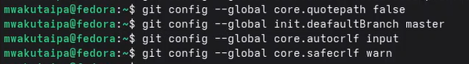
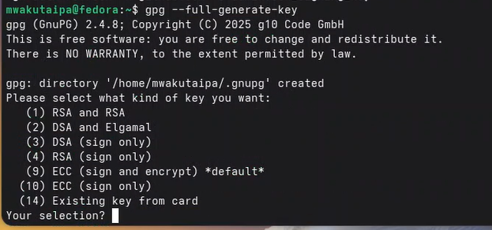
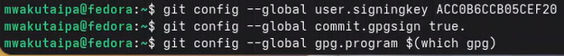
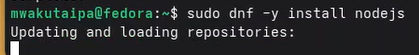
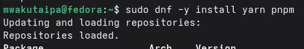
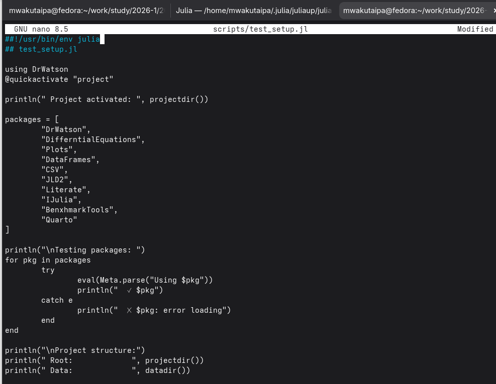
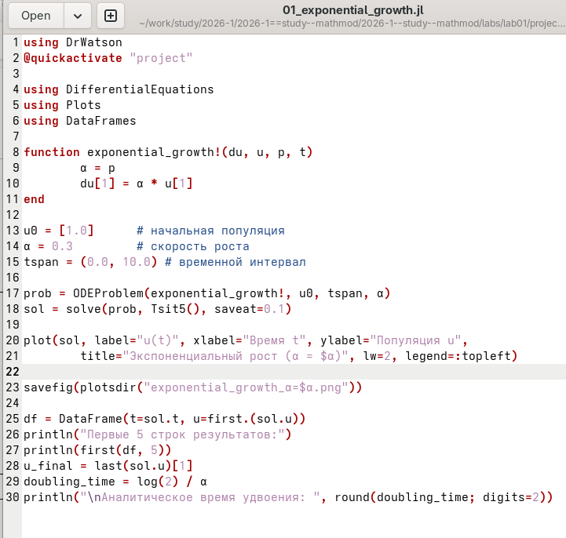
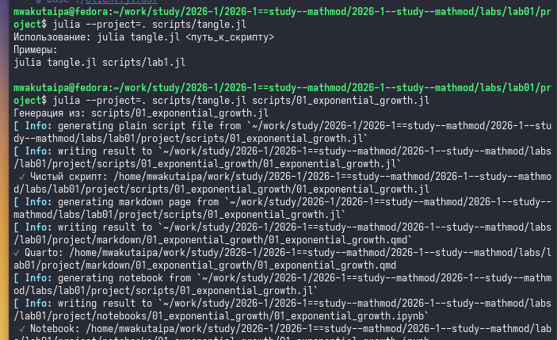
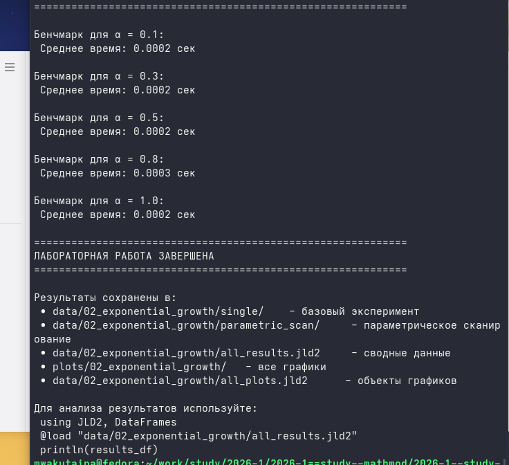

---
author:
  - name: Вакутайпа Милдред
    degrees: BSc
    orcid: 0009-0001-3145-3518
    email: 1032239009@rudn.ru
    affiliation:
      - name: Российский университет дружбы народов
        country: Российская Федерация
        postal-code: 117198
        city: Москва
        address: ул. Миклухо-Маклая, д. 6
title: Презентация по Лабораторная работа №1
subtitle: Подготовка стенда
license: CC BY
date: today
date-format: "YYYY-MM-DD"
---

# Информация

## Докладчик

:::::::::::::: {.columns align=center}
::: {.column width="70%"}

  * Вакутайпа Милдред
  * Группа НКНбд-01-23
  * Кафедры Математическое молелирование и искуственного интелекта
  * Российский университет дружбы народов им. П. Лумумбы
  * [1032239009@rudn.ru](mailto:1032239009@rudn.ru)
  * <https://wakutaipa.github.io/ru/>

:::
::: {.column width="30%"}

:::
::::::::::::::

# Вводная часть

## Актуальность

- Подготовка рабочее пространство
- Ознакомление с пакет DrWatson языка Julia
- Ознакомление с Quarto и общеприятными коммитами

## Цели и задачи

1. Создать рабочий каталог для всего курса.
2. Создать рабочее пространство для программ в рамках лабораторной работы.
3. Выполнить все задания по тексту лабораторной работы.
4. Установить необходимые пакеты.
5. Выполнить предложенный код.
6. Преобразовать код в литературный стиль.
7. Сгенерировать из литературного кода:

	— чистый код;
	
	— jupyter notebook;
	
	— документацию в формате Quarto.
	
8. Выполнить код из jupyter notebook.
9. Интегрировать документацию в формате Quarto в отчёт.
10. Добавить в код в литературном стиле вычисление для набора параметров.
11. Сгенерировать из литературного кода с параметрами:

	— чистый код;
	
	— jupyter notebook;
	
	— документацию в формате Quarto.
	
	— Выполнить код из jupyter notebook с параметрами.
	
	— Интегрировать документацию с параметрами в формате Quarto в отчёт.

# Результаты работы

## Настройка git

Сначла установила git, чтобы работать с системой контроля версии github локально и gh ,чтобы работать в командной строке. Я использовала команды sudo dnf -y install git и sudo dnf -y install gh.

Далее я вошла в свою учетную запись в командной строке зададив свой логин и email. 

{#fig-003 width=50%}

## Настроила utf-8

{#fig-004 width=70%}

## Настройка git

Потом создала аккаунт на  gitverse и вошла в существующий аккаунт github, авторизировалась с gh через броузер

{#fig-006 width=60%}

## Настройка git

Создала ssh ключ для доступа к github и добавила в агент. Добавила ключ в учетную запись gitverse через web-интерфейс после коприрования с помощью xclip.

## Настройка git

Сгенерировала ключ gpg типа RSA and RSA, размера 4096, срока действия по умолчанию (не истекает никогда). Задала имя и электронную почту соответствущему адресу и на github и на gitverse. После этого я вставила полученный ключ и на github и на giverse.

{#fig-013 width=50%}

## Настройка git

Используя введёный email, указала Git применять его при подписи коммитов.

{#fig-018 width=70%}

# Рабочее пространство лабораторной работы

## Установила средства разработки

{#fig-019 width=70%}

## Рабочее пространство лабораторной работы

На Node.js базируется программное обеспечение для семантического вер-
сионирования и общепринятых коммитов, позтому установила nodejs и для управления пакетами установила pnpm и yarn и из COPR установила quarto 

{#fig-023 width=70%}

## Установка pnpm и yarn

{#fig-024 width=70%}

## Настройки nodejs

Для работы с Node.js добавила каталог с исполняемыми файлами, устанавлива-
емыми пакетным менеджером, в переменную PATH. В файле ~/.bashrc добавила к переменной PATH yarn и установила gitflow из COPR .

Commitizen используется для помощи в форматировании коммитов. Установила его и с pnpm и с yarn.
cz-customizable позволяет более глубоко настроить форматирование коммитов. Устанавила его с pnpm.
standard-version автоматизирует изменение номера версии. Нстановила его с pnpm и yarn.

## Рабочее пространство лабораторной работы

Создала репозиторий на основе шаблона в gitverse и сделала его публичным. Потом я создала директорию для моей работы, клонировала репозиторий и инициализировала курс и отправила файлы на сервер.

Я создала новый репозиторий в github и запускала репозиторий на github. Далее инициализировала git-flow, который мне понадобиться для работы и
Проверила на какой ветке нахожусь.

## Рабочее пространство лабораторной работы

Загрузила весь репозиторий в хранилище и создала перый релиз (версия 1.0.0) и перешла на ветку release

{#fig-045 width=70%}

## Рабочее пространство лабораторной работы

Создала журнал изменений, добавила журнал изменений в индекс и сохранила сообщение мерджа как и было. После этого я залила релизную ветку в основную ветку и отправила данные на github.

Я скопировала CHANGELOG.md ,который создался в каталог release и создала новый релиз с использованием утилиты работы с github

## Создание проекта DrWatson для лабораторных работ

Перешла в каталог labs/lab01 и в терминале запускала Julia. В REPL иннициализировала проект DrWatson и в созданный каталог, позтапно установила основные пакеты: DrWatson, DifferentialEquations, Plots, DataFrames, Literate, CSV, JLD2, IJulia, BenchmarkTools и Quartoб а потом создала тестовый скрипт scripts/test_setup.jl, чтобы проверить установки.

## Создание проекта DrWatson для лабораторных работ

{#fig-062 width=70%}

## Модель экспоненциального роста

Экспоненциальный рост — это процесс увеличения величины, при котором ско-
рость роста в каждый момент времени пропорциональна текущему значению
этой величины. Чем больше система, тем быстрее она растет.

Создала скрипт (scripts/01_exponential_growth.jl)б чтобы реализовать модель и запускала его.

## Модель экспоненциального роста

{#fig-062 width=70%}

## Модель экспоненциального роста

В ответе получила такой график

{#fig-065 width=70%}

## Модель экспоненциального роста

Изменила файл scripts/01_exponential_growth.lj при этом добавила еще пакеты и выполнила программный код:

{#fig-066 width=70%}

## Создание производных форматов

Создала скрипт для генерации производных форматов (scripts/tangle.jl), потом выполнила программу, чтобы создать производные форматы

{#fig-067 width=70%}

## Создание производных форматов

В каталоге отчёта в файл _quarto.yml включила поддержку кода julia и в преамбуле preamble.tex подключила пакет juliamono

## Модель экспоненциального роста

Так как исследование не ограничивается одним значением параметров, изменила программу так, чтобы она принимала набор параметров. Выполнила программу и создала производные форматы

{#fig-070 width=70%}

# СПАСИБО!

