---
## Author
author:
  name: Вакутайпа Милдред
  degrees: BSc
  orcid: 0009-0001-3145-3518
  email: 1032239009@rudn.ru
  affiliation:
    - name: Российский университет дружбы народов
      country: Российская Федерация
      postal-code: 117198
      city: Москва
      address: ул. Миклухо-Маклая, д. 6

## Title
title: "Шаблон отчёта по лабораторной работе №1"
subtitle: "Подготовка стенда"
license: "CC BY"
---

# Цель работы

Цель данной работы - подготовить рабочее пространство и познакомиться с языком программирования Julia и пакет DrWatson, освоить основы литературного программирования. 

# Задание

1. Создать рабочий каталог для всего курса.
2. Создать рабочее пространство для программ в рамках лабораторной работы.
3. Выполнить все задания по тексту лабораторной работы.
4. Установить необходимые пакеты.
5. Выполнить предложенный код.
6. Преобразовать код в литературный стиль.
7. Сгенерировать из литературного кода:

	— чистый код;
	
	— jupyter notebook;
	
	— документацию в формате Quarto.
	
8. Выполнить код из jupyter notebook.
9. Интегрировать документацию в формате Quarto в отчёт.
10. Добавить в код в литературном стиле вычисление для набора параметров.
11. Сгенерировать из литературного кода с параметрами:

	— чистый код;
	
	— jupyter notebook;
	
	— документацию в формате Quarto.
	
	— Выполнить код из jupyter notebook с параметрами.
	
	— Интегрировать документацию с параметрами в формате Quarto в отчёт.

# Выполнение лабораторной работы

## Настройка git

Сначла установила git, чтобы работать с системой контроля версии github локально и gh ,чтобы работать в командной строке. 

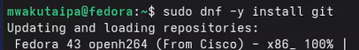{#fig-001 width=70%}

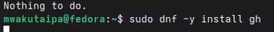{#fig-002 width=70%}

Далее я вошла в свою учетную запись в командной строке зададив свой логин и email. 

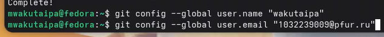{#fig-003 width=70%}

Настроила utf-8 в выводе сообщений git, верификацию и подписание комммитов. Задддала имя начальной ветки (master) и настроила autocrlf и safecrlf.

{#fig-004 width=70%}

Потом я создала аккаунт на  gitverse и вошла в существующий аккаунт github 

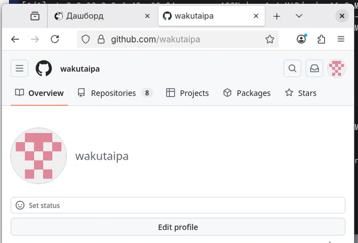{#fig-005 width=70%}

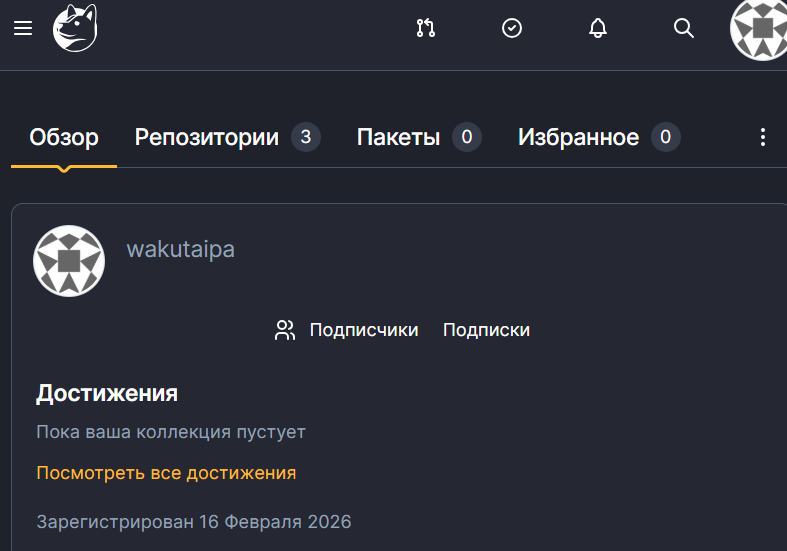{#fig-008 width=70%}

Авторизировалась с gh через броузер

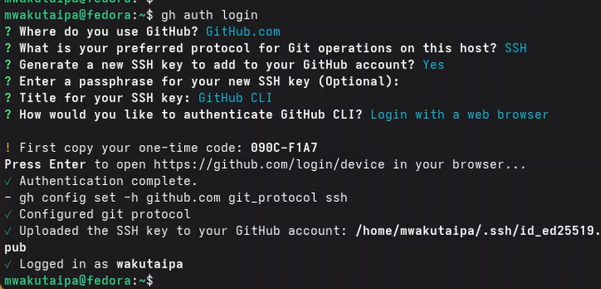{#fig-006 width=70%}

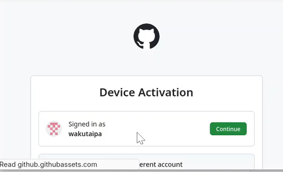{#fig-007 width=70%}

Создала ssh ключ для доступа к github и добавила в агент. Добавила ключ в учетную запись gitverse через web-интерфейс после коприрования с помощью xclip.

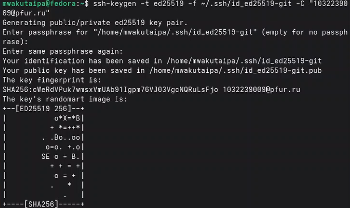{#fig-009 width=70%}

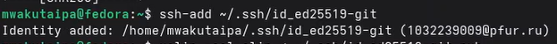{#fig-010 width=70%}

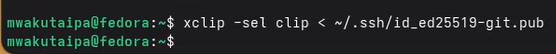{#fig-011 width=70%}

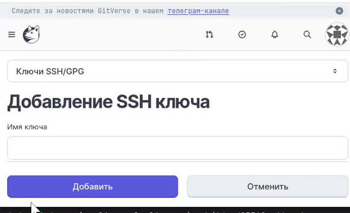{#fig-012 width=70%}

Сгенерировала ключ gpg типа RSA and RSA, размера 4096, срока действия по умолчанию (не истекает никогда). Задала имя и электронную почту соответствущему адресу и на github и на gitverse

{#fig-013 width=70%}

Выводила список ключей и скопировала отпечаток приватного ключа в буфер обмена и вставила полученный ключ и на github и на giverse.

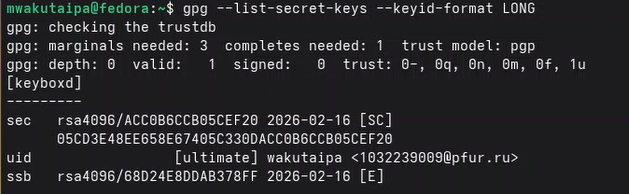{#fig-014 width=70%}

{#fig-015 width=70%}

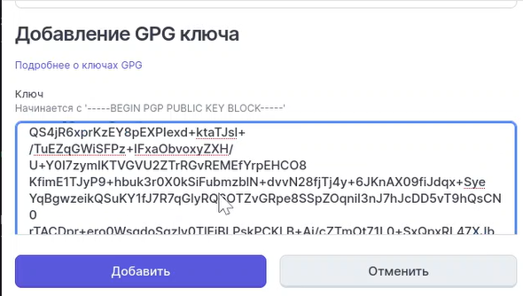{#fig-016 width=70%}

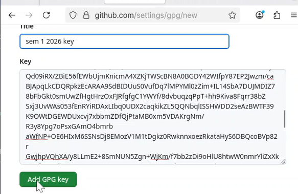{#fig-017 width=70%}

Используя введёный email, указала Git применять его при подписи коммитов.

{#fig-018 width=70%}


## Рабочее пространство лабораторной работы

Установила средства разработки

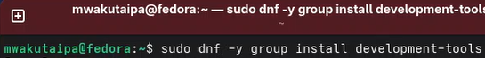{#fig-019 width=70%}

Из COPR установила quarto 

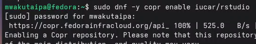{#fig-020 width=70%}

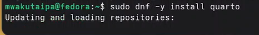{#fig-021 width=70%}

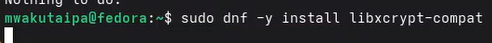{#fig-022 width=70%}

На Node.js базируется программное обеспечение для семантического вер-
сионирования и общепринятых коммитов, позтому установила nodejs и для управления пакетами установила pnpm и yarn 

{#fig-023 width=70%}

{#fig-024 width=70%}

Для работы с Node.js добавила каталог с исполняемыми файлами, устанавлива-
емыми пакетным менеджером, в переменную PATH. 

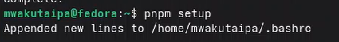{#fig-025 width=70%}

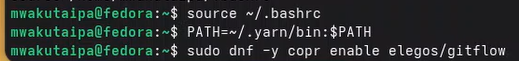{#fig-026 width=70%}

В файле ~/.bashrc добавила к переменной PATH yarn и установила gitflow из COPR 

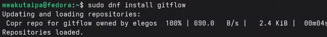{#fig-027 width=70%}

Commitizen используется для помощи в форматировании коммитов. Установила его и с pnpm и с yarn

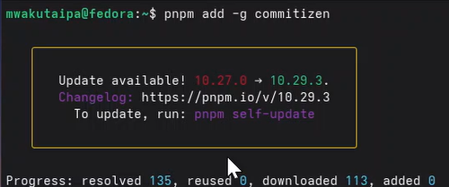{#fig-028 width=70%}

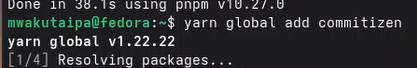{#fig-029 width=70%}

cz-customizable позволяет более глубоко настроить форматирование коммитов. Устанавила его с pnpm

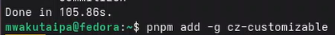{#fig-030 width=70%}

standard-version автоматизирует изменение номера версии. Нстановила его с pnpm и yarn

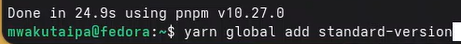{#fig-031 width=70%}

Создала репозиторий на основе шаблона в gitverse и сделала его публичным.

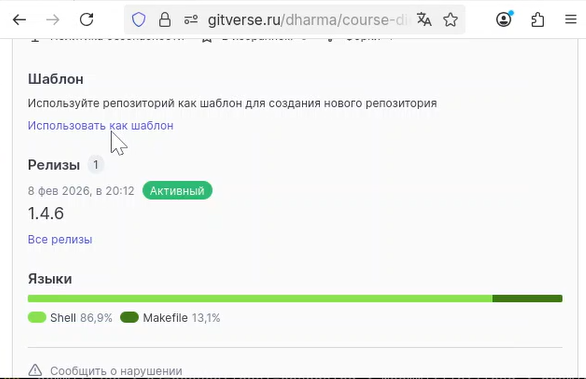{#fig-032 width=70%}

{#fig-033 width=70%}

Потом я создала директорию для моей работы, клонировала репозиторий и инициализировала курс.

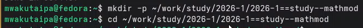{#fig-034 width=70%}

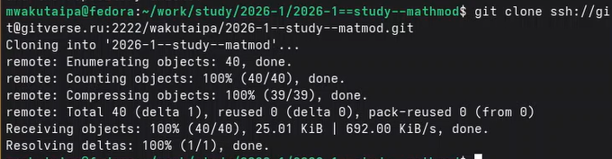{#fig-035 width=70%}

Потом я отправила файлы на сервер.

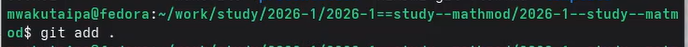{#fig-037 width=70%}

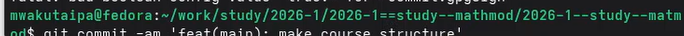{#fig-038 width=70%}

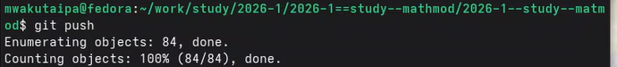{#fig-039 width=70%}

Я создала новый репозиторий в github и запускала репозиторий на github.

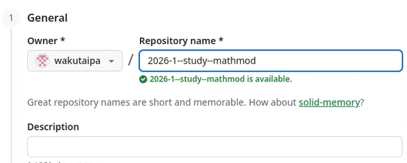{#fig-036 width=70%}

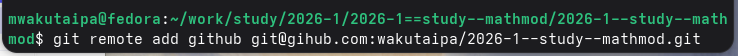{#fig-040 width=70%}

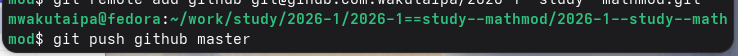{#fig-041 width=70%}

Инициализировала git-flow, который мне понадобиться для работы.

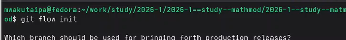{#fig-042 width=70%}

Проверила на какой ветке нахожусь

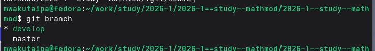{#fig-043 width=70%}

Загрузила весь репозиторий в хранилище

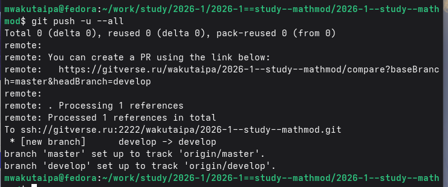{#fig-044 width=70%}

Создала перый релиз (версия 1.0.0) и перешла на ветку release

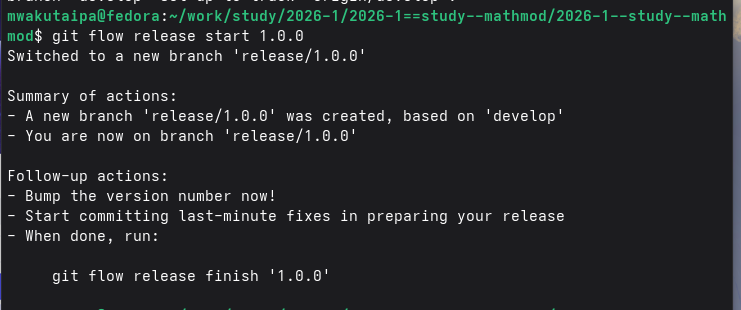{#fig-045 width=70%}

Создадала журнал изменений

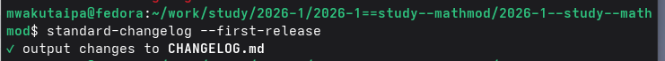{#fig-046 width=70%}

Добавила журнал изменений в индекс и сохранила сообщение мерджа как и было

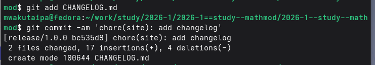{#fig-047 width=70%}

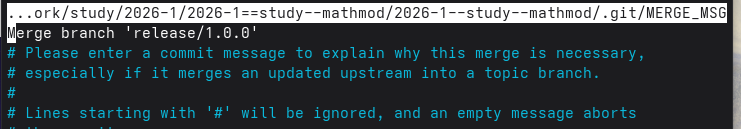{#fig-048 width=70%}

Залила релизную ветку в основную ветку

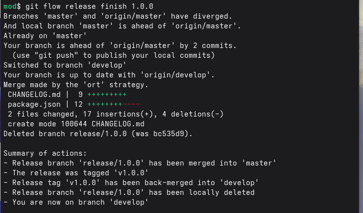{#fig-048 width=70%}

Отправила данные на github

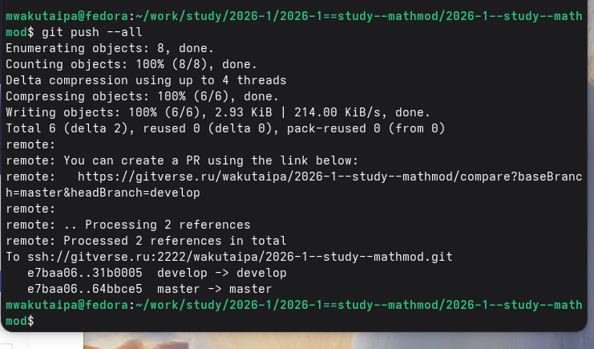{#fig-049 width=70%}

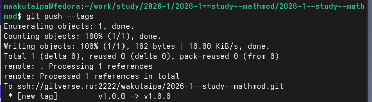{#fig-050 width=70%}

Скопировала CHANGELOG.md в каталог release

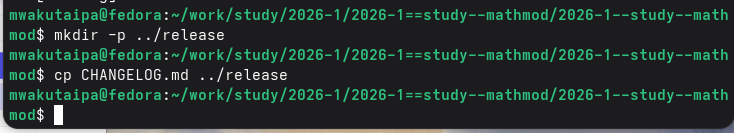{#fig-051 width=70%}

Создала релиз с использованием утилиты работы с github

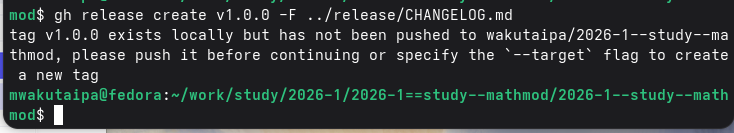{#fig-052 width=70%}


## Создание проекта DrWatson для лабораторных работ

Перешла в каталог labs/lab01 и в терминале запускала Julia

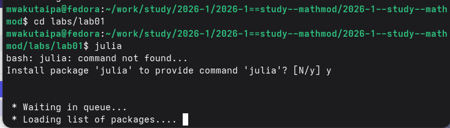{#fig-053 width=70%}

В REPL иннициализировала проект DrWatson

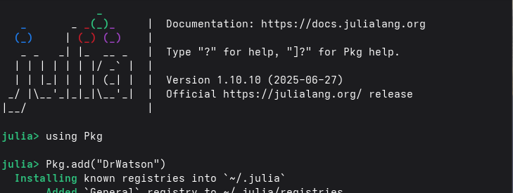{#fig-054 width=70%}

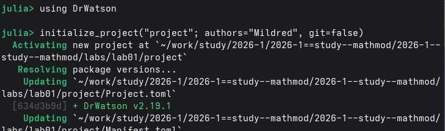{#fig-055 width=70%}

Перешла в созданный каталог и позтапно установила основные пакеты

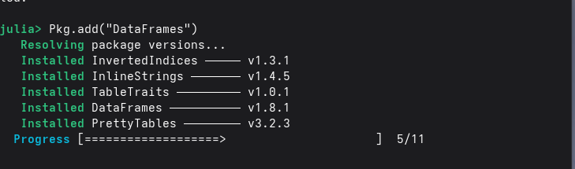{#fig-055 width=70%}

{#fig-056 width=70%}

{#fig-057 width=70%}

{#fig-058 width=70%}

{#fig-059 width=70%}

{#fig-060 width=70%}

{#fig-061 width=70%}

Создала тестовый скрипт scripts/test_setup.jl, чтобы проверить установки

{#fig-062 width=70%}

``` Julia

##!/usr/bin/env julia
## test_setup.jl

using DrWatson
@quickactivate "project"
println("✅ Проект активирован: ", projectdir())
## Проверка пакетов
packages = [
	"DrWatson",	# Организация проекта
	"DifferentialEquations", # Решение ОДУ
	"Plots",	# Визуализация
	"DataFrames",	# Таблицы данных
	"CSV",	# Работа с CSV
	"JLD2",	# Сохранение данных
	"Literate",	# Literate programming
	"IJulia",	# Jupyter notebook
	"BenchmarkTools",	# Бенчмаркинг
	"Quarto"	# Создание отчетов
	]
println("\nПроверка пакетов:")
for pkg in packages
	try
		eval(Meta.parse("using $pkg"))
		println(" ✓ $pkg")
	catch e
		println(" ✗ $pkg: Ошибка загрузки")
	end
end
## Проверка путей
println("\nСтруктура проекта:")
println(" Корень:	", projectdir())
println(" Данные:	", datadir())
println(" Скрипты:	", srcdir())
println(" Графики:	", plotsdir())


```

Потом запускала скрипт

{#fig-063 width=70%}

## Модель экспоненциального роста

Экспоненциальный рост — это процесс увеличения величины, при котором ско-
рость роста в каждый момент времени пропорциональна текущему значению
этой величины. Чем больше система, тем быстрее она растет.
Создала скрипт (scripts/01_exponential_growth.jl) и запускала его.

```Julia

using DrWatson
@quickactivate "project"

using DifferentialEquations
using Plots
using DataFrames

function exponential_growth!(du, u, p, t)
	α = p
	du[1] = α * u[1]
end
u0 = [1.0]	# начальная популяция
α = 0.3	# скорость роста
tspan = (0.0, 10.0) # временной интервал

prob = ODEProblem(exponential_growth!, u0, tspan, α)
sol = solve(prob, Tsit5(), saveat=0.1)

plot(sol, label="u(t)", xlabel="Время t", ylabel="Популяция u",
	title="Экспоненциальный рост (α = $α)", lw=2, legend=:topleft)
	
savefig(plotsdir("exponential_growth_α=$α.png"))

df = DataFrame(t=sol.t, u=first.(sol.u))
println("Первые 5 строк результатов:")
println(first(df, 5))

u_final = last(sol.u)[1]
doubling_time = log(2) / α
println("\nАналитическое время удвоения: ", round(doubling_time; digits=2))

```

{#fig-064 width=70%}

{#fig-065 width=70%}

Изменила файл scripts/01_exponential_growth.lj: 

``` Julia

# # Экспоненциальный рост
# **Цель:** Исследовать решение уравнения 𝑑𝑢/𝑑𝑡 = 𝛼𝑢.
#
# ## Инициализация проекта и загрузка пакетов

using DrWatson
@quickactivate "project"

using DifferentialEquations
using Plots
using DataFrames
using JLD2

script_name = splitext(basename(PROGRAM_FILE))[1]
mkpath(plotsdir(script_name))
mkpath(datadir(script_name))
# ## Определение модели
# Уравнение экспоненциального роста:
# 𝑑𝑢/𝑑𝑡 = 𝛼𝑢, 𝑢(0) = 𝑢0

function exponential_growth!(du, u, p, t)
	α = p
	du[1] = α * u[1]
end

u0 = [1.0]	# начальная популяция
α = 0.3 	# скорость роста
tspan = (0.0, 10.0) # временной интервал

prob = ODEProblem(exponential_growth!, u0, tspan, α)
sol = solve(prob, Tsit5(), saveat=0.1)

plot(sol, label="u(t)", xlabel="Время t", ylabel="Популяция u",
	title="Экспоненциальный рост (α = $α)", lw=2, legend=:topleft)

savefig(plotsdir("exponential_growth_α=$α.png"))

df = DataFrame(t=sol.t, u=first.(sol.u))
println("Первые 5 строк результатов:")
println(first(df, 5))

u_final = last(sol.u)[1]
doubling_time = log(2) / α
println("\nАналитическое время удвоения: ", round(doubling_time; digits=2))

@save datadir(script_name, "all_results.jld2") df


```

Выполнила программный код:

{#fig-066 width=70%}

Создала скрипт для генерации производных форматов (scripts/tangle.jl):

``` Julia

#!/usr/bin/env julia
# tangle.jl - Генератор отчетов из Literate-скриптов
# Использование: julia tangle.jl <путь_к_скрипту>
using DrWatson
@quickactivate

# Активирует текущий проект DrWatson
using Literate

function main()
		if length(ARGS) == 0
			println("""
				Использование: julia tangle.jl <путь_к_скрипту>
				Примеры:
				julia tangle.jl scripts/lab1.jl
				""")
			return
		end

	script_path = ARGS[1]

	if !isfile(script_path)
		error("Файл не найден: $script_path")
	end

# Пути и имена
	script_dir = dirname(script_path)
	script_name = splitext(basename(script_path))[1]

	println("Генерация из: $script_path")

# Чистый скрипт (без комментариев)
	scripts_dir = scriptsdir(script_name)
	Literate.script(script_path, scripts_dir; credit=false)
	println(" ✓ Чистый скрипт: $(scripts_dir)/$(script_name).jl")

# Quarto-документ
	quarto_dir = projectdir("markdown", script_name);
	Literate.markdown(script_path, quarto_dir;
			flavor=Literate.QuartoFlavor(),
			name=script_name, credit=false)
	println("✓ Quarto: $(quarto_dir)/$(script_name).qmd")

# Jupyter notebook
	notebooks_dir = projectdir("notebooks", script_name)
	Literate.notebook(script_path, notebooks_dir, name=script_name;
				execute=false, credit=false)
	println(" ✓ Notebook: $(notebooks_dir)/$(script_name).ipynb")
	println("\nГотово! Все файлы созданы.")
end

# Запуск
if abspath(PROGRAM_FILE) == @__FILE__
	main()
end

```

Потом выполнила программу, чтобы создать производные форматы

{#fig-067 width=70%}

В каталоге отчёта в файл _quarto.yml включила поддержку кода julia. 

{#fig-068 width=70%}

В преамбуле preamble.tex подключила пакет juliamono

{#fig-069 width=70%}

Исследование не ограничивается одним значением параметров, поэтому изменила программу так, чтобы она принимала набор параметров.

``` Julia

# # Параметрическое исследование экспоненциального роста
#
# ## Активация проекта и загрузка пакетов
#
# **ИЗМЕНЕНИЕ:** Добавлен DrWatson для управления проектом и параметрами

using DrWatson
@quickactivate "project"	# Активация проекта DrWatson

using DifferentialEquations
using DataFrames
using Plots
using JLD2
using BenchmarkTools

# Установка каталогов
script_name = splitext(basename(PROGRAM_FILE))[1]
mkpath(plotsdir(script_name))
mkpath(datadir(script_name))

# ## Определение модели
# Модель: 𝑑𝑢/𝑑𝑡 = 𝛼 ⋅ 𝑢

function exponential_growth!(du, u, p, t)
	α = p.α # **ИЗМЕНЕНИЕ:** Параметры теперь передаются как именованный кортеж
	du[1] = α * u[1]
end

# ## Определение параметров в Dict
# **ОСНОВНОЕ ИЗМЕНЕНИЕ:** Все параметры собраны в Dict для систематизации
# Базовый набор параметров (один эксперимент)

base_params = Dict(
	:u0 => [1.0],	# начальная популяция
	:α => 0.3,	# скорость роста
	:tspan => (0.0, 10.0), # интервал времени
	:solver => Tsit5(), # метод решения
	:saveat => 0.1,	# шаг сохранения результатов
	:experiment_name => "base_experiment"
	)
	
println("Базовые параметры эксперимента:")
for (key, value) in base_params
	println(" $key = $value")
end

# ## Функция-обертка для запуска одного эксперимента
# **ИСПРАВЛЕНИЕ:** Возвращаем Dict со строковыми ключами

function run_single_experiment(params::Dict)
	@unpack u0, α, tspan, solver, saveat = params
	prob = ODEProblem(exponential_growth!, u0, tspan, (α=α,)) #Создаем и решаем задачу
	sol = solve(prob, solver; saveat=saveat)
	final_population = last(sol.u)[1] # Анализ результатов
	doubling_time = log(2) / α
	return Dict(
		"solution" => sol,
		"time_points" => sol.t,
		"population_values" => first.(sol.u),
		"final_population" => final_population,
		"doubling_time" => doubling_time,
		"parameters" => params # Сохраняем исходные параметры
		) # Используем строки как ключи для совместимости с DrWatson
end

# ## Запуск базового эксперимента
# **ИЗМЕНЕНИЕ:** Используем produce_or_load для автоматического кэширования

data, path = produce_or_load(
		datadir(script_name, "single"), # Папка для сохранения
		base_params,	# Параметры эксперимента
		run_single_experiment, # Функция для выполнения
		prefix = "exp_growth", # Префикс имени файла
		tag = false, # Не добавлять git-тег
		verbose = true
		)
		
println("\nРезультаты базового эксперимента:")
println(" Финальная популяция: ", data["final_population"])
println(" Время удвоения: ", round(data["doubling_time"]; digits=2))

# ## Визуализация базового эксперимента
p1 = plot(data["time_points"], data["population_values"],
		label="α = $(base_params[:α])",
		xlabel="Время, t",
		ylabel="Популяция, u(t)",
		title="Экспоненциальный рост (базовый эксперимент)",
		lw=2,
		legend=:topleft,
		grid=true
		)

# Сохраним график в папку plots
savefig(plotsdir(script_name, "single_experiment.png"))

# ## Параметрическое сканирование
# **НОВАЯ СЕКЦИЯ:** Исследование влияния параметра α

# Сетка параметров для сканирования
param_grid = Dict(
	:u0 => [[1.0]],	# фиксируем начальное условие
	:α => [0.1, 0.3, 0.5, 0.8, 1.0], # исследуемые значения скорости роста
	:tspan => [(0.0, 10.0)], # фиксируем интервал времени
	:solver => [Tsit5()], # фиксируем метод решения
	:saveat => [0.1], # фиксируем шаг сохранения
	:experiment_name => ["parametric_scan"]
	)
	
# Генерация всех комбинаций параметров
all_params = dict_list(param_grid)

println("\n" * "="^60)
println("ПАРАМЕТРИЧЕСКОЕ СКАНИРОВАНИЕ")
println("Всего комбинаций параметров: ", length(all_params))
println("Исследуемые значения α: ", param_grid[:α])
println("="^60)

# ## Запуск всех экспериментов и собор результатов
# **НОВАЯ СЕКЦИЯ:** Автоматический запуск и сохранение всех вариантов
all_results = []
all_dfs = []
println(" Файл результатов: ", path)

for (i, params) in enumerate(all_params)
	println("Прогресс: $i/$(length(all_params)) | α = $(params[:α])")
	data, path = produce_or_load(
		datadir(script_name, "parametric_scan"), # Данные
		params,		# Текущий набор параметров
		run_single_experiment,	# Функция для выполнения
		prefix = "scan",	# Префикс имени файла
		tag = false,
		verbose = false		# Не выводить подробности для каждого запуска
		) # Автоматическое сохранение/загрузка каждого эксперимента
	
	result_summary = merge(
		params,
		Dict(
			:final_population => data["final_population"],
			:doubling_time => data["doubling_time"],
			:filepath => path # Путь к сохраненным данным
			)
		) # Сохраняем сводные результаты (используем символы для параметров, но данные из data - строки)
	push!(all_results, result_summary)

	df = DataFrame(
		t = data["time_points"],
		u = data["population_values"],
		α = fill(params[:α], length(data["time_points"]))
		) # Сохраняем полные данные для визуализации

	push!(all_dfs, df)
end
# ## Анализ и визуализация результатов сканирования
# **НОВАЯ СЕКЦИЯ:** Сравнительный анализ всех экспериментов

# Сводная таблица результатов
results_df = DataFrame(all_results)
println("\nСводная таблица результатов:")
println(results_df[!, [:α, :final_population, :doubling_time]])

# Сравнительный график всех траекторий
p2 = plot(size=(800, 500), dpi=150)

for params in all_params
	data, _ = produce_or_load(
			datadir(script_name, "parametric_scan"),
			params,
			run_single_experiment,
			prefix = "scan"
		) # Загружаем данные (они уже есть на диске)

	plot!(p2, data["time_points"], data["population_values"],
		label="α = $(params[:α])",
		lw=2,
		alpha=0.8
		)
end
plot!(p2,
	xlabel="Время, t",
	ylabel="Популяция, u(t)",
	title="Параметрическое исследование: влияние α на рост",
	legend=:topleft,
	grid=true
	)
	
# Сохраним график в папку plots
savefig(plotsdir(script_name, "parametric_scan_comparison.png"))

# График зависимости времени удвоения от α
p3 = plot(results_df.α, results_df.doubling_time,
	seriestype=:scatter,
	label="Численное решение",
	xlabel="Скорость роста, α",
	ylabel="Время удвоения, t₂",
	title="Зависимость времени удвоения от α",
	markersize=8,
	markercolor=:red,
	legend=:topright
	)
	
# Теоретическая кривая: t₂ = ln(2)/α
α_range = 0.1:0.01:1.0

plot!(p3, α_range, log(2) ./ α_range,
	label="Теория: t₂ = ln(2)/α",
	lw=2,
	linestyle=:dash,
	linecolor=:blue
	)
	
# Сохраним график в папку plots
savefig(plotsdir(script_name, "doubling_time_vs_alpha.png"))

# ## Бенчмаркинг с разными параметрами
# **ИЗМЕНЕНИЕ:** Бенчмаркинг для разных значений α
println("\n" * "="^60)
println("Бенчмаркинг для разных значений α")
println("="^60)
benchmark_results = []
for α_value in param_grid[:α]
	bench_params = Dict(
		:u0 => [1.0],
		:α => α_value,
		:tspan => (0.0, 10.0),
		:solver => Tsit5(),
		:saveat => 0.1
		) # Подготавливаем параметры для бенчмарка
	function benchmark_run() # Функция для бенчмарка
			prob = ODEProblem(exponential_growth!,
			bench_params[:u0],
			bench_params[:tspan],
			(α=bench_params[:α],))
	return solve(prob, bench_params[:solver];
			saveat=bench_params[:saveat])
	end
	
	println("\nБенчмарк для α = $α_value:")
	b = @benchmark $benchmark_run() samples=100 evals=1 # Запуск бенчмарка
	push!(benchmark_results, (α=α_value, time=median(b).time/1e9)) #время в секундах
	println(" Среднее время: ", round(median(b).time/1e9; digits=4), " сек")
end

# График зависимости времени вычисления от α
bench_df = DataFrame(benchmark_results)
p4 = plot(bench_df.α, bench_df.time,
	seriestype=:scatter,
	label="Время вычисления",
	xlabel="Скорость роста, α",
	ylabel="Время вычисления, сек",
	title="Зависимость времени вычисления от α",
	markersize=8,
	markercolor=:green,
	legend=:topleft
	)
	
# Сохраним график в папку plots
savefig(plotsdir(script_name, "computation_time_vs_alpha.png"))

# ## Сохранение всех результатов
# **НОВАЯ СЕКЦИЯ:** Сохранение сводных данных для последующего анализа

@save datadir(script_name, "all_results.jld2") base_params param_grid all_params results_df bench_df
@save datadir(script_name, "all_plots.jld2") p1 p2 p3 p4

println("\n" * "="^60)
println("ЛАБОРАТОРНАЯ РАБОТА ЗАВЕРШЕНА")
println("="^60)
println("\nРезультаты сохранены в:")
println(" • data/$(script_name)/single/    - базовый эксперимент")
println(" • data/$(script_name)/parametric_scan/     - параметрическое сканирование")
println(" • data/$(script_name)/all_results.jld2     - сводные данные")
println(" • plots/$(script_name)/   - все графики")
println(" • data/$(script_name)/all_plots.jld2      - объекты графиков")
println("\nДля анализа результатов используйте:")
println(" using JLD2, DataFrames")
println(" @load \"data/$(script_name)/all_results.jld2\"")
println(" println(results_df)")

```

Выполнила программу и создала производные форматы

{#fig-070 width=70%}

{#fig-071 width=70%}

<!--  -->

<!--  -->

# Выводы

При выполнение данной работы я подготовила рабочее пространство и познакомилась с языком программирования Julia и пакет DrWatson, освоила основы литературного программирования. 


# Список литературы{.unnumbered}

::: {#refs}
:::
