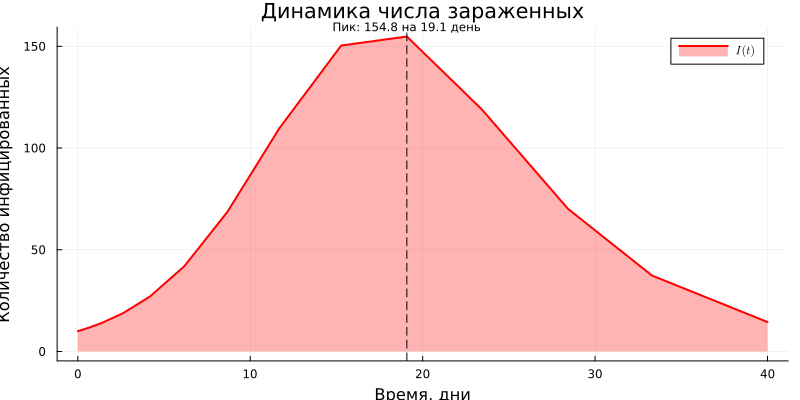
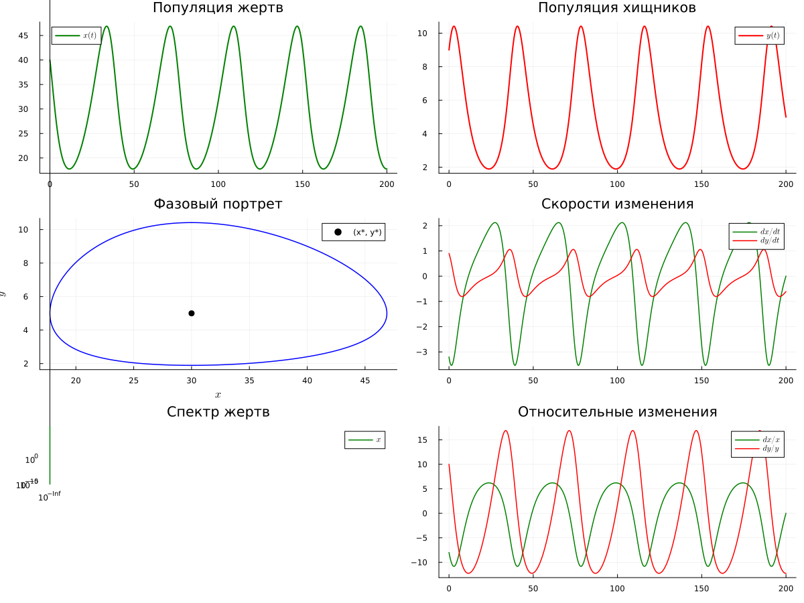
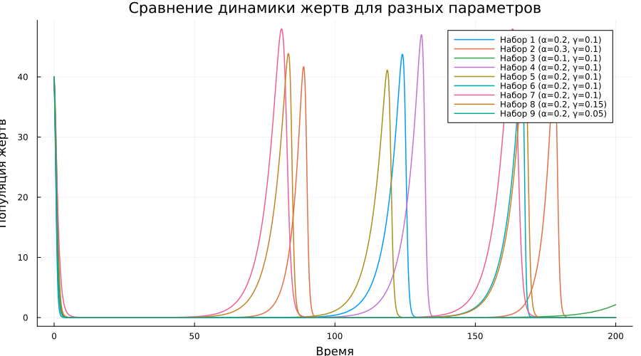
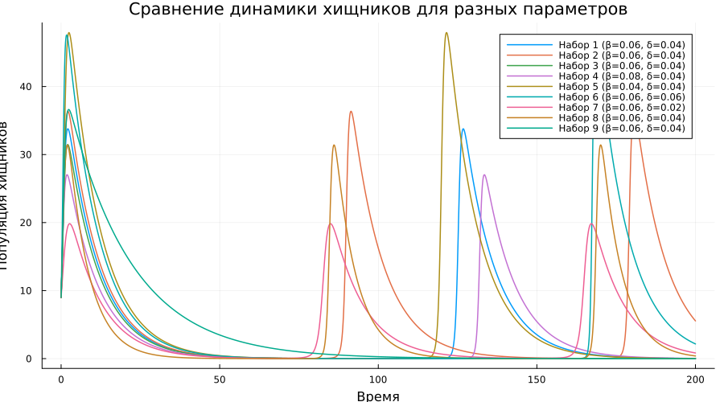

---
## Author
author:
  name: Вакутайпа Милдред
  degrees: BSc
  orcid: 0009-0001-3145-3518
  email: 1032239009@rudn.ru
  affiliation:
    - name: Российский университет дружбы народов
      country: Российская Федерация
      postal-code: 117198
      city: Москва
      address: ул. Миклухо-Маклая, д. 6
## Title
title: Презентация по лабораторная работа №2
subtitle: Модели SIR и Лотки-Волтерры
license: CC BY
date: today
date-format: "YYYY-MM-DD" # Example: 2025-09-06
---

# Информация

## Докладчик

:::::::::::::: {.columns align=center}
::: {.column width="70%"}

  * Вакутайпа Милдред
  * НКНбд-01-23
  * Факультет Физико-математических и Естесвенных Наук
  * Российский университет дружбы народов им. П. Лумумбы
  * <https://1032239009.github.io/ru/>

:::
::::::::::::::

# Вводная часть

## Цели и задачи

1. Установить необходимые пакеты.
3. Выполнить предложенный код.
4. Преобразовать код в литературный стиль.
5. Сгенерировать из литературного кода:
	— чистый код;
	— jupyter notebook;
	— документацию в формате Quarto.
6. Выполнить код из jupyter notebook.
7. Добавить в код в литературном стиле вычисление для набора параметров.
8. Сгенерировать из литературного кода с параметрами:
	— чистый код;
	— jupyter notebook;
	— документацию в формате Quarto.
9. Выполнить код из jupyter notebook с параметрами.

## Материалы и методы

- Модель SIR
- Модель Лотки-Вольтерры

## Теоретическое введение

## Модель SIR

Модель SIR есть классическая и фундаментальная математическая модель эпидемиологии, описывающая распространение инфекционного заболевания в закрытой популяции.

Модель SIR делит всю популяцию на три взаимосвязанные группы (компартменты), что отражено в её названии:
— 𝑆 — Susceptible (Восприимчивые): люди, которые не болели, не имеют иммунитета и могут заразиться.
— 𝐼 — Infectious (Инфицированные/Заразные): люди, которые в данный момент больны и могут передавать инфекцию.
— 𝑅 — Recovered (Выздоровевшие/Удаленные): люди, которые переболели и приобрели иммунитет (или умерли). Они больше не участвуют в процессе передачи.

## Модель Лотки-Вольтерры 

Ключевая идея модели Лотки-Вольтерры заключается в, том что она демонстрирует, как даже простая система взаимодействий может порождать сложные колебательные режимы, объясняя циклические изменения численности в природных экосистемах.

Модель строится на следующих упрощающих предположениях:
— Закрытая система: популяции изолированы, нет миграции.
— Неограниченные ресурсы для жертв: в отсутствие хищников жертвы растут экспоненциально.
— Линейная функциональная реакция: вероятность встречи хищника и жертвы пропорциональна произведению их численностей.
— Постоянные параметры: коэффициенты взаимодействия не меняются во времени.
— Отсутствие внутривидовой конкуренции: нет конкуренции за ресурсы внутри вида.
— Хищники питаются только жертвами: нет альтернативных источников пищи.
— Отсутствие временных задержек: все процессы происходят мгновенно.

# Выполнение работы

``` julia

using Pkg
Pkg.activate(".")
Pkg.add("DifferentialEquations")
Pkg.add("SimpleDiffEq")
Pkg.add("Tables")
Pkg.add("DataFrames")
Pkg.add("StatsPlots")
Pkg.add("LaTeXStrings")
Pkg.add("Plots")
Pkg.add("BenchmarkTools")
Pkg.add("Statistics")
Pkg.add("FFTW")

```

## Работа с моделем SIR

Я выполнила предложенный код для модели SIR. Используя скрит для преобразовния кода в литературном стиле с прошлой работы я сгенерировала чистый код, документацию в формате Quarto, jupyter notebook. Потом я выполнила код в jupyter, чтобы проверить работу. В результате получила следующие графики:

## Работа с моделем SIR

{#fig-001 width=70%}

## Работа с моделем SIR

{#fig-002 width=70%}

## Работа с моделем SIR

{#fig-003 width=70%}

## Работа с моделем SIR

{#fig-004 width=70%}

## Работа с моделем SIR

{#fig-005 width=70%}

## Работа с моделем SIR

{#fig-006 width=70%}

## Работа с моделем SIR

{#fig-007 width=70%}

## Работа с моделем SIR

Чтобы моделировать работа модели с набором параметров, я создала маленький датасет и создала графики которые сравнивают Re разных параметров и количество зараженных

``` julia

parameter_sets = [
    [0.05, 20.0, 0.25],  # Низкая передача
    [0.10, 20.0, 0.25],  # Средняя передача (базовый)
    [0.15, 20.0, 0.25],  # Высокая передача
    [0.10, 15.0, 0.25],  # Уменьшенные контакты
    [0.10, 25.0, 0.25],  # Увеличенные контакты
    [0.10, 20.0, 0.15],  # Более долгое выздоровление
    [0.10, 20.0, 0.35],  # Более быстрое выздоровление
]

```
## Работа с моделем SIR

{#fig-010 width=70%}

## Работа с моделем SIR

{#fig-011 width=70%}

## Работа с моделем Лотки-Вольтерры

После выполнения предложенный код, я проверила работу в jupyter и сохранила полученные графики

{#fig-012 width=70%}

## Работа с моделем Лотки-Вольтерры

{#fig-013 width=70%}

## Работа с моделем Лотки-Вольтерры

{#fig-014 width=70%}

## Работа с моделем Лотки-Вольтерры

{#fig-015 width=70%}

## Работа с моделем Лотки-Вольтерры

{#fig-016 width=70%}

## Работа с моделем Лотки-Вольтерры

{#fig-017 width=70%}

## Работа с моделем Лотки-Вольтерры
 
Создала датасет с разными параметрами 

``` julia

parameter_sets = [
    [0.20, 0.06, 0.04, 0.10],  # Классический набор (базовый)
    [0.30, 0.06, 0.04, 0.10],  # Увеличенный рост жертв
    [0.10, 0.06, 0.04, 0.10],  # Уменьшенный рост жертв
    [0.20, 0.08, 0.04, 0.10],  # Увеличенное поедание жертв
    [0.20, 0.04, 0.04, 0.10],  # Уменьшенное поедание жертв
    [0.20, 0.06, 0.06, 0.10],  # Увеличенная конверсия в хищников
    [0.20, 0.06, 0.02, 0.10],  # Уменьшенная конверсия в хищников
    [0.20, 0.06, 0.04, 0.15],  # Увеличенная смертность хищников
    [0.20, 0.06, 0.04, 0.05],  # Уменьшенная смертность хищников
]

```

## Работа с моделем Лотки-Вольтерры

И так я сравнивала фазовых портретов для всех параметров

{#fig-019 width=70%}

## Работа с моделем Лотки-Вольтерры

Сравнивала популяции жертв при разных параметров

{#fig-020 width=70%}

## Работа с моделем Лотки-Вольтерры

Сравнивала популяции жищков при разных параметров

{#fig-021 width=70%}

# Вывод

При выполнении данной работы я научилась работать с моделями SIR и Лотки-Вольтерры и освоила использование профессиональными инструментами.

