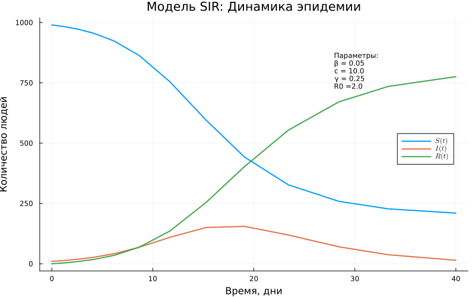
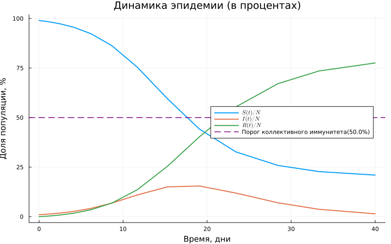
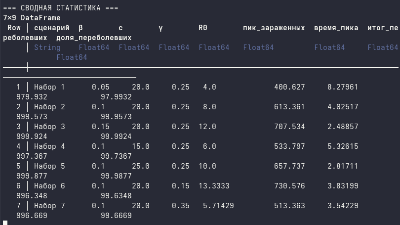
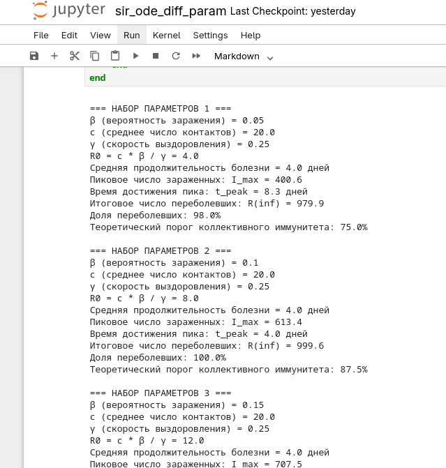
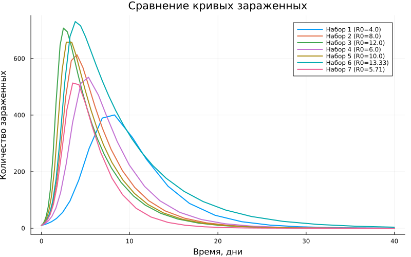
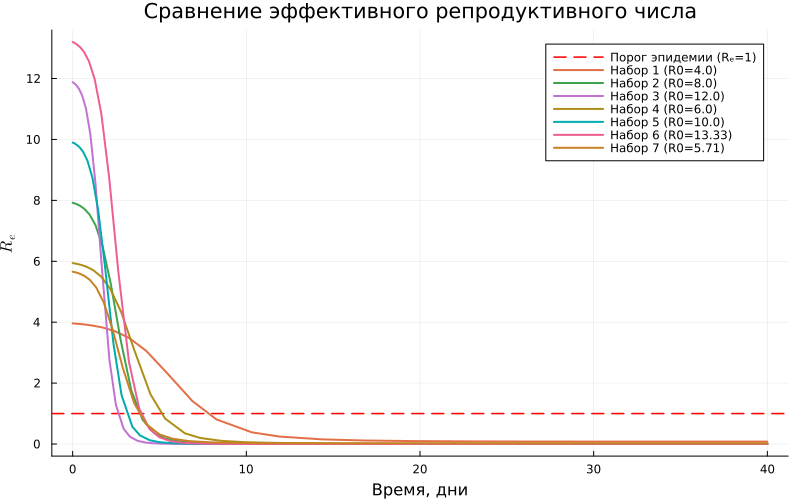
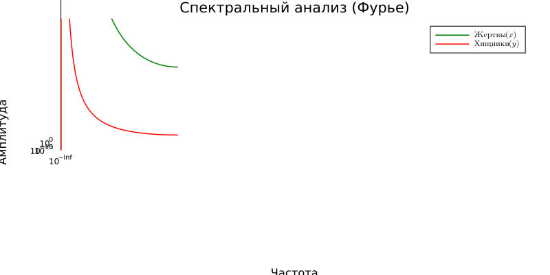
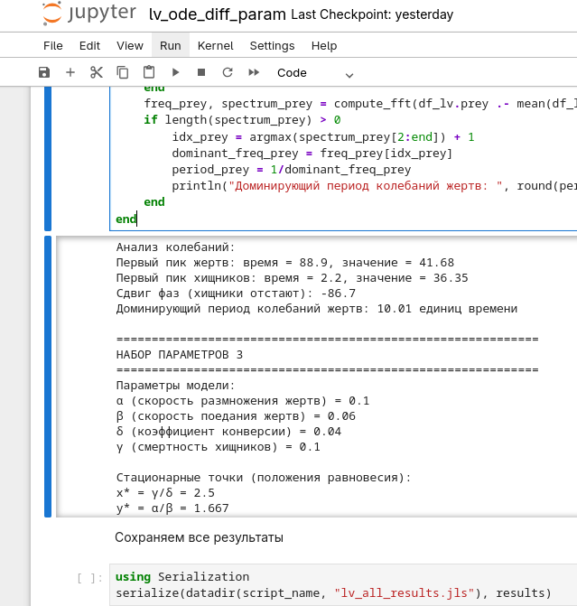
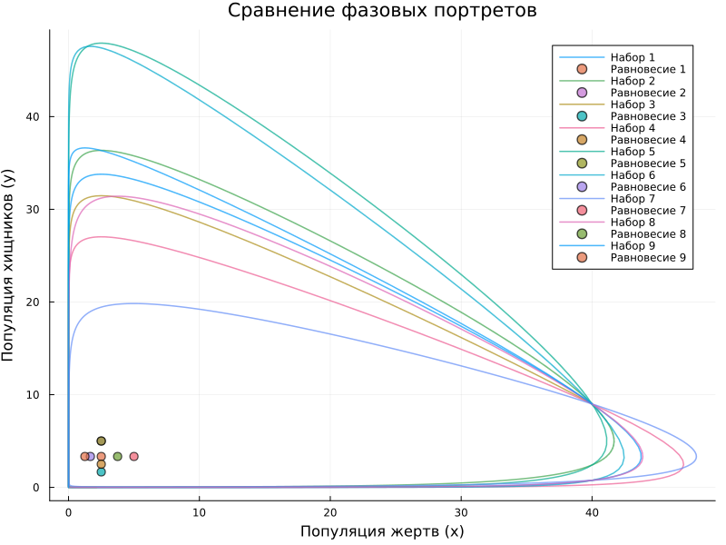

---
## Author
author:
  name: Вакутайпа Милдред
  degrees: BSc
  orcid: 0009-0001-3145-3518
  email: 1032239009@rudn.ru
  affiliation:
    - name: Российский университет дружбы народов
      country: Российская Федерация
      postal-code: 117198
      city: Москва
      address: ул. Миклухо-Маклая, д. 6

## Title
title: "Отчёт по лабораторной работе №2"
subtitle: "Основные модели"
license: "CC BY"
---

# Цель работы

Цель данная работа -- освоить работу с профессиональные инструменты, научиться работать с фундаментальными моделями SIR и Лотки-Волтерра.

# Задание

1. Создать рабочий каталог для кода.
2. Установить необходимые пакеты.
3. Выполнить предложенный код.
4. Преобразовать код в литературный стиль.
5. Сгенерировать из литературного кода:
	— чистый код;
	— jupyter notebook;
	— документацию в формате Quarto.
6. Выполнить код из jupyter notebook.
7. Интегрировать документацию в формате Quarto в отчёт.
8. Добавить в код в литературном стиле вычисление для набора параметров.
9. Сгенерировать из литературного кода с параметрами:
	— чистый код;
	— jupyter notebook;
	— документацию в формате Quarto.
10. Выполнить код из jupyter notebook с параметрами.
11. Интегрировать документацию с параметрами в формате Quarto в отчёт.

# Теоретическое введение

Модель SIR есть классическая и фундаментальная математическая модель эпидемиологии, описывающая распространение инфекционного заболевания в закрытой популяции.

Модель SIR делит всю популяцию на три взаимосвязанные группы (компартменты), что отражено в её названии:
— 𝑆 — Susceptible (Восприимчивые): люди, которые не болели, не имеют иммунитета и могут заразиться.
— 𝐼 — Infectious (Инфицированные/Заразные): люди, которые в данный момент больны и могут передавать инфекцию.
— 𝑅 — Recovered (Выздоровевшие/Удаленные): люди, которые переболели и приобрели иммунитет (или умерли). Они больше не участвуют в процессе передачи.

Ключевая идея модели Лотки-Вольтерры заключается в, том что она демонстрирует, как даже простая система взаимодействий может порождать сложные колебательные режимы, объясняя циклические изменения численности в природных экосистемах.

Модель строится на следующих упрощающих предположениях:
— Закрытая система: популяции изолированы, нет миграции.
— Неограниченные ресурсы для жертв: в отсутствие хищников жертвы растут
экспоненциально.
— Линейная функциональная реакция: вероятность встречи хищника и жертвы
пропорциональна произведению их численностей.
— Постоянные параметры: коэффициенты взаимодействия не меняются во вре-
мени.
— Отсутствие внутривидовой конкуренции: нет конкуренции за ресурсы внутри
вида.
— Хищники питаются только жертвами: нет альтернативных источников пищи.
— Отсутствие временных задержек: все процессы происходят мгновенно.

# Выполнение лабораторной работы

До того, как начала выполнить работу я создала кактлог "project" в котором храняется все скрипты, графики, изображения итп. В этом же каталоге я импортировала все необходимые пакеты следующим скриптом:

``` julia

using Pkg
Pkg.activate(".")
Pkg.add("DifferentialEquations")
Pkg.add("SimpleDiffEq")
Pkg.add("Tables")
Pkg.add("DataFrames")
Pkg.add("StatsPlots")
Pkg.add("LaTeXStrings")
Pkg.add("Plots")
Pkg.add("BenchmarkTools")
Pkg.add("Statistics")
Pkg.add("FFTW")

```

## Модель SIR

Далее я выполнила предложенный код для модели SIR:

``` julia

using DrWatson
@quickactivate "project"

using DifferentialEquations
using SimpleDiffEq
using Tables
using DataFrames
using StatsPlots
using LaTeXStrings
using Plots
using BenchmarkTools

script_name = splitext(basename(PROGRAM_FILE))[1]
mkpath(plotsdir(script_name))
mkpath(datadir(script_name))

function sir_ode!(du, u, p, t)
	(S, I, R) = u
	(β, c, γ) = p
	N = S + I + R
	@inbounds begin
		du[1] = -β * c * I / N * S
		du[2] = β * c * I / N * S - γ * I
		du[3] = γ * I
	end
	nothing
end

δt = 0.1
tmax = 40.0
tspan = (0.0, tmax)
u0 = [990.0, 10.0, 0.0]  # S, I, R
p = [0.05, 10.0, 0.25] # β, c, γ

# Расчет базового репродуктивного числа
R0 = (p[2] * p[1]) / p[3]

prob_ode = ODEProblem(sir_ode!, u0, tspan, p)
sol_ode = solve(prob_ode, dt = δt)

df_ode = DataFrame(Tables.table(sol_ode'))
rename!(df_ode, ["S", "I", "R"])
df_ode[!, :t] = sol_ode.t
df_ode[!, :N] = df_ode.S + df_ode.I + df_ode.R

println("Параметры модели SIR:")
println("β (вероятность заражения) = ", p[1])
println("c (среднее число контактов) = ", p[2])
println("γ (скорость выздоровления) = ", p[3])
println("R0 = c * β / γ = ", round(R0, digits=3))
println("Средняя продолжительность болезни = ", round(1/p[3], digits=2), " дней")
println("Начальные условия: S0 = ", u0[1], ", I0 = ", u0[2], ", R0 =", u0[3])

plt1 = @df df_ode plot(:t,
	[:S :I :R],
	label=[L"S(t)" L"I(t)" L"R(t)"],
	xlabel="Время, дни",
	ylabel="Количество людей",
	title="Модель SIR: Динамика эпидемии",
	linewidth=2,
	legend=:right,
	grid=true,
	size=(800, 500))
	
annotate!(plt1, maximum(df_ode.t) * 0.7, maximum(df_ode.N) * 0.8,
	text("Параметры:\nβ = $(p[1])\nc = $(p[2])\nγ = $(p[3])\nR0 =$(round(R0, digits=2))",
	8, :left))
	
plt2 = @df df_ode plot(:t, :I,
	label=L"I(t)",
	xlabel="Время, дни",
	ylabel="Количество инфицированных",
	title="Динамика числа зараженных",
	color=:red,
	linewidth=2,
	fill=(0, 0.3, :red),
	grid=true,
	size=(800, 400))
	
peak_idx = argmax(df_ode.I)
peak_time = df_ode.t[peak_idx]
peak_value = df_ode.I[peak_idx]
vline!(plt2, [peak_time], color=:black, linestyle=:dash, label=false, linewidth=1)
annotate!(plt2, peak_time, peak_value * 1.05,
	text("Пик: $(round(peak_value, digits=1)) на $(round(peak_time,digits=1)) день",
	8, :top))
	
plt3 = @df df_ode plot(:t, :I,
	label=L"I(t)",
	xlabel="Время, дни",
	ylabel="Количество инфицированных (лог. масштаб)",
	title="Экспоненциальный рост (лог. шкала)",
	yscale=:log10,
	color=:red,
	linewidth=2,
	grid=true,
	size=(800, 400))
	
plt4 = @df df_ode plot(:t,
	[:S :I :R] ./ df_ode.N .* 100,
	label=[L"S(t)/N" L"I(t)/N" L"R(t)/N"],
	xlabel="Время, дни",
	ylabel="Доля популяции, %",
	title="Динамика эпидемии (в процентах)",
	linewidth=2,
	legend=:right,
	grid=true,
	size=(800, 500))
	
if R0 > 1
	herd_immunity_threshold = (1 - 1/R0) * 100
	hline!(plt4, [herd_immunity_threshold], color=:purple,linestyle=:dash,
	label="Порог коллективного иммунитета($(round(herd_immunity_threshold, digits=1))%)",
	linewidth=1.5)
end

plt5 = plot(df_ode.S, df_ode.I,
	label="Фазовая траектория",
	xlabel=L"S(t)",
	ylabel=L"I(t)",
	title="Фазовый портрет SIR модели",
	color=:blue,
	linewidth=2,
	grid=true,
	size=(800, 500),
	legend=:topright)
	
for i in 1:50:length(df_ode.S)-1
	plot!(plt5, [df_ode.S[i], df_ode.S[i+1]], [df_ode.I[i], df_ode.I[i+1]],
	arrow=:closed, color=:blue, alpha=0.5, label=false)
end

df_ode[!, :Re] = R0 .* df_ode.S ./ df_ode.N

plt6 = @df df_ode plot(:t, :Re,
	label=L"R_e(t)",
	xlabel="Время, дни",
	ylabel=L"R_e",
	title="Динамика эффективного репродуктивного числа",
	color=:green,
	linewidth=2,
	grid=true,
	size=(800, 400))
	
# Горизонтальная линия на уровне 1
hline!(plt6, [1.0], color=:red, linestyle=:dash, label="Порог эпидемии (Rₑ=1)", linewidth=1.5)

cross_idx = findfirst(x -> x < 1, df_ode.Re)
if !isnothing(cross_idx) && cross_idx > 1
	cross_time = df_ode.t[cross_idx]
	vline!(plt6, [cross_time], color=:black, linestyle=:dash, label=false, linewidth=1)
	annotate!(plt6, cross_time, 1.2,
		text("Rₑ<1 с $(round(cross_time, digits=1)) дня", 8, :left))
end

plt7 = plot(layout=(2, 3), size=(1200, 800))

plot!(plt7[1], df_ode.t, df_ode.S, label=L"S(t)", color=1, linewidth=2, title="Восприимчивые")
plot!(plt7[2], df_ode.t, df_ode.I, label=L"I(t)", color=2, linewidth=2, title="Зараженные")
plot!(plt7[3], df_ode.t, df_ode.R, label=L"R(t)", color=3, linewidth=2, title="Выздоровевшие")

plot!(plt7[4], df_ode.t, df_ode.I, label=L"I(t)", color=2, linewidth=2, yscale=:log10, title="Лог. масштаб")
plot!(plt7[5], df_ode.S, df_ode.I, label=false, color=4, linewidth=2, title="Фазовый портрет", xlabel=L"S", ylabel=L"I")
plot!(plt7[6], df_ode.t, df_ode.Re, label=L"R_e", color=:green, linewidth=2, title=L"R_e(t)", hline=[1.0], linestyle=:dash, linecolor=:red)

savefig(plt1, plotsdir(script_name, "sir_main.png"))
savefig(plt2, plotsdir(script_name, "sir_infected.png"))
savefig(plt3, plotsdir(script_name, "sir_log_scale.png"))
savefig(plt4, plotsdir(script_name, "sir_percentages.png"))
savefig(plt5, plotsdir(script_name, "sir_phase_portrait.png"))
savefig(plt6, plotsdir(script_name, "sir_effective_R.png"))
savefig(plt7, plotsdir(script_name, "sir_panel.png"))

println("\nБенчмарк решения:")
@benchmark solve(prob_ode, dt = δt)
# Дополнительный анализ
println("\n=== АНАЛИЗ РЕЗУЛЬТАТОВ ===")
println("Общая численность популяции (контроль): N = ", round(df_ode.N[1], digits=1))
println("Пиковое число зараженных: I_max = ", round(peak_value, digits=1))
println("Время достижения пика: t_peak = ", round(peak_time, digits=1), " дней")
println("Итоговое число переболевших: R(∞) = ", round(df_ode.R[end], digits=1))
println("Доля переболевших: ", round(df_ode.R[end]/df_ode.N[1]*100, digits=1), "%")

if R0 > 1
	println("\nТеоретический анализ:")
	println(" - Порог коллективного иммунитета: ", round((1-1/R0)*100, digits=1), "%")
	println(" - Теоретический пик при S/N = 1/R0 = ", round(1/R0, digits=3))
end

```

Используя скрит для преобразовния кода в литературном стиле с прошлой работы я сгенерировала чистый код, документацию в формате Quarto, jupyter notebook. Потом я выполнила код в jupyter, чтобы проверить работу. В результате получила следующие графики:

Репродуктивное число убывает и значит эпидемия затухает:

{#fig-001 width=70%}

По графике видно, что максимальное количество инфицированных было на 19 день эпидемии и составила 155

{#fig-002 width=70%}

Экспоненциальный график показывает рост количество инфицированных

{#fig-003 width=70%}

В соответствие с репродуктивным числом число загражненных убывает и число выздоровших вырастает

{#fig-004 width=70%}

{#fig-005 width=70%}

{#fig-006 width=70%}

{#fig-007 width=70%}

Я добавила в код в литературном стиле набор параметров:

``` julia

parameter_sets = [
    [0.05, 20.0, 0.25],  # Низкая передача
    [0.10, 20.0, 0.25],  # Средняя передача (базовый)
    [0.15, 20.0, 0.25],  # Высокая передача
    [0.10, 15.0, 0.25],  # Уменьшенные контакты
    [0.10, 25.0, 0.25],  # Увеличенные контакты
    [0.10, 20.0, 0.15],  # Более долгое выздоровление
    [0.10, 20.0, 0.35],  # Более быстрое выздоровление
]

# Сохраняем все результаты
results = []

# Проходим циклом по каждому набору параметров
for (idx, p) in enumerate(parameter_sets)
    # Расчет базового репродуктивного числа
    R0 = (p[2] * p[1]) / p[3]
    
    # Создаем и решаем ODE задачу
    prob_ode = ODEProblem(sir_ode!, u0, tspan, p)
    sol_ode = solve(prob_ode, dt = δt)
    
    # Преобразуем в DataFrame
    df_ode = DataFrame(Tables.table(sol_ode'))
    rename!(df_ode, ["S", "I", "R"])
    df_ode[!, :t] = sol_ode.t
    df_ode[!, :N] = df_ode.S + df_ode.I + df_ode.R
    df_ode[!, :R0] .= R0
    df_ode[!, :Re] = R0 .* df_ode.S ./ df_ode.N
    df_ode[!, :сценарий] .= "Набор $idx"
    
    # Сохраняем результаты
    push!(results, df_ode)
    
    # Выводим параметры для этого запуска
    println("\n=== НАБОР ПАРАМЕТРОВ $idx ===")
    println("β (вероятность заражения) = ", p[1])
    println("c (среднее число контактов) = ", p[2])
    println("γ (скорость выздоровления) = ", p[3])
    println("R0 = c * β / γ = ", round(R0, digits=3))
    println("Средняя продолжительность болезни = ", round(1/p[3], digits=2), " дней")
    
    # Анализ для этого запуска
    peak_idx = argmax(df_ode.I)
    peak_time = df_ode.t[peak_idx]
    peak_value = df_ode.I[peak_idx]
    
    println("Пиковое число зараженных: I_max = ", round(peak_value, digits=1))
    println("Время достижения пика: t_peak = ", round(peak_time, digits=1), " дней")
    println("Итоговое число переболевших: R(inf) = ", round(df_ode.R[end], digits=1))
    println("Доля переболевших: ", round(df_ode.R[end]/df_ode.N[1]*100, digits=1), "%")
    
    if R0 > 1
        println("Теоретический порог коллективного иммунитета: ", round((1-1/R0)*100, digits=1), "%")
    end
end

```
выполнила скрипт и получила такую статистику 

{#fig-008 width=70%}

Проверила работу в jupyter и создала график статистики

{#fig-009 width=70%}

Потом я сохранила графики которые сравнивают репродуктивное число и количество зараженных.  

{#fig-010 width=70%}

{#fig-011 width=70%}

Такие модели с наборами праметров важны для сравнении статистики эпидемии разных регионов и понимание эпидемии. 

## Модель Лотки-Вольтерры

Как и в модели SIR, я выполнила предложенный код

``` julia

using DrWatson
@quickactivate "project"

using DifferentialEquations
using DataFrames
using StatsPlots
using LaTeXStrings
using Plots
using Statistics
using FFTW


script_name = splitext(basename(PROGRAM_FILE))[1]
mkpath(plotsdir(script_name))
mkpath(datadir(script_name))

# Описание модели Лотки-Вольтерры
"""
Модель Лотки-Вольтерры (хищник-жертва)
Система уравнений:
dx/dt = αx - βxy
dy/dt = δxy - γy
# Изменение популяции жертв
# Изменение популяции хищников
Где:
x - популяция жертв (например, зайцы)
y - популяция хищников (например, лисы)
α - естественный прирост жертв (в отсутствие хищников)
β - коэффициент поедания жертв хищниками
δ - коэффициент прироста хищников за счет поедания жертв
γ - естественная смертность хищников (в отсутствие жертв)
"""

function lotka_volterra!(du, u, p, t)
	x, y = u # x - жертвы, y - хищники
	α, β, δ, γ = p # параметры модели
	@inbounds begin
	du[1] = α*x - β*x*y # уравнение для жертв
	du[2] = δ*x*y - γ*y  # уравнение для хищников
	end
	nothing
end

# Параметры модели и начальные условия
# Классические параметры из литературы

p_lv = [0.1, # α: скорость размножения жертв
	0.02, # β: скорость поедания жертв хищниками
	0.01, # δ: коэффициент конверсии пищи (жертв) в хищников
	0.3]	# γ: смертность хищников
	
# Начальные условия: [жертвы, хищники]
u0_lv = [40.0, 9.0] # начальная популяция

# Временные параметры
tspan_lv = (0.0, 200.0) # длительность симуляции
dt_lv = 0.01 # шаг интегрирования

# Создание и решение задачи
prob_lv = ODEProblem(lotka_volterra!, u0_lv, tspan_lv, p_lv)
sol_lv = solve(prob_lv,
		dt = dt_lv,
		Tsit5(),# Метод 5-го порядка
		reltol=1e-8,# Относительная точность
		abstol=1e-10,# Абсолютная точность
		saveat=0.1,# Сохраняем каждые 0.1 единицы времени
		dense=true # Включаем плотный вывод для интерполяции
)

# Подготовка данных
df_lv = DataFrame()
df_lv[!, :t] = sol_lv.t
df_lv[!, :prey] = [u[1] for u in sol_lv.u] # жертвы
df_lv[!, :predator] = [u[2] for u in sol_lv.u] # хищники

# Рассчет производных для анализа
df_lv[!, :dprey_dt] = p_lv[1] .* df_lv.prey .- p_lv[2] .* df_lv.prey.* df_lv.predator
df_lv[!, :dpredator_dt] = p_lv[3] .* df_lv.prey .* df_lv.predator .-p_lv[4] .* df_lv.predator

# Вывод информации о модели
println("="^60)
println("Модель Лотки-Вольтерры (хищник-жертва)")
println("="^60)
println("\nПараметры модели:")
println("α (скорость размножения жертв) = ", p_lv[1])
println("β (скорость поедания жертв) = ", p_lv[2])
println("δ (коэффициент конверсии) = ", p_lv[3])
println("γ (смертность хищников) = ", p_lv[4])
println("\nНачальные условия:")
println("Жертвы (x0) = ", u0_lv[1])
println("Хищники (y0) = ", u0_lv[2])

# Стационарные точки (нулевые изоклины)
x_star = p_lv[4] / p_lv[3] # стационарная точка для жертв
y_star = p_lv[1] / p_lv[2] # стационарная точка для хищников
println("\nСтационарные точки (положения равновесия):")
println("x* = γ/δ = ", round(x_star, digits=3))
println("y* = α/β = ", round(y_star, digits=3))

# Построение графиков
# График 1: Динамика популяций во времени
plt1 = plot(df_lv.t, [df_lv.prey df_lv.predator],
	label=[L"Жертвы (x)" L"Хищники (y)"],
	xlabel="Время",
	ylabel="Популяция",
	title="Модель Лотки-Вольтерры: Динамика популяций",
	linewidth=2,
	legend=:topright,
	grid=true,
	size=(900, 500),
	color=[:green :red])
	
# Добавление стационарных уровней
hline!(plt1, [x_star], color=:green, linestyle=:dash, alpha=0.5, label="x* (равновесие жертв)")
hline!(plt1, [y_star], color=:red, linestyle=:dash, alpha=0.5, label="y* (равновесие хищников)")

# График 2: Фазовый портрет (хищники vs жертвы)
plt2 = plot(df_lv.prey, df_lv.predator,
	label="Фазовая траектория",
	xlabel="Популяция жертв (x)",
	ylabel="Популяция хищников (y)",
	title="Фазовый портрет системы",
	color=:blue,
	linewidth=1.5,
	grid=true,
	size=(800, 600),
	legend=:topright)
	
# Добавление стрелок направления на фазовом портрете
step = 50 # шаг для отображения стрелок
for i in 1:step:length(df_lv.prey)-step
	plot!(plt2, [df_lv.prey[i], df_lv.prey[i+step]],
		[df_lv.predator[i], df_lv.predator[i+step]],
		arrow=:closed, color=:blue, alpha=0.3, label=false)
end

# Добавление стационарной точки
scatter!(plt2, [x_star], [y_star],
	color=:black, markersize=8, label="Стационарная точка (x*, y*)")
	
# Изоклины (нулевого роста)
x_range = LinRange(0, maximum(df_lv.prey)*1.1, 100)
y_nullcline = p_lv[1] ./ (p_lv[2] .* x_range) # y-изоклина (dy/dt =0)
plot!(plt2, x_range, y_nullcline,
	color=:red, linestyle=:dash, linewidth=1.5, label="Изоклина хищников (dy/dt=0)")
	y_range = LinRange(0, maximum(df_lv.predator)*1.1, 100)
	x_nullcline = p_lv[4] ./ (p_lv[3] .* ones(length(y_range))) # x-изоклина (dx/dt = 0)
plot!(plt2, x_nullcline, y_range,
	color=:green, linestyle=:dash, linewidth=1.5, label="Изоклина жертв (dx/dt=0)")
	
# График 3: Производные (скорости изменения)
plt3 = plot(df_lv.t, [df_lv.dprey_dt df_lv.dpredator_dt],
	label=[L"dx/dt" L"dy/dt"],
	xlabel="Время",
	ylabel="Скорость изменения",
	title="Производные популяций",
	linewidth=1.5,
	legend=:topright,
	grid=true,
	size=(900, 400),
	color=[:green :red])
	hline!(plt3, [0], color=:black, linestyle=:solid, alpha=0.3,label=false)

# График 4: Относительные изменения (в %)
df_lv[!, :prey_pct_change] = df_lv.dprey_dt ./ df_lv.prey .* 100
df_lv[!, :predator_pct_change] = df_lv.dpredator_dt ./df_lv.predator .* 100

plt4 = plot(df_lv.t, [df_lv.prey_pct_change df_lv.predator_pct_change],
	label=[L"dx/dt / x (\%)" L"dy/dt / y (\%)"],
	xlabel="Время",
	ylabel="Относительное изменение, %",
	title="Относительные темпы роста",
	linewidth=1.5,
	legend=:topright,
	grid=true,
	size=(900, 400),
	color=[:green :red])
	
# График 5: Спектральный анализ (быстрое преобразование Фурье)
function compute_fft(signal, dt)
	n = length(signal) # Используем rfft для вещественных сигналов (возвращает толькоположительные частоты)
	
	spectrum = abs.(rfft(signal))
# Соответствующие частоты для rfft
	freq = rfftfreq(n, 1/dt)
	return freq, spectrum
end

# Вычисление периодов колебаний
freq_prey, spectrum_prey = compute_fft(df_lv.prey .-mean(df_lv.prey), dt_lv)
freq_predator, spectrum_predator = compute_fft(df_lv.predator .-mean(df_lv.predator), dt_lv)
plt5 = plot(freq_prey, [spectrum_prey spectrum_predator],
	label=[L"Жертвы (x)" L"Хищники (y)"],
	xlabel="Частота",
	ylabel="Амплитуда",
	title="Спектральный анализ (Фурье)",
	linewidth=1.5,
	xscale=:log10,
	yscale=:log10,
	legend=:topright,
	grid=true,
	size=(800, 400),
	color=[:green :red])
	
# Нахождение доминирующих частот
if length(spectrum_prey) > 0
	idx_prey = argmax(spectrum_prey[2:end]) + 1 # пропускаем нулевую частоту
	dominant_freq_prey = freq_prey[idx_prey]
	period_prey = 1/dominant_freq_prey
	println("\nДоминирующая частота колебаний жертв: ", round(dominant_freq_prey, digits=4), " Гц")
	println("Период колебаний жертв: ", round(period_prey, digits=2), " единиц времени")
end

# График 6: Компактная панель всех графиков
plt6 = plot(layout=(3, 2), size=(1200, 900))
plot!(plt6[1], df_lv.t, df_lv.prey, label=L"x(t)", color=:green, linewidth=2, title="Популяция жертв", grid=true)
plot!(plt6[2], df_lv.t, df_lv.predator, label=L"y(t)", color=:red, linewidth=2, title="Популяция хищников", grid=true)
plot!(plt6[3], df_lv.prey, df_lv.predator, label=false, color=:blue, linewidth=1.5, title="Фазовый портрет", xlabel=L"x", ylabel=L"y", grid=true)
scatter!(plt6[3], [x_star], [y_star], color=:black, markersize=5, label="(x*, y*)")
plot!(plt6[4], df_lv.t, [df_lv.dprey_dt df_lv.dpredator_dt], label=[L"dx/dt" L"dy/dt"], color=[:green :red], linewidth=1.5, title="Скорости изменения", grid=true, legend=:topright)
plot!(plt6[5], freq_prey, spectrum_prey, label=L"x", color=:green, linewidth=1.5, title="Спектр жертв", xscale=:log10, yscale=:log10, grid=true)
plot!(plt6[6], df_lv.t, [df_lv.prey_pct_change df_lv.predator_pct_change], label=[L"dx/x" L"dy/y"], color=[:green :red], linewidth=1.5, title="Относительные изменения", grid=true, legend=:topright)

# Анализ результатов
println("\n" * "="^60)
println("Анализ результатов")
println("="^60)
println("\nОсновные статистики:")
println("Жертвы: min = ", round(minimum(df_lv.prey), digits=2),
	", max = ", round(maximum(df_lv.prey), digits=2),
	", mean = ", round(mean(df_lv.prey), digits=2))
println("Хищники: min = ", round(minimum(df_lv.predator), digits=2),
	", max = ", round(maximum(df_lv.predator), digits=2),
	", mean = ", round(mean(df_lv.predator), digits=2))
	
# Упрощенный анализ колебаний без поиска максимумов
# Вместо сложного анализа сдвига фаз, просто посчитаем основные характеристики
# Находим время первого пика жертв (простой алгоритм)

function find_first_peak(signal, time)
	for i in 2:length(signal)-1
		if signal[i] > signal[i-1] && signal[i] > signal[i+1]
			return time[i], signal[i]
		end
	end
	return NaN, NaN
end

peak_time_prey, peak_value_prey = find_first_peak(df_lv.prey, df_lv.t)
peak_time_predator, peak_value_predator = find_first_peak(df_lv.predator, df_lv.t)

if !isnan(peak_time_prey) && !isnan(peak_time_predator)
	phase_shift = peak_time_predator - peak_time_prey
	println("\nАнализ колебаний:")
	println("Первый пик жертв: время = ", round(peak_time_prey,digits=2), ", значение = ", round(peak_value_prey, digits=2))
	println("Первый пик хищников: время = ", round(peak_time_predator, digits=2), ", значение = ", round(peak_value_predator, digits=2))
	println("Сдвиг фаз (хищники отстают): ", round(phase_shift, digits=2))
end

# Сохранение графиков
savefig(plt1, plotsdir(script_name, "lv_dynamics.png"))
savefig(plt2, plotsdir(script_name, "lv_phase_portrait.png"))
savefig(plt3, plotsdir(script_name, "lv_derivatives.png"))
savefig(plt4, plotsdir(script_name, "lv_relative_changes.png"))
savefig(plt5, plotsdir(script_name, "lv_spectrum.png"))
savefig(plt6, plotsdir(script_name, "lv_panel.png"))

# Дополнительный анализ: чувствительность к параметрам
println("\n\n" * "="^60)
println("Анализ чувствительности")
println("="^60)

# Функция для анализа влияния параметров
function analyze_parameter_sensitivity(param_index, values, param_name)
	println("\nАнализ чувствительности к параметру: ", param_name)
	results = []
	for val in values
	p_test = copy(p_lv)
	p_test[param_index] = val
	prob_test = ODEProblem(lotka_volterra!, u0_lv, tspan_lv, p_test)
	sol_test = solve(prob_test, dt = dt_lv)
	prey_end = sol_test.u[end][1]
	predator_end = sol_test.u[end][2]
	push!(results, (param=val, prey=prey_end, predator=predator_end))
	println(" $(param_name)=$(val): жертвы=$(round(prey_end,2)), хищники=$(round(predator_end,2))")
	end
	return results
end

# Анализ чувствительности к ключевым параметрам
if false # Установите в true для выполнения анализа
	println("\n1. Влияние скорости размножения жертв (α):")
	analyze_parameter_sensitivity(1, [0.05, 0.1, 0.2, 0.3], "α")
	println("\n2. Влияние смертности хищников (γ):")
	analyze_parameter_sensitivity(4, [0.1, 0.3, 0.5, 0.7], "γ")
end

println("\nМоделирование завершено успешно!")

```

Выполнила код и сгенерировала чистый код, документацию в формате Quarto, jupyter notebook. Далее я проверила работу в jupyter и сохранила графики:

Производные популяции показывают изменение популяции жертв и хищников

{#fig-012 width=70%}

Динамика популяции по времени

{#fig-013 width=70%}

Фазовый портрет системы

{#fig-014 width=70%}

Темпы роста популяции относительно друг другу

{#fig-015 width=70%}

Спектральный анализ роста

{#fig-016 width=70%}

{#fig-017 width=70%}

В литературном коде, я добавила набор параметров 

``` julia

# Каждый набор параметров: [α, β, δ, γ]
parameter_sets = [
    [0.20, 0.06, 0.04, 0.10],  # Классический набор (базовый)
    [0.30, 0.06, 0.04, 0.10],  # Увеличенный рост жертв
    [0.10, 0.06, 0.04, 0.10],  # Уменьшенный рост жертв
    [0.20, 0.08, 0.04, 0.10],  # Увеличенное поедание жертв
    [0.20, 0.04, 0.04, 0.10],  # Уменьшенное поедание жертв
    [0.20, 0.06, 0.06, 0.10],  # Увеличенная конверсия в хищников
    [0.20, 0.06, 0.02, 0.10],  # Уменьшенная конверсия в хищников
    [0.20, 0.06, 0.04, 0.15],  # Увеличенная смертность хищников
    [0.20, 0.06, 0.04, 0.05],  # Уменьшенная смертность хищников
]

# Сохраняем все результаты
results = []

# Функция для нахождения первого пика
function find_first_peak(signal, time)
    for i in 2:length(signal)-1
        if signal[i] > signal[i-1] && signal[i] > signal[i+1]
            return time[i], signal[i]
        end
    end
    return NaN, NaN
end

# Функция для вычисления спектра
function compute_fft(signal, dt)
    n = length(signal)
    spectrum = abs.(rfft(signal))
    freq = rfftfreq(n, 1/dt)
    return freq, spectrum
end

# Проходим циклом по каждому набору параметров
for (idx, p) in enumerate(parameter_sets)
    println("\n" * "="^60)
    println("НАБОР ПАРАМЕТРОВ $idx")
    println("="^60)
    
    # Вывод параметров
    println("Параметры модели:")
    println("α (скорость размножения жертв) = ", p[1])
    println("β (скорость поедания жертв) = ", p[2])
    println("δ (коэффициент конверсии) = ", p[3])
    println("γ (смертность хищников) = ", p[4])
    
    # Стационарные точки (нулевые изоклины)
    x_star = p[4] / p[3] # стационарная точка для жертв
    y_star = p[1] / p[2] # стационарная точка для хищников
    println("\nСтационарные точки (положения равновесия):")
    println("x* = γ/δ = ", round(x_star, digits=3))
    println("y* = α/β = ", round(y_star, digits=3))
    
    # Создание и решение задачи
    prob_lv = ODEProblem(lotka_volterra!, u0_lv, tspan_lv, p)
    sol_lv = solve(prob_lv,
                   dt = dt_lv,
                   Tsit5(),# Метод 5-го порядка
                   reltol=1e-8,# Относительная точность
                   abstol=1e-10,# Абсолютная точность
                   saveat=0.1,# Сохраняем каждые 0.1 единицы времени
                   dense=true) # Включаем плотный вывод для интерполяции
    
    # Подготовка данных
    df_lv = DataFrame()
    df_lv[!, :t] = sol_lv.t
    df_lv[!, :prey] = [u[1] for u in sol_lv.u] # жертвы
    df_lv[!, :predator] = [u[2] for u in sol_lv.u] # хищники
    df_lv[!, :набор] .= "Набор $idx"
    
    # Расчет производных для анализа
    df_lv[!, :dprey_dt] = p[1] .* df_lv.prey .- p[2] .* df_lv.prey .* df_lv.predator
    df_lv[!, :dpredator_dt] = p[3] .* df_lv.prey .* df_lv.predator .- p[4] .* df_lv.predator
    
    # Относительные изменения
    df_lv[!, :prey_pct_change] = df_lv.dprey_dt ./ df_lv.prey .* 100
    df_lv[!, :predator_pct_change] = df_lv.dpredator_dt ./ df_lv.predator .* 100
    
    # Добавляем стационарные точки в DataFrame
    df_lv[!, :x_star] .= x_star
    df_lv[!, :y_star] .= y_star
    
    # Сохраняем результаты
    push!(results, df_lv)
    
    # Основные статистики
    println("\nОсновные статистики:")
    println("Жертвы: min = ", round(minimum(df_lv.prey), digits=2),
            ", max = ", round(maximum(df_lv.prey), digits=2),
            ", mean = ", round(mean(df_lv.prey), digits=2))
    println("Хищники: min = ", round(minimum(df_lv.predator), digits=2),
            ", max = ", round(maximum(df_lv.predator), digits=2),
            ", mean = ", round(mean(df_lv.predator), digits=2))
    
    # Анализ колебаний
    peak_time_prey, peak_value_prey = find_first_peak(df_lv.prey, df_lv.t)
    peak_time_predator, peak_value_predator = find_first_peak(df_lv.predator, df_lv.t)
    
    if !isnan(peak_time_prey) && !isnan(peak_time_predator)
        phase_shift = peak_time_predator - peak_time_prey
        println("\nАнализ колебаний:")
        println("Первый пик жертв: время = ", round(peak_time_prey, digits=2), 
                ", значение = ", round(peak_value_prey, digits=2))
        println("Первый пик хищников: время = ", round(peak_time_predator, digits=2), 
                ", значение = ", round(peak_value_predator, digits=2))
        println("Сдвиг фаз (хищники отстают): ", round(phase_shift, digits=2))
    end
    
    # Спектральный анализ
    freq_prey, spectrum_prey = compute_fft(df_lv.prey .- mean(df_lv.prey), dt_lv)
    if length(spectrum_prey) > 0
        idx_prey = argmax(spectrum_prey[2:end]) + 1
        dominant_freq_prey = freq_prey[idx_prey]
        period_prey = 1/dominant_freq_prey
        println("Доминирующий период колебаний жертв: ", round(period_prey, digits=2), " единиц времени")
    end
end

```

Проверила статистику и работу в jupyter

{#fig-023 width=70%}

{#fig-018 width=70%}

Я сравнивала фазовых портретов для всех параметров

{#fig-019 width=70%}

Сравнивала популяции жертв при разных параметров

{#fig-020 width=70%}

Сравнивала популяции жищков при разных параметров

{#fig-021 width=70%}










# Выводы

При выполнении данной работы я научилась работать с моделями SIR и Лотки-Вольтерры и освоила использование профессиональными инструментами.

# Список литературы{.unnumbered}

::: {#refs}
:::
