---
## Author
author:
  name: Вакутайпа Милдред
  degrees: BSc
  orcid: 0009-0001-3145-3518
  email: 1032239009@rudn.ru
  affiliation:
    - name: Российский университет дружбы народов
      country: Российская Федерация
      postal-code: 117198
      city: Москва
      address: ул. Миклухо-Маклая, д. 6
## Title
title: Структура научной презентации
subtitle: Простейший вариант
license: CC BY
date: today
date-format: "YYYY-MM-DD" # Example: 2025-09-06
---

# Информация

## Докладчик

:::::::::::::: {.columns align=center}
::: {.column width="70%"}

  * Вакутайпа Милдред
  * НКНбд-01-23
  * Кафедра теории вероятностей и кибербезопасности
  * Российский университет дружбы народов им. П. Лумумбы
  * [1032239009@rudn.ru](mailto:1032239009@rudn.ru)
  * <https://wakutaipa.github.io/ru/>

:::
::::::::::::::

# Цель работы

Цель данной работы -- применять агентный подход к иммитационному моделированию в модели daisyworld, познакомиться с моделем daisyworld.

# Задание

1. Создать рабочий каталог для кода.
2. Установить необходимые пакеты.
3. Выполнить предложенный код.
4. Преобразовать код в литературный стиль.
5. Сгенерировать из литературного кода:
	— чистый код;
	— jupyter notebook;
	— документацию в формате Quarto.
6. Выполнить код из jupyter notebook.
7. Интегрировать документацию в формате Quarto в отчёт.

# Теоретическое введение

Агентный подход к имитационному моделированию (Agent-Based Modeling, ABM) — это метод исследования сложных систем, в котором поведение системы возникает из взаимодействия множества автономных сущностей, называемых агентами.
Вместо того чтобы описывать систему глобальными уравнениями, мы моделируем каждую индивидуальную единицу и правила её поведения, а затем наблюдаем, какие коллективные паттерны появляются снизу вверх. Этот подход особенно полезен, когда поведение системы трудно предсказать из-за нелинейностей, гетерогенности участников или адаптивных стратегий.

## Компоненты агентных моделей

1. Агенты: независимые сущности со своими собственными атрибутами и правилами поведения.
2. Окружающая среда: Пространство, в котором существуют и взаимодействуют агенты.
3. Правила взаимодействия: Руководящие принципы, определяющие, как агенты взаимодействуют друг с другом и со своим окружением.
4. Возникновение: закономерности или результаты системного уровня, возникающие в результате простых взаимодействий между агентами.

## Модель Daisyworld

Мир маргариток - это очень простая планета, на поверхности которой обитают только два вида жизни - белые и черные маргаритки. Предполагается, что планета хорошо орошается, и все дожди выпадают ночью, так что дни стоят безоблачные. Предполагается, что содержание водяного пара и CO2 в атмосфере остается постоянным, так что парниковый эффект планеты не меняется. Ключевым аспектом Daisyworld является то, что два вида маргариток имеют разные цвета и, следовательно, разные альбедо. Таким образом, маргаритки могут изменять температуру поверхности, на которой они растут.


# Выполнение лабораторной работы

До начала работы с модели, я создала рабочий каталог под названием "project". Для этого я использовала следующие строки:

``` julia
using DrWatson
initialize_project("project"; authors='Milly', git=false)

```
далее я загрузила необходимые пакеты с помощью команда Pkg.add("имя пакета"). 

## Реализация на Agents.jl

После этого я создала файл src/daisyworld.jl в котором описывается тип агенты и функции модели и выполнила предложенный код. я выполнила предложенный код для базовой визуализации scripts/daisyworld-animate.jl.


{#fig-001 width=60%}

##

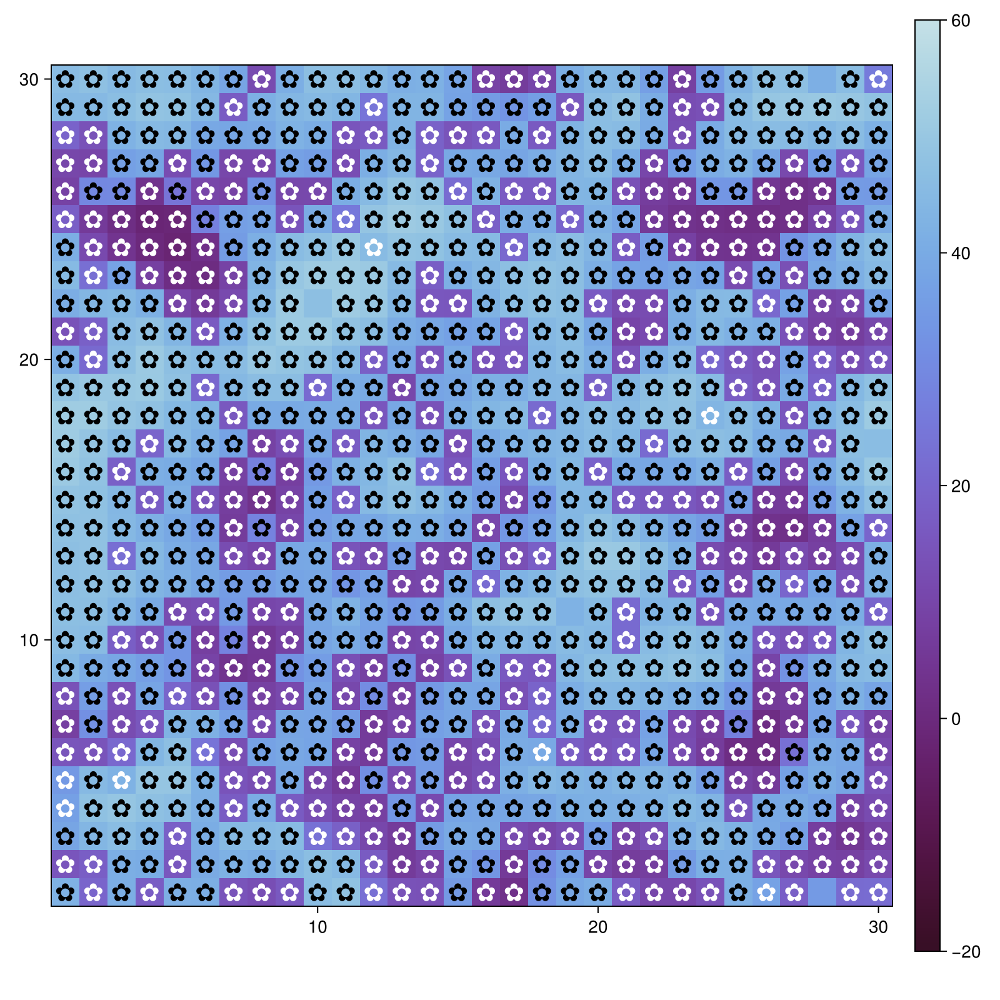{#fig-002 width=70%}

##

{#fig-003 width=70%}

##

Создала ноутбук с скрипта из первой лабораторной работы и выполнила его

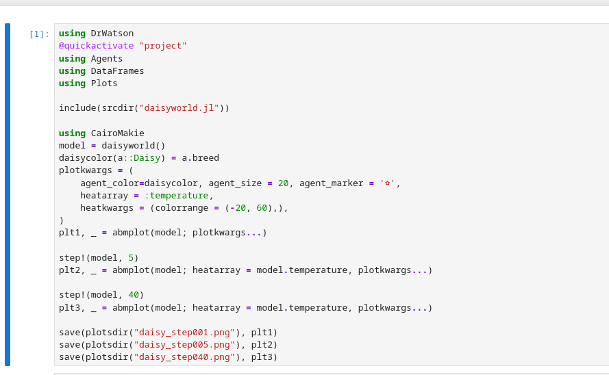{#fig-004 width=70%}

## Анимация модели

Выполнила предложенный код для анимации эволюции модели и поместила результирующий файл на видеохостинг

[Анимация модели daisyworld](https://rutube.ru/video/private/feff8c487cd2be7bb87562338c0ed33c/?p=Y_D54CRwNDJOpFvgVwrgig)

## Динамика числа маргариток

Выполнила файл scripts/daisyworld-count.jl ([Рис. @fig-005])

{#fig-005 width=70%}

##

Выполнила код в jupyter notebook ([Рис. @fig-006])

{#fig-006 width=70%}

## Динамика модели

Выполнила код, чтобы построит комплексный график изменения числа маргариток, температуры, альбедо в зависимости от модельного времени ([Рис. @fig-007]) 

{#fig-007 width=70%}

##

Я преобразовала код в литературный стиль и выполнила код в jupyter notebook ([Рис. @fig-008])

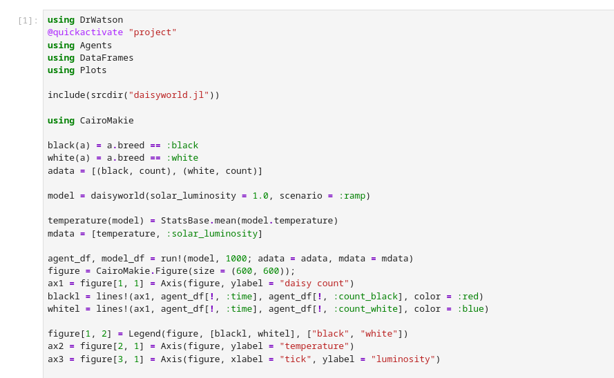{#fig-008 width=70%}

## Базовая визуализация (параметры)

Выполнила код для визуализации за счет параметров ([Рис. @fig-009])

{#fig-009 width=70%}

##

{#fig-010 width=70%}

##

{#fig-011 width=70%}

##

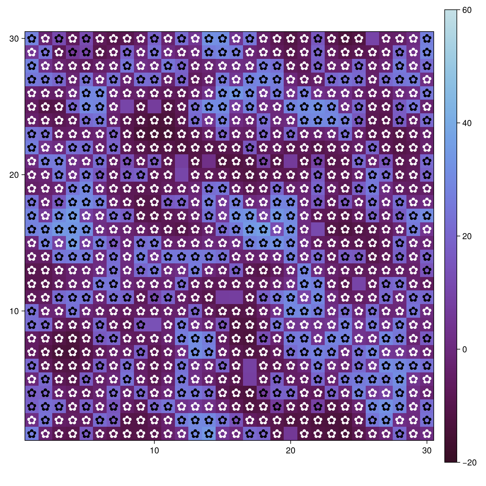{#fig-012 width=70%}

##

{#fig-013 width=70%}

##

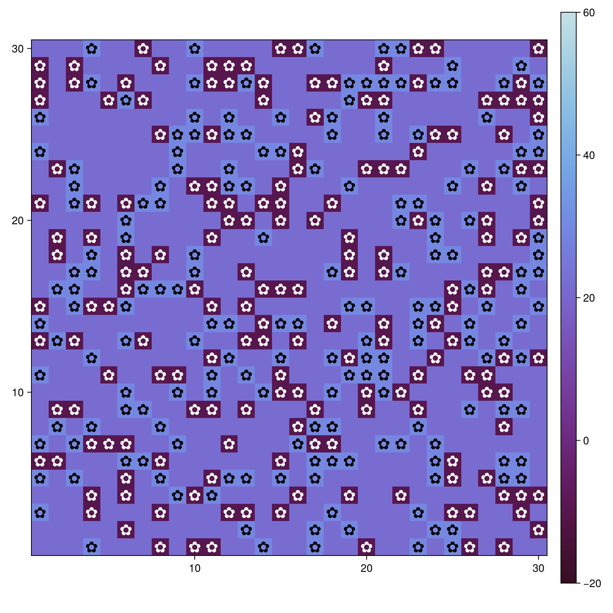{#fig-014 width=70%}

##

{#fig-015 width=70%}

##

{#fig-016 width=70%}

##

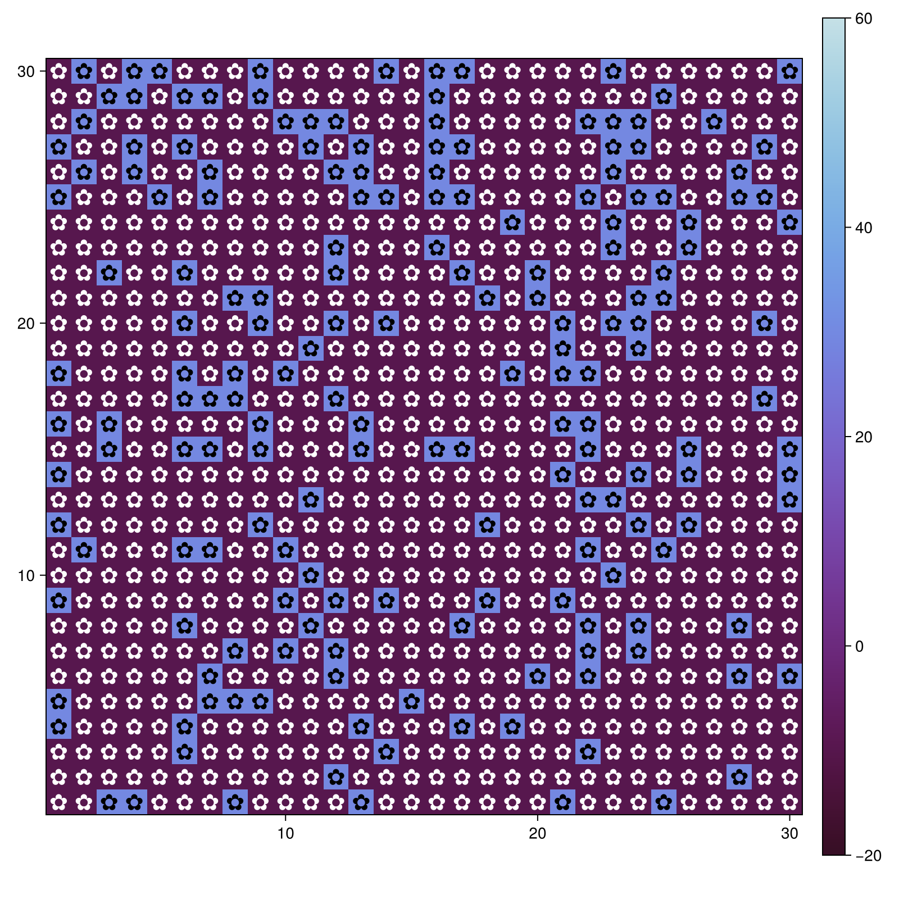{#fig-017 width=70%}

##

{#fig-018 width=70%}

##

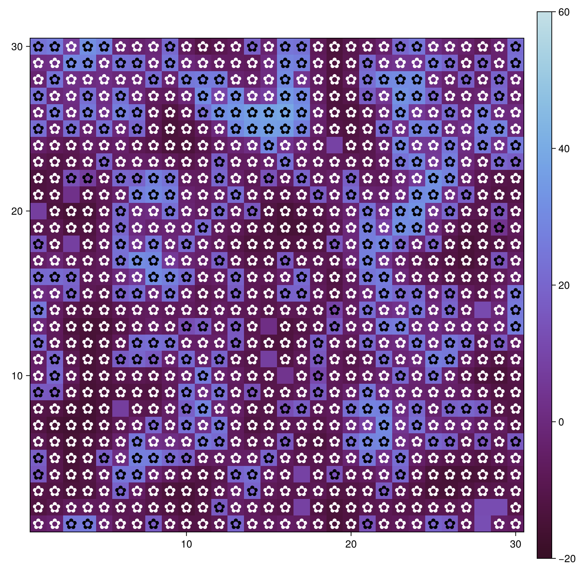{#fig-019 width=70%}

##

{#fig-020 width=70%}

##

Преобразовала код в литературный стиль и выполнила код в jupyter ([Рис. @fig-021])

{#fig-021 width=70%}

## Динамика числа маргариток (параметры)

Выполнила код для динамики модели числа маргариток для набора параметров ([Рис. @fig-022])

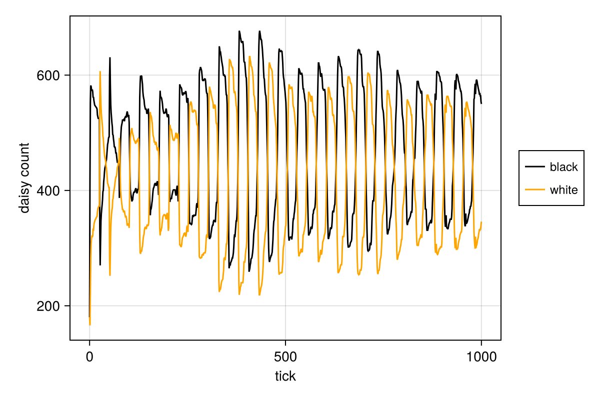{#fig-022 width=70%}

##

{#fig-023 width=70%}

##

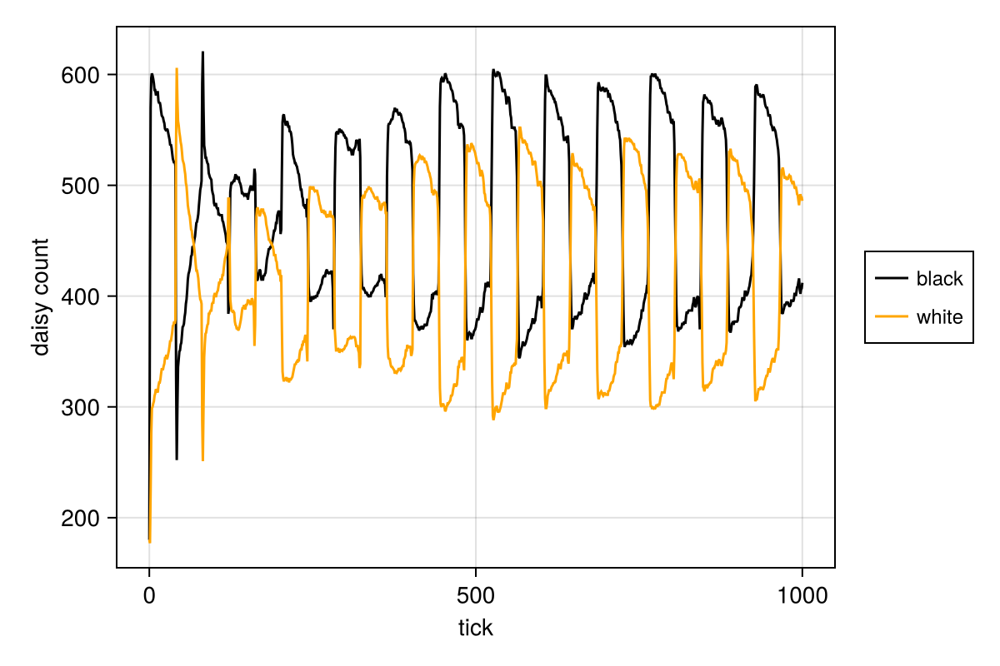{#fig-024 width=70%}

##

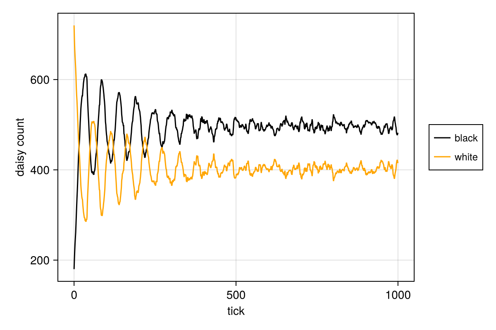{#fig-025 width=70%}

##

Преобразовала код в литературный стиль и выполнила код в jupyter ([Рис. @fig-026])

{#fig-026 width=70%}

## Динамика модели (параметры)

Выполнила скрипт для динамики модели с параметрами ([Рис. @fig-027])

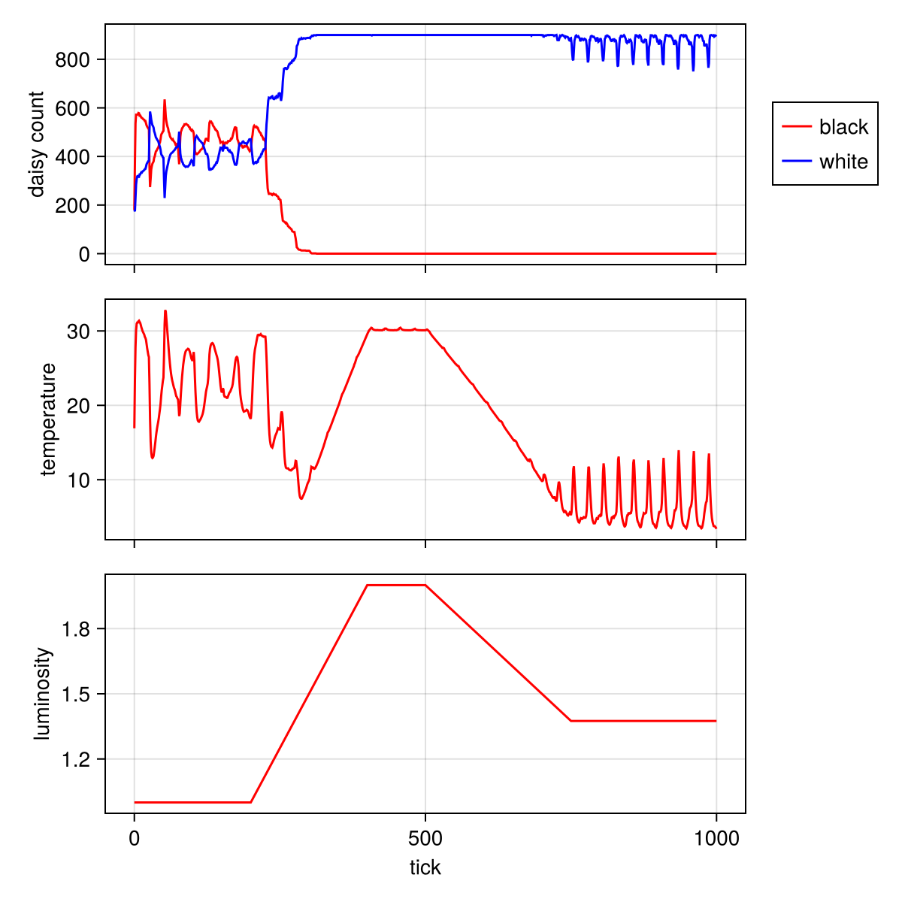{#fig-027 width=70%}

##

{#fig-028 width=70%}

##

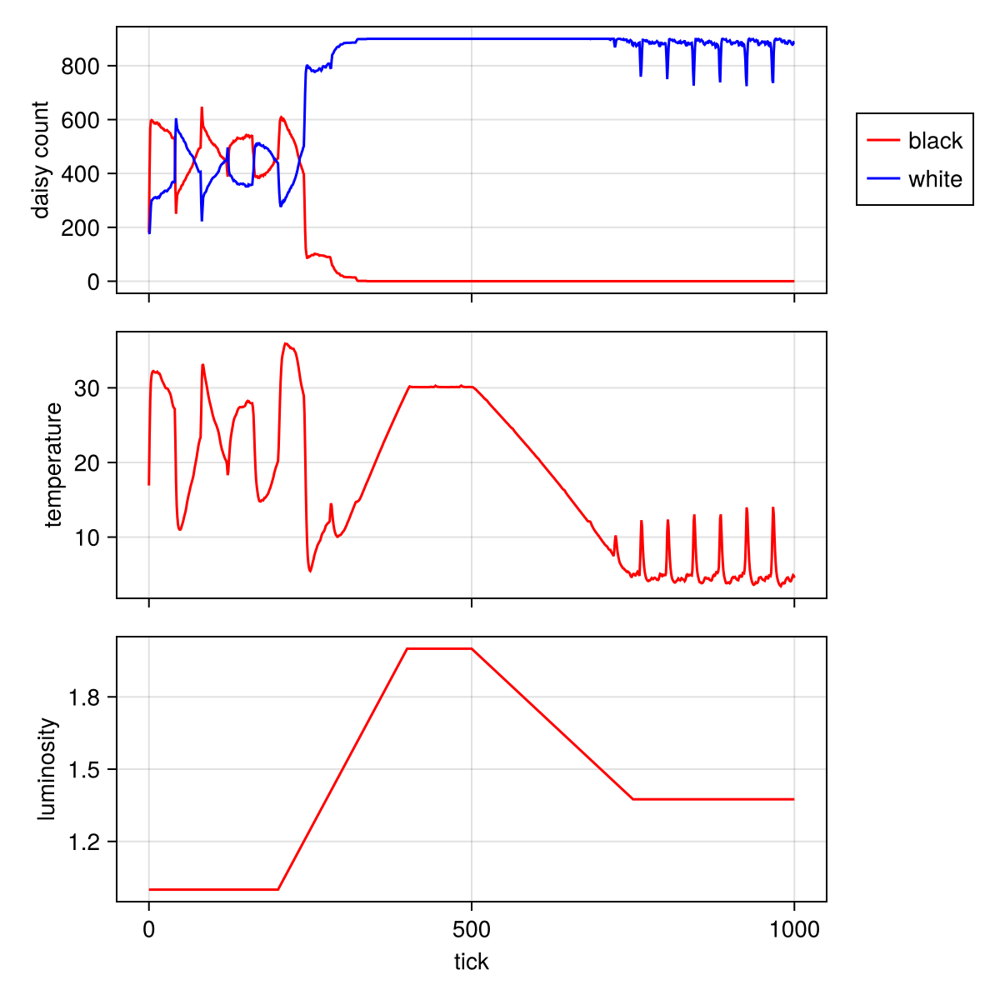{#fig-029 width=70%}

##

{#fig-030 width=70%}

##

Преобразовала код в литературный стиль и выполнила код в jupyter ([Рис. @fig-031])

{#fig-031 width=70%}

# Выводы

При выполнении данной работы я применила агентный подход к иммитационному моделированию в модели daisyworld и познакомилась с моделем daisyworld.


