---
## Author
author:
  name: Вакутайпа Милдред
  degrees: BSc
  orcid: 0009-0001-3145-3518
  email: 1032239009@rudn.ru
  affiliation:
    - name: Российский университет дружбы народов
      country: Российская Федерация
      postal-code: 117198
      city: Москва
      address: ул. Миклухо-Маклая, д. 6

## Title
title: "Отчёт по лабораторной работе №3"
subtitle: "Агентное Моделирование"
license: "CC BY"
---

# Цель работы

Цель данной работы -- применять агентный подход к иммитационному моделированию в модели daisyworld, познакомиться с моделем daisyworld.

# Задание

1. Создать рабочий каталог для кода.
2. Установить необходимые пакеты.
3. Выполнить предложенный код.
4. Преобразовать код в литературный стиль.
5. Сгенерировать из литературного кода:
	— чистый код;
	— jupyter notebook;
	— документацию в формате Quarto.
6. Выполнить код из jupyter notebook.
7. Интегрировать документацию в формате Quarto в отчёт.

# Теоретическое введение

Агентный подход к имитационному моделированию (Agent-Based Modeling, ABM) — это метод исследования сложных систем, в котором поведение системы возникает из взаимодействия множества автономных сущностей, называемых агентами.
Вместо того чтобы описывать систему глобальными уравнениями, мы моделируем каждую индивидуальную единицу и правила её поведения, а затем наблюдаем, какие коллективные паттерны появляются снизу вверх. Этот подход особенно полезен, когда поведение системы трудно предсказать из-за нелинейностей, гетерогенности участников или адаптивных стратегий.

## Компоненты агентных моделей

1. Агенты: независимые сущности со своими собственными атрибутами и правилами поведения.
2. Окружающая среда: Пространство, в котором существуют и взаимодействуют агенты.
3. Правила взаимодействия: Руководящие принципы, определяющие, как агенты взаимодействуют друг с другом и со своим окружением.
4. Возникновение: закономерности или результаты системного уровня, возникающие в результате простых взаимодействий между агентами.

## Модель Daisyworld

Мир маргариток - это очень простая планета, на поверхности которой обитают только два вида жизни - белые и черные маргаритки. Предполагается, что планета хорошо орошается, и все дожди выпадают ночью, так что дни стоят безоблачные. Предполагается, что содержание водяного пара и CO2 в атмосфере остается постоянным, так что парниковый эффект планеты не меняется. Ключевым аспектом Daisyworld является то, что два вида маргариток имеют разные цвета и, следовательно, разные альбедо. Таким образом, маргаритки могут изменять температуру поверхности, на которой они растут.

Для этой модели, агенты являются маргаритками двух типов — чёрные (black) и белые (white), пространство -- двумерная квадратная сетка (например, 30×30) с периодическими границами, параметры -- luminosity – солнечная постоянная (может изменяться со временем); albedo_black, albedo_white – альбедо чёрных и белых маргариток; surface_albedo — альбедо пустой почвы;  max_age — максимальный возраст маргаритки.

# Выполнение лабораторной работы

До начала работы с модели, я создала рабочий каталог под названием "project". Для этого я использовала следующие строки:

``` julia
using DrWatson
initialize_project("project"; authors='Milly', git=false)

```

далее я загрузила необходимые пакеты с помощью команда Pkg.add("имя пакета"). После этого я создала файл src/daisyworld.jl и выполнила его:

``` julia

using Agents
import StatsBase
using Random

@agent struct Daisy(GridAgent{2})
    breed::Symbol
    age::Int
    albedo::Float64
end

function update_surface_temperature!(pos, model)
    absorbed_luminosity = if isempty(pos, model)
        (1 - model.surface_albedo) * model.solar_luminosity
    else
        daisy = model[id_in_position(pos, model)]
        (1 - daisy.albedo) * model.solar_luminosity
    end
    local_heating = absorbed_luminosity > 0 ? 72 * log(absorbed_luminosity) + 80 : 80
    model.temperature[pos...] = (model.temperature[pos...] + local_heating) / 2
end

function diffuse_temperature!(pos, model)
    ratio = model.ratio
    npos = nearby_positions(pos, model)
    model.temperature[pos...] = (1 - ratio) * model.temperature[pos...] + 
                                 sum(model.temperature[p...] for p in npos) * 0.125 * ratio
end

function propagate!(pos, model)
    isempty(pos, model) && return
    daisy = model[id_in_position(pos, model)]
    temperature = model.temperature[pos...]
    seed_threshold = (0.1457 * temperature - 0.0032 * temperature^2) - 0.6443
    if rand(abmrng(model)) < seed_threshold
        empty_near_pos = random_nearby_position(pos, model, 1, npos->isempty(npos, model))
        if !isnothing(empty_near_pos)
            add_agent!(empty_near_pos, model, daisy.breed, 0, daisy.albedo)
        end
    end
end

function daisy_step!(agent::Daisy, model)
    agent.age += 1
    agent.age >= model.max_age && remove_agent!(agent, model)
end

function daisyworld_step!(model)
    for p in positions(model)
        update_surface_temperature!(p, model)
        diffuse_temperature!(p, model)
        propagate!(p, model)
    end
    model.tick = model.tick + 1
    solar_activity!(model)
end

function solar_activity!(model)
    if model.scenario == :ramp
        if model.tick > 200 && model.tick <= 400
            model.solar_luminosity += model.solar_change
        end
        if model.tick > 500 && model.tick <= 750
            model.solar_luminosity -= model.solar_change / 2
        end
    elseif model.scenario == :change
        model.solar_luminosity += model.solar_change
    end
end

function daisyworld(;
    griddims = (30, 30),
    max_age = 25,
    init_white = 0.2,
    init_black = 0.2,
    albedo_white = 0.75,
    albedo_black = 0.25,
    surface_albedo = 0.4,
    solar_change = 0.005,
    solar_luminosity = 1.0, 
    scenario = :default,
    seed = 165)

    rng = MersenneTwister(seed)
    space = GridSpaceSingle(griddims)
    
    properties = (;
        max_age, 
        surface_albedo, 
        solar_luminosity, 
        solar_change, 
        scenario, 
        tick = 0, 
        ratio = 0.5, 
        temperature = zeros(griddims)
    )
    properties = Dict(k=>v for (k,v) in pairs(properties))
    
    model = StandardABM(Daisy, space; 
                       properties, 
                       rng, 
                       agent_step! = daisy_step!, 
                       model_step! = daisyworld_step!)
    
    grid = collect(positions(model))
    num_positions = prod(griddims)

    white_positions = StatsBase.sample(grid, Int(init_white * num_positions); replace = false)
    for wp in white_positions
        add_agent!(wp, Daisy, model, :white, rand(abmrng(model), 0:max_age), albedo_white)
    end

    allowed = setdiff(grid, white_positions)
    black_positions = StatsBase.sample(allowed, Int(init_black * num_positions); replace = false)
    for bp in black_positions
        add_agent!(bp, Daisy, model, :black, rand(abmrng(model), 0:max_age), albedo_black)
    end

    for p in positions(model)
        update_surface_temperature!(p, model)
    end
    
    return model
end

```

После этого, я делала базовую визуализацию с помощью скрипта scripts/daisyworld-animate.jl. Построила тепловую карту, которая представлять собой температуру поверхности модели. Маргаритки будут отображаться черно-белыми в соответствии с их видом ([Рис. @fig-001]), ([Рис. @fig-002]), ([Рис. @fig-003]).

``` julia

using DrWatson
@quickactivate "project"
using Agents
using DataFrames
using Plots

include(srcdir("daisyworld.jl"))

using CairoMakie
model = daisyworld()
daisycolor(a::Daisy) = a.breed
plotkwargs = (
	agent_color=daisycolor, agent_size = 20, agent_marker = '✿',
	heatarray = :temperature,
	heatkwargs = (colorrange = (-20, 60),),
)
plt1, _ = abmplot(model; plotkwargs...)

step!(model, 5)
plt2, _ = abmplot(model; heatarray = model.temperature, plotkwargs...)

step!(model, 40)
plt3, _ = abmplot(model; heatarray = model.temperature, plotkwargs...)

save(plotsdir("daisy_step001.png"), plt1)
save(plotsdir("daisy_step005.png"), plt2)
save(plotsdir("daisy_step040.png"), plt3)

```

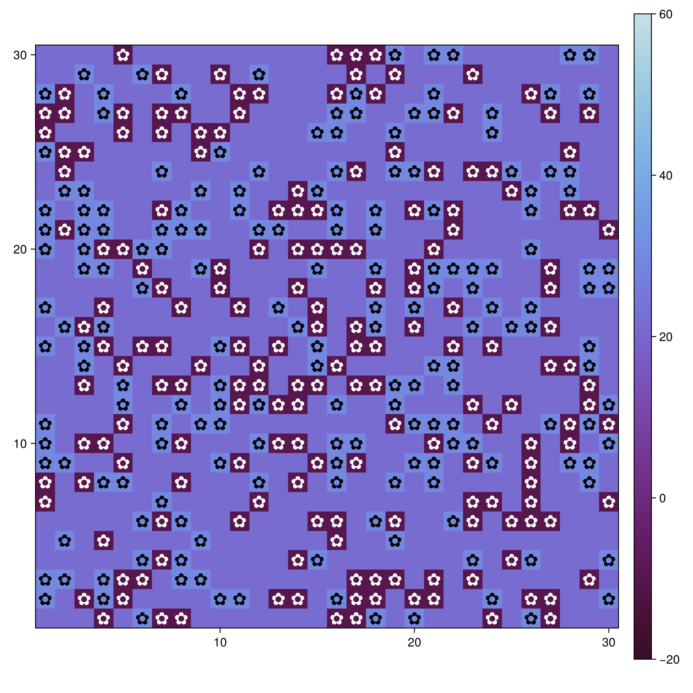{#fig-001 width=70%}

{#fig-002 width=70%}

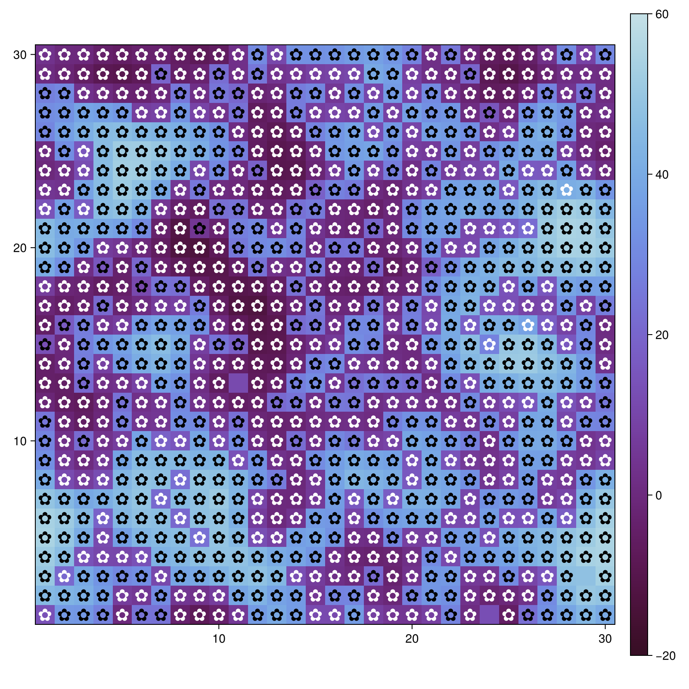{#fig-003 width=70%}

Создала ноутбук с скрипта и первой лабораторной работы и выполнила его

{#fig-004 width=70%}

Выполнила код для анимации эволюции модели

``` julia

using DrWatson
@quickactivate "project"
using Agents
using DataFrames
using Plots

include(srcdir("daisyworld.jl"))

using CairoMakie
model = daisyworld()

daisycolor(a::Daisy) = a.breed

plotkwargs = (
		agent_color = daisycolor, agent_size = 20, agent_marker = '✿',
		heatarray = :temperature,
		heatkwargs = (colorrange = (-20, 60),),)
		
abmvideo(
	plotsdir("simulation.mp4"),
	model;
	title = "Daisy World",
	frames = 60,
	plotkwargs...,)

```

Поместила результирующий файл на видеохостинг

[Анимация модели daisyworld](https://rutube.ru/video/private/feff8c487cd2be7bb87562338c0ed33c/?p=Y_D54CRwNDJOpFvgVwrgig)

Выполнила файл scripts/daisyworld-count.jl ([Рис. @fig-005])

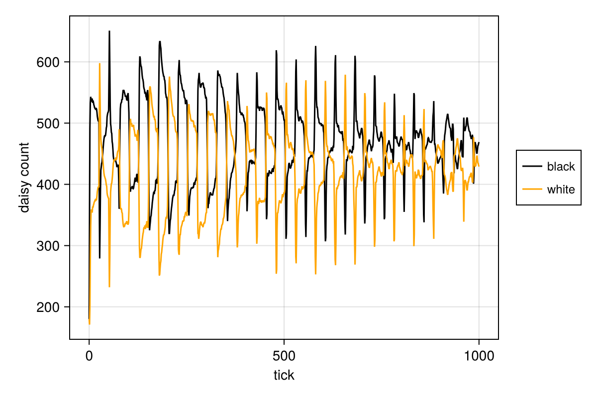{#fig-005 width=70%}

Выполнила код в jupyter notebook ([Рис. @fig-006])

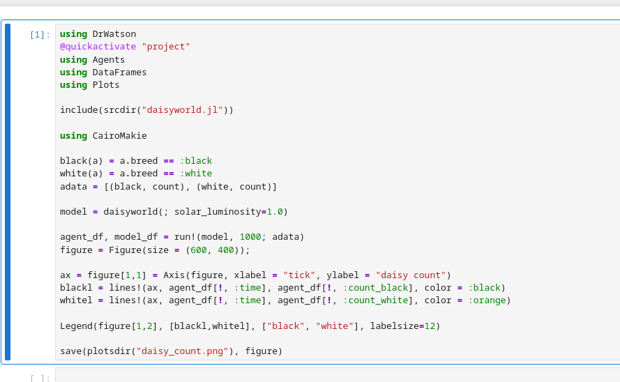{#fig-006 width=70%}

Выполнила код, чтобы построит комплексный график изменения числа маргариток, температуры, альбедо в зависимости от модельного времени ([Рис. @fig-007]) 

``` julia

using DrWatson
@quickactivate "project"
using Agents
using DataFrames
using Plots

include(srcdir("daisyworld.jl"))

using CairoMakie

black(a) = a.breed == :black
white(a) = a.breed == :white
adata = [(black, count), (white, count)]

model = daisyworld(solar_luminosity = 1.0, scenario = :ramp)

temperature(model) = StatsBase.mean(model.temperature)
mdata = [temperature, :solar_luminosity]

agent_df, model_df = run!(model, 1000; adata = adata, mdata = mdata)
figure = CairoMakie.Figure(size = (600, 600));
ax1 = figure[1, 1] = Axis(figure, ylabel = "daisy count")
blackl = lines!(ax1, agent_df[!, :time], agent_df[!, :count_black], color = :red)
whitel = lines!(ax1, agent_df[!, :time], agent_df[!, :count_white], color = :blue)

figure[1, 2] = Legend(figure, [blackl, whitel], ["black", "white"])
ax2 = figure[2, 1] = Axis(figure, ylabel = "temperature")
ax3 = figure[3, 1] = Axis(figure, xlabel = "tick", ylabel = "luminosity")

lines!(ax2, model_df[!, :time], model_df[!, :temperature], color = :red)
lines!(ax3, model_df[!, :time], model_df[!, :solar_luminosity], color = :red)
for ax in (ax1, ax2); ax.xticklabelsvisible = false; end

save(plotsdir("daisy_luminosity.png"), figure)


```

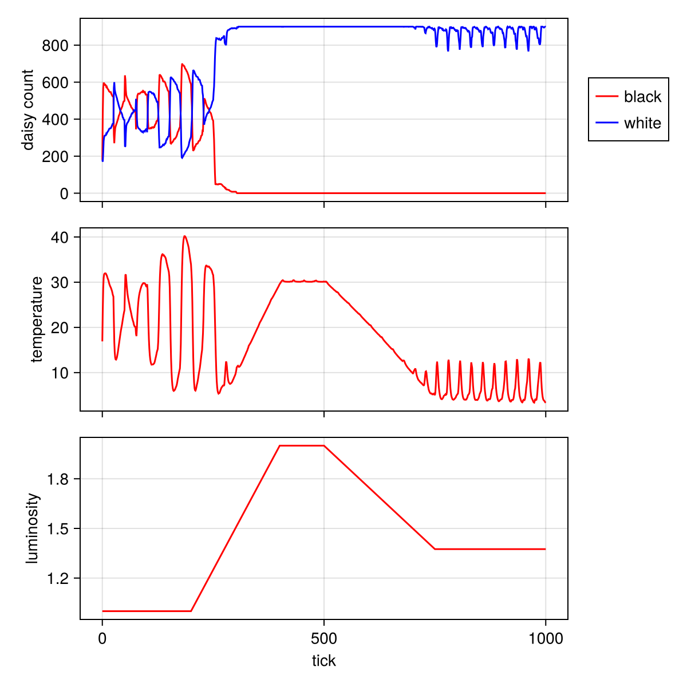{#fig-007 width=70%}

Я преобразовала код в литературный стиль и выполнила код в jupyter notebook ([Рис. @fig-008])

{#fig-008 width=70%}

Выполнила код для визуализации за счет параметров ([Рис. @fig-009])

``` julia

using DrWatson
@quickactivate "project"
using Agents
using DataFrames
using Plots
using CairoMakie

include(srcdir("daisyworld.jl"))

param_dict = Dict(
	:griddims => (30, 30),
	:max_age => [25, 40],
	:init_white => [0.2, 0.8],
	:albedo_white => 0.75,
	:albedo_black => 0.25,
	:surface_albedo => 0.4,
	:solar_change => 0.005,
	:solar_luminosity => 1.0,
	:scenario => :default,
	:seed => 165,
	
	)
	
params_list = dict_list(param_dict)

for params in params_list

	model = daisyworld(;params...)
	daisycolor(a::Daisy) = a.breed
	plotkwargs = (
		agent_color=daisycolor,
		agent_size = 20,
		agent_marker = '✿',
		heatarray = :temperature,
		heatkwargs = (colorrange = (-20, 60),),
	)
	plt1, _ = abmplot(model; plotkwargs...)

	step!(model, 5)
	plt2, _ = abmplot(model; heatarray = model.temperature, plotkwargs...)
	step!(model, 40)
	plt3, _ = abmplot(model; heatarray = model.temperature, plotkwargs...)

	plt1_name = savename("daisyworld",params) * "_step01" * ".png"
	plt2_name = savename("daisyworld",params) * "_step04" * ".png"
	plt3_name = savename("daisyworld",params) * "_step40" * ".png"

	save(plotsdir(plt1_name), plt1)
	save(plotsdir(plt2_name), plt2)
	save(plotsdir(plt3_name), plt3)

end

```

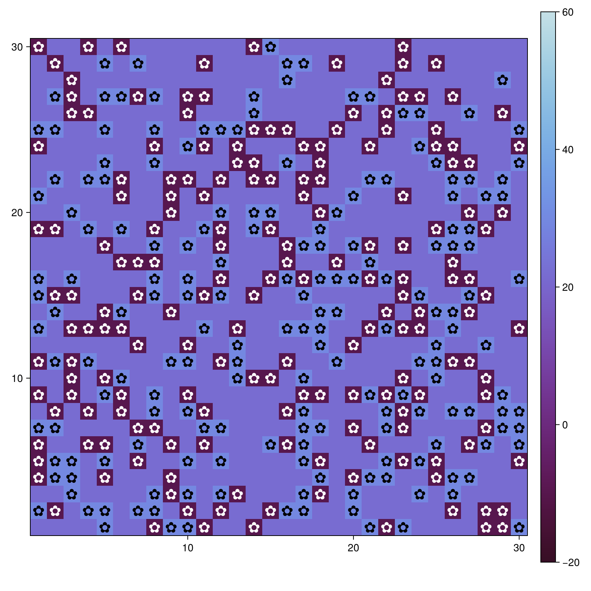{#fig-009 width=70%}

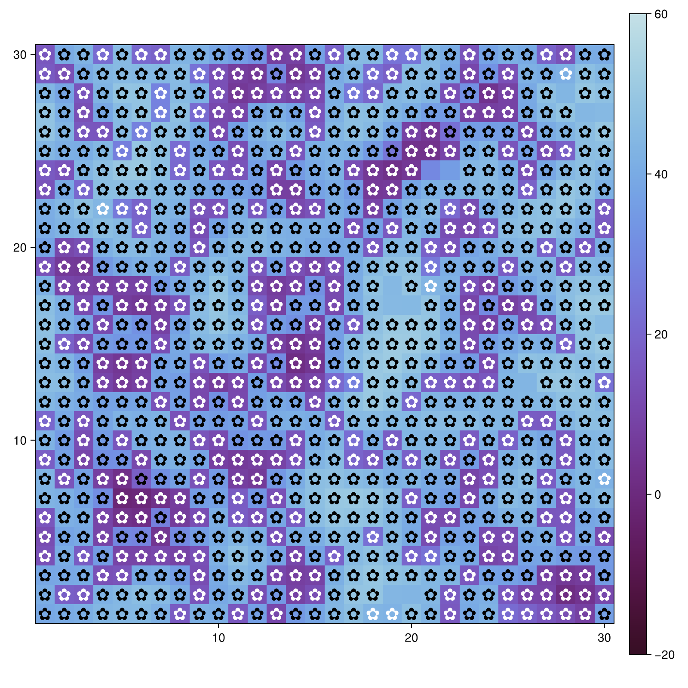{#fig-010 width=70%}

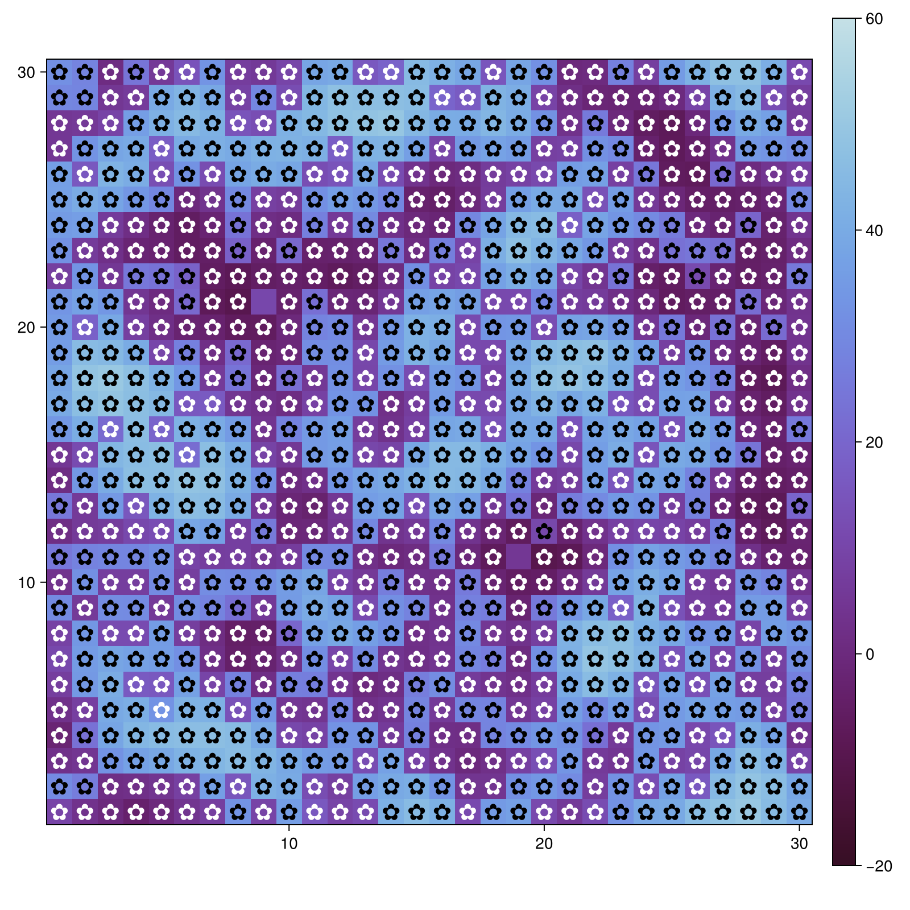{#fig-011 width=70%}

{#fig-012 width=70%}

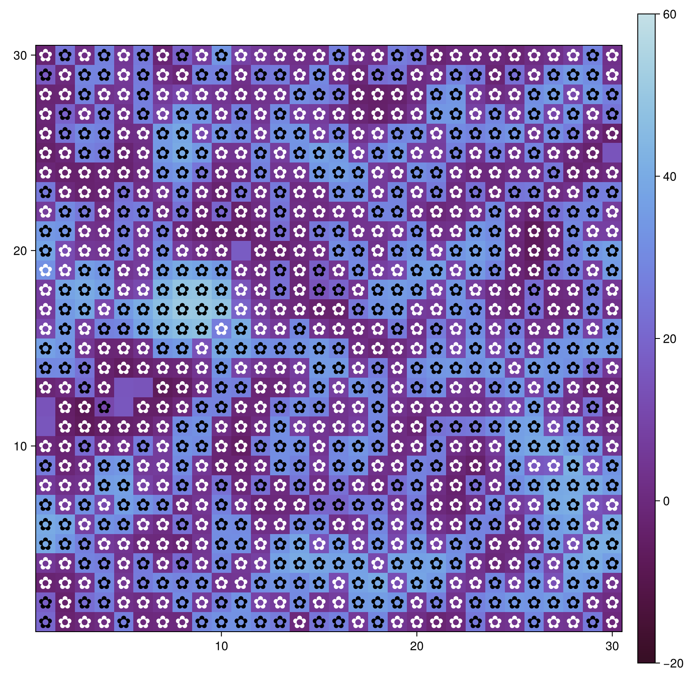{#fig-013 width=70%}

{#fig-014 width=70%}

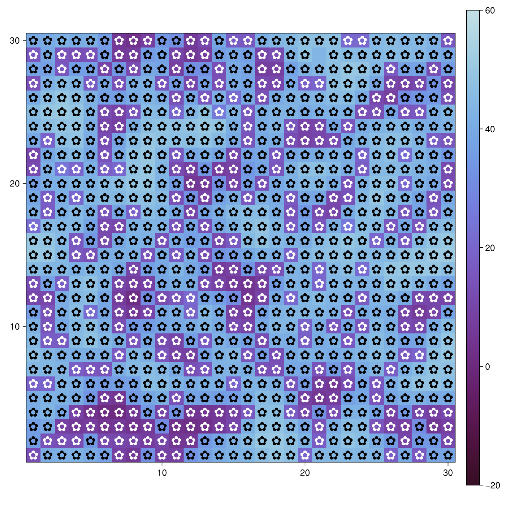{#fig-015 width=70%}

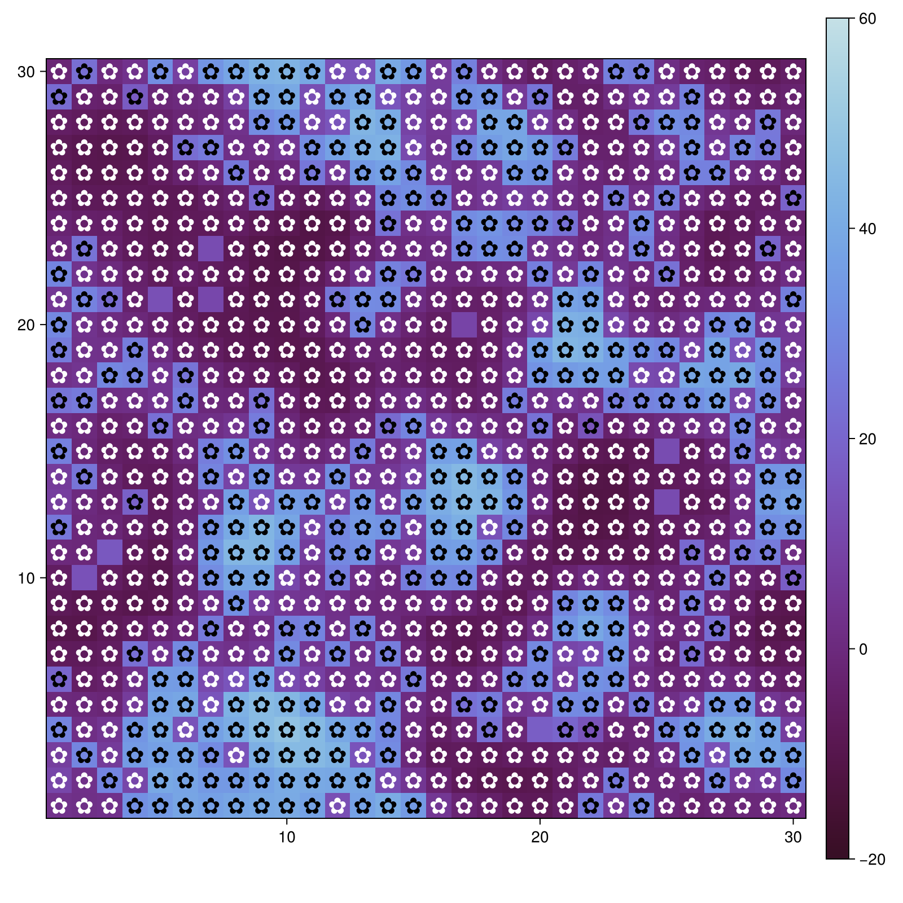{#fig-016 width=70%}

{#fig-017 width=70%}

{#fig-018 width=70%}

{#fig-019 width=70%}

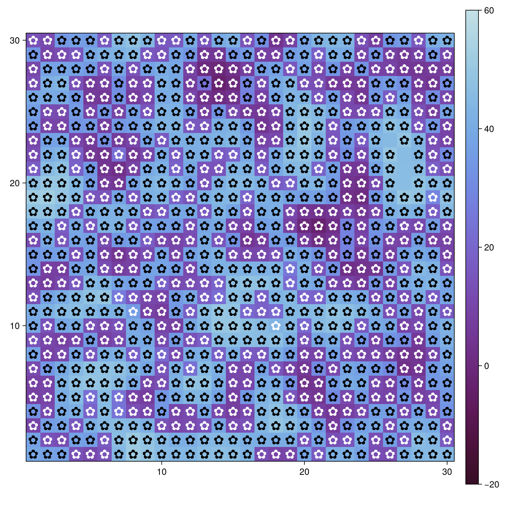{#fig-020 width=70%}

Преобразовала код в литературный стиль и выполнила код в jupyter ([Рис. @fig-021])

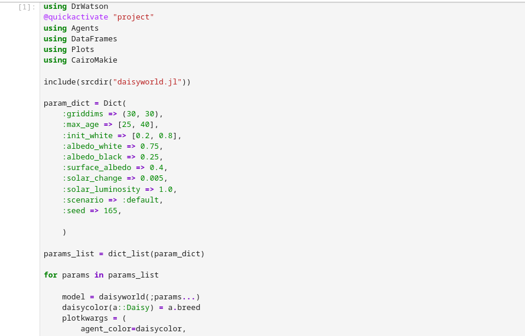{#fig-021 width=70%}

Выполнила код для динамики модели числа маргариток для набора параметров ([Рис. @fig-022])

``` julia

using DrWatson
@quickactivate "project"
using Agents
using DataFrames
using Plots
using CairoMakie

include(srcdir("daisyworld.jl"))

black(a) = a.breed == :black
white(a) = a.breed == :white
adata = [(black, count), (white, count)]

param_dict = Dict(
	:griddims => (30, 30),
	:max_age => [25, 40],
	:init_white => [0.2, 0.8],
	:init_black => 0.2,
	:albedo_white => 0.75,
	:albedo_black => 0.25,
	:surface_albedo => 0.4,
	:solar_change => 0.005,
	:solar_luminosity => 1.0,
	:scenario => :default,
	:seed => 165,
	)
	
params_list = dict_list(param_dict)
for params in params_list
	model = daisyworld(;params...)
	agent_df, model_df = run!(model, 1000; adata)
	figure = Figure(size = (600, 400));
	ax = figure[1, 1] = Axis(figure, xlabel = "tick", ylabel = "daisy count")
	blackl = lines!(ax, agent_df[!, :time], agent_df[!, :count_black], color = :black)
	whitel = lines!(ax, agent_df[!, :time], agent_df[!, :count_white], color = :orange)
	Legend(figure[1, 2], [blackl, whitel], ["black", "white"], labelsize = 12)
	plt_name = savename("daisy-count",params) * ".png"
	save(plotsdir(plt_name), figure)
	
end

```

{#fig-022 width=70%}

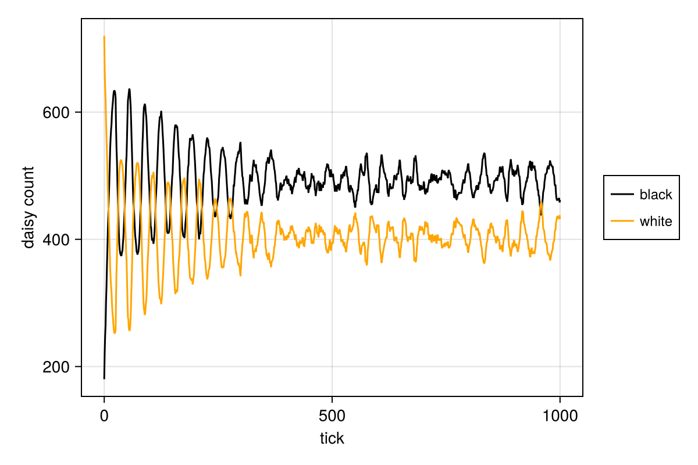{#fig-023 width=70%}

{#fig-024 width=70%}

{#fig-025 width=70%}

Преобразовала код в литературный стиль и выполнила код в jupyter ([Рис. @fig-026])

{#fig-026 width=70%}

Выполнила скрипт для динамики модели с параметрами ([Рис. @fig-027])

``` julia

using DrWatson
@quickactivate "project"
using Agents
using DataFrames
using Plots
using CairoMakie

include(srcdir("daisyworld.jl"))

black(a) = a.breed == :black
white(a) = a.breed == :white
adata = [(black, count), (white, count)]

param_dict = Dict(
	:griddims => (30, 30),
	:max_age => [25, 40],
	:init_white => [0.2, 0.8],
	:init_black => 0.2,
	:albedo_white => 0.75,
	:albedo_black => 0.25,
	:surface_albedo => 0.4,
	:solar_change => 0.005,
	:solar_luminosity => 1.0,
	:scenario => :ramp,
	:seed => 165,
	)
	
params_list = dict_list(param_dict)
for params in params_list
	model = daisyworld(;params...)
	temperature(model) = StatsBase.mean(model.temperature)
	mdata = [temperature, :solar_luminosity]
	agent_df, model_df = run!(model, 1000; adata = adata, mdata =mdata)
	figure = CairoMakie.Figure(size = (600, 600));
	ax1 = figure[1, 1] = Axis(figure, ylabel = "daisy count")
	blackl = lines!(ax1, agent_df[!, :time], agent_df[!, :count_black], color = :red)
	whitel = lines!(ax1, agent_df[!, :time], agent_df[!, :count_white], color = :blue)
	figure[1, 2] = Legend(figure, [blackl, whitel], ["black", "white"])
	ax2 = figure[2, 1] = Axis(figure, ylabel = "temperature")
	ax3 = figure[3, 1] = Axis(figure, xlabel = "tick", ylabel ="luminosity")
	lines!(ax2, model_df[!, :time], model_df[!, :temperature], color= :red)
	lines!(ax3, model_df[!, :time], model_df[!, :solar_luminosity], color = :red)
	for ax in (ax1, ax2); ax.xticklabelsvisible = false; end
	plt_name = savename("daisy-luminosity",params) * ".png"
	save(plotsdir(plt_name), figure)
end	

```

{#fig-027 width=70%}

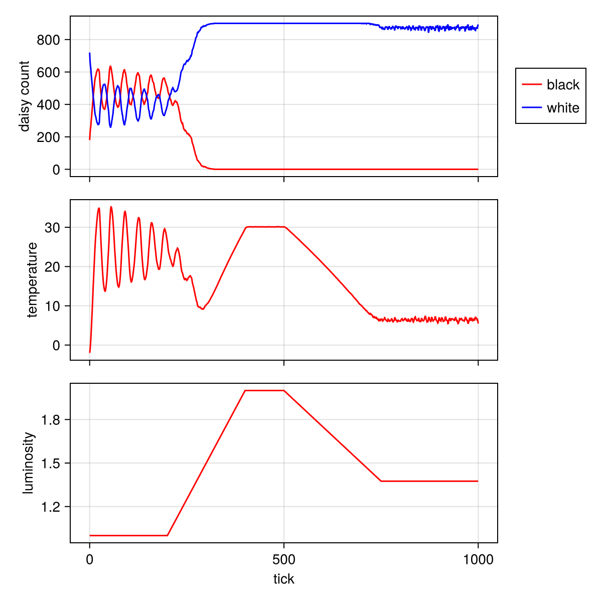{#fig-028 width=70%}

{#fig-029 width=70%}

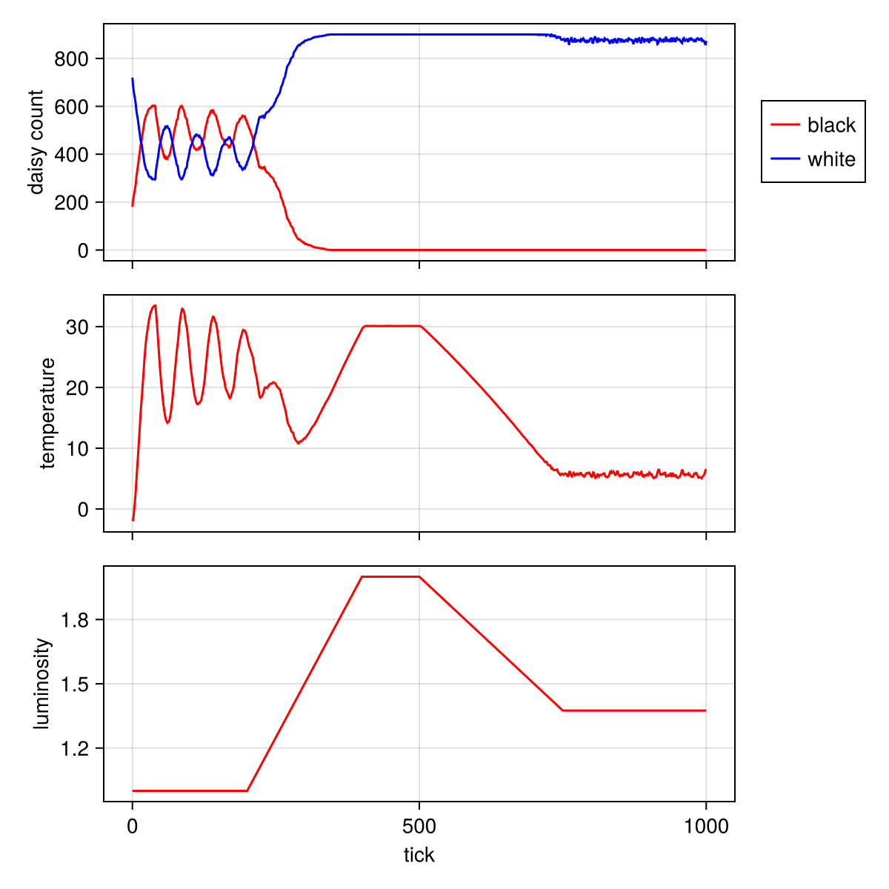{#fig-030 width=70%}

Преобразовала код в литературный стиль и выполнила код в jupyter ([Рис. @fig-031])

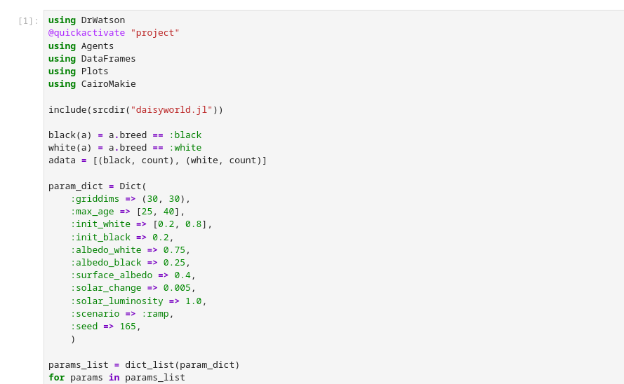{#fig-031 width=70%}

# Выводы

При выполнении данной работы я применила агентный подход к иммитационному моделированию в модели daisyworld и познакомилась с моделем daisyworld.

# Список литературы{.unnumbered}

[Agent Based Modelling](https://www.geeksforgeeks.org/artificial-intelligence/agent-based-modelling/)

[Daisyworld](https://ccl.northwestern.edu/netlogo/models/Daisyworld)

[А. В. Королькова, Кулябов Д. С. Имитационное моделирование. Практикум](https://esystem.rudn.ru/pluginfile.php/3094247/mod_resource/content/2/simulation-modeling-lab.pdf)

::: {#refs}
:::

