---
## Author
author:
  name: Вакутайпа Милдред
  degrees: BSc
  orcid: 0009-0001-3145-3518
  email: kulyabov-ds@rudn.ru
  affiliation:
    - name: Российский университет дружбы народов
      country: Российская Федерация
      postal-code: 117198
      city: Москва
      address: ул. Миклухо-Маклая, д. 6
## Title
title: Презентация по имитационному моделированию
subtitle: Реализация основных моделей в агентном подходе
license: CC BY
date: today
date-format: "YYYY-MM-DD" # Example: 2025-09-06
---

# Информация

## Докладчик

:::::::::::::: {.columns align=center}
::: {.column width="70%"}

  * Вакутайпа Милдред
  * студентка группы НКНбд-01-23
  * кафедра математического моделирования и исскуственного интеллекта
  * Российский университет дружбы народов им. П. Лумумбы
  * [1032239009@rudn.ru](mailto:1032239009@rudn.ru)
  * <https://wakutaipa.github.io/ru/>

:::
::: {.column width="30%"}


:::
::::::::::::::

# Цель работы

Цель данной работы -- реализовать основных моделей в агентном подходе к имитационному моделированию.

# Задание

1. Создать рабочий каталог для кода.
2. Установить необходимые пакеты.
3. Выполнить предложенный код.
4. Преобразовать код в литературный стиль. 
5. Выполнить код из jupyter notebook.
6. Интегрировать документацию в формате Quarto в отчёт.
7. Ответить на дополнительные задания

# Теоретическое введение

Создадим агентную модель распространения инфекционного заболевания на основе классической компартментальной модели SIR (Susceptible-Infectious-Recovered). Модель будет реализована с использованием пакета Agents.jl. В отличие от классической модели на дифференциальных уравнениях, агентный подход позволит учесть индивидуальные характеристики, пространственную структуру и стохастичность процессов.

# Выполнение лабораторной работы

Используя программмного обеспечения julia и пакт Pkg, я установила DrWatson([рис. @fig-001]).

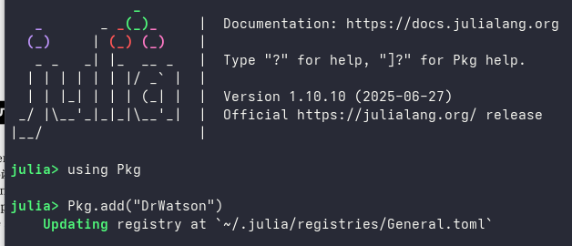{#fig-001 width=70%}

## Создание каталога для проекта

Далее я создала каталог для работы project и в нем установила остальные пакты, которые мне нужно будет ([рис. @fig-002])

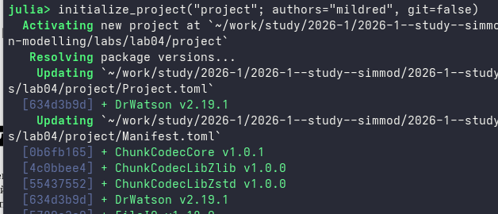{#fig-002 width=70%}

## Модель

Я выполнила предложенный код для модели src/sir_model.jl. В нем описывается агенты, пространство состояния и другие параметры модели.

## график динамики SIR

Далее я выполнила предлоденный код базового эксперимента. 

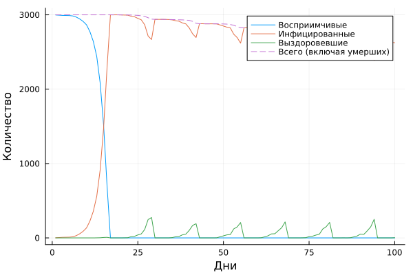{#fig-003 width=70%}

## Сканирование коэффициента заразности

Я выполнила скрипт sir_scan_beta.jl, который исследует, как изменение базовой заразности (β_und и пропорционально β_det) влияет на эпидемические показатели: пик заболеваемости, долю переболевших, число умерших. Выполняется параметрическое сканирование с несколькими повторными прогонами для учёта стохастичности.

## Влияние изменения базовой зврвзности на эпидемические показатели

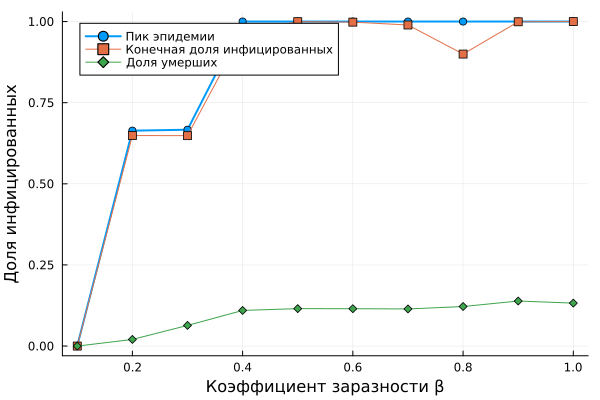{#fig-004 width=70%}

## Исследование эффекта миграции

- Я выполнила предложенный код для исследовавния эффекта миграции scripts/sir_migration_effect.jl

- Инфекция начинается только в одном городе, остальные изначально здоровы.
В ответе получила следующий график ([рис. @fig-005]):

## График эффекта миграции

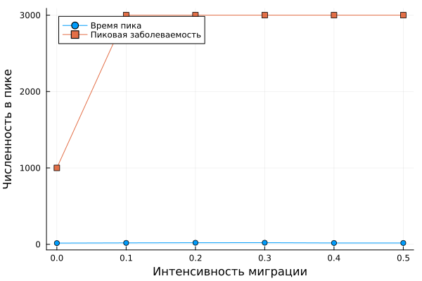{#fig-005 width=70%}

## Многокритериальная оптимизация параметров

- Выполнила код для многокритериальной оптимизации параметров scripts/sir_optimize_parameters.jl. 

{#fig-006 width=70%}

## Сводная визуализация результатов

Выполнила предложенный код для визуализации результатов 

{#fig-007 width=70%}

## Дополнительные задания

1. Я запустила модель с параметрами по умолчанию и построила график динамики численности 𝑆 , 𝐼 , 𝑅 ([рис. @fig-003]). Чтобы определить базовое репродуктивное число R₀ я добавила в коде следующие строка:

```julia

y = 1/params[:infection_period]
B = params[:β_und][1] 
R_0 = B/y

println("базовое репродуктивное число: ", R_0)

```

## Репродуктивное число

В ответе получила ([рис. @fig-008]). 

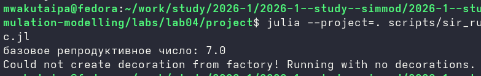{#fig-008 width=70%}

## Миниальное значение 𝛽

2. Чтобы найти минимальное значение 𝛽, при котором возникает эпидемия, я добавила следующие строка в скрипте sir_scan_beta:

```julia

epidemic_threshold = nothing

for row in eachrow(grouped)
	if row.mean_peak > 0.05
		epidemic_threshold = row.beta
		break
	end
end

```

## Миниальное значение 𝛽

Она равна 0.21 и больше чем теоретический порог в 2 раза ([рис. @fig-009])

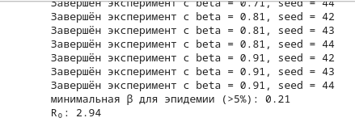{#fig-009 width=70%}

## Эффект гетерогенности 

3. Я создала новый скрипт scripts/sir_diff_cities и исползовала три разные значения параметр 𝛽 для всех городов. Сначала я задала значения 0.0, 0.0, 0.1 и получила в ответе ([рис. @fig-010])

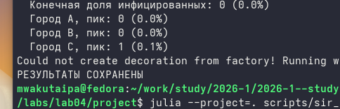{#fig-010 width=70%}

## Эффект гетерогенности 

Я также построила их графики:

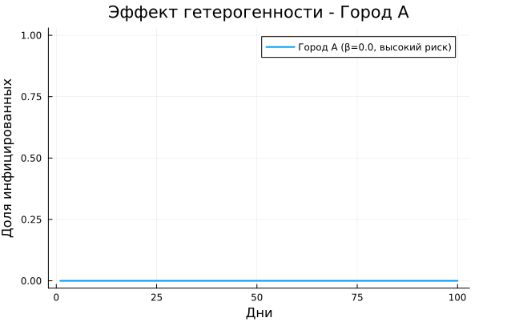{#fig-011 width=70%}

## Эффект гетерогенности 

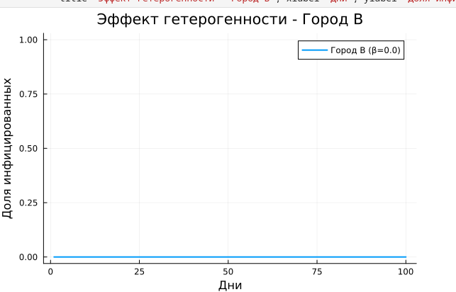{#fig-012 width=70%}

## Эффект гетерогенности 

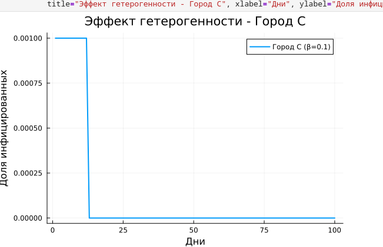{#fig-013 width=70%}

## Эффект гетерогенности 

во вторых потестировала с ззначениями 0.03, 0.1 и 0.4 которые меньше, чем минимальная 𝛽 в первых двух городах и получила в ответе ([рис. @fig-014])

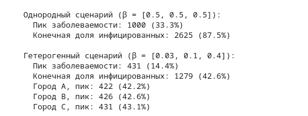{#fig-014 width=70%}

## Эффект гетерогенности 

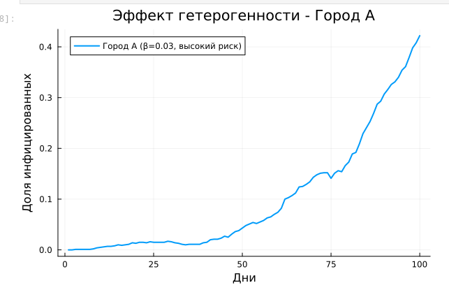{#fig-015 width=70%}

## Эффект гетерогенности 

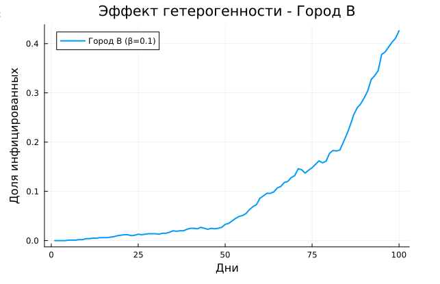{#fig-016 width=70%}

## Эффект гетерогенности 

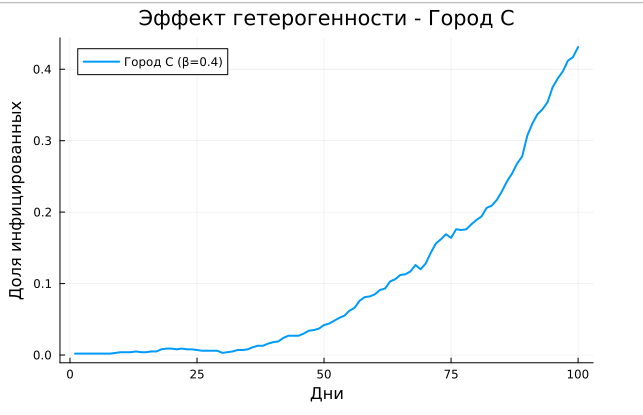{#fig-017 width=70%}

## Эффект гетерогенности 

в последнем варианте я повысила 𝛽 во втором городе в 6 раз и получила в ответе ([рис. @fig-018])   

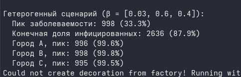{#fig-018 width=70%}

## Эффект гетерогенности 

Графики получились как в исходном графике:

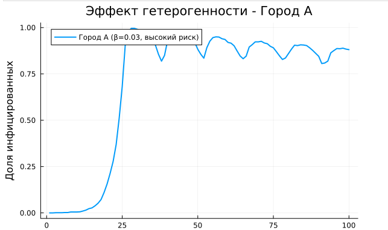{#fig-019 width=70%}

## Эффект гетерогенности 

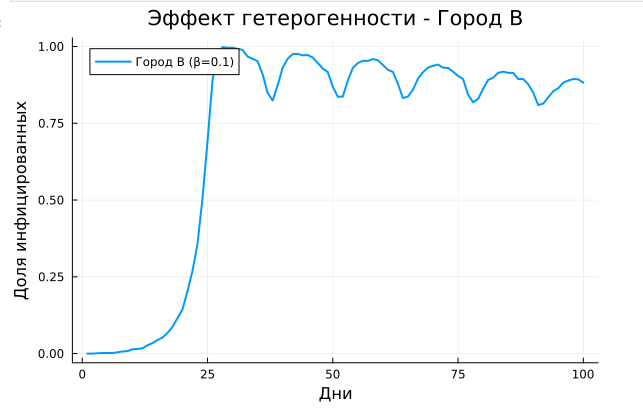{#fig-020 width=70%}

## Эффект гетерогенности 

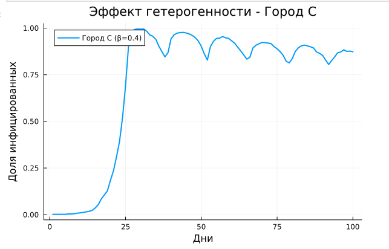{#fig-021 width=70%}

## Исследование эффект миграции

4.  Запускла скрипт sir_migration_effect и проверила созданный датасет чтобы узнать при какой интенсивности миграции наблюдается минимальное время до пика и заметила ,что при интенсивности 0.0 время до пика минимально.

## Эффект карантина

5. Я добавила возможность закрытия города (обнуление миграции из него) при превышении порога заболеваемости. Получила ,что количество умерших уменьшилось но не сильно 

{#fig-022 width=70%}

## Нахождение опитимальных параметров

6. Использовала оптимизацию, чтобы найти параметры, которые минимизируют общее число умерших при сохранении пика заболеваемости ниже 30%. 

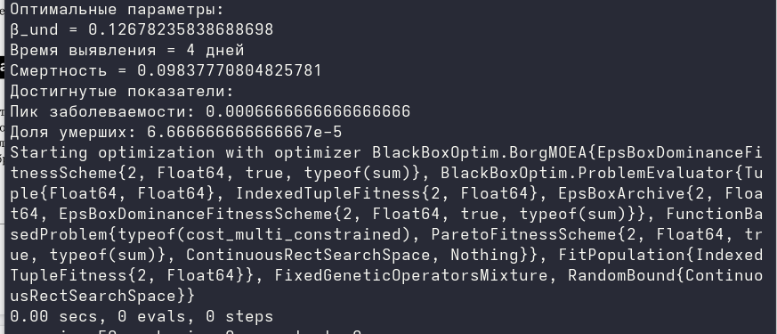{#fig-023 width=70%}

## Применение опитимальных параметров

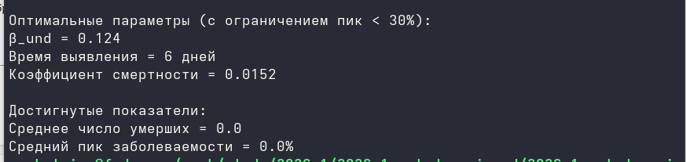{#fig-024 width=70%}

# Выводы

При выполнении данной работы я реализовала основных моделей в агентном подходе к имитационному моделированию.

