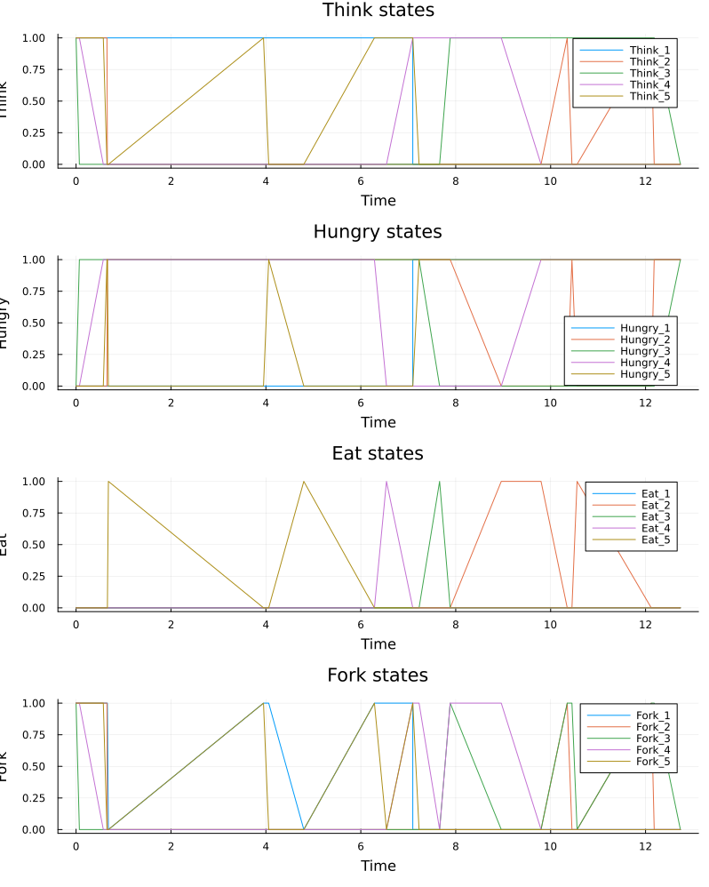
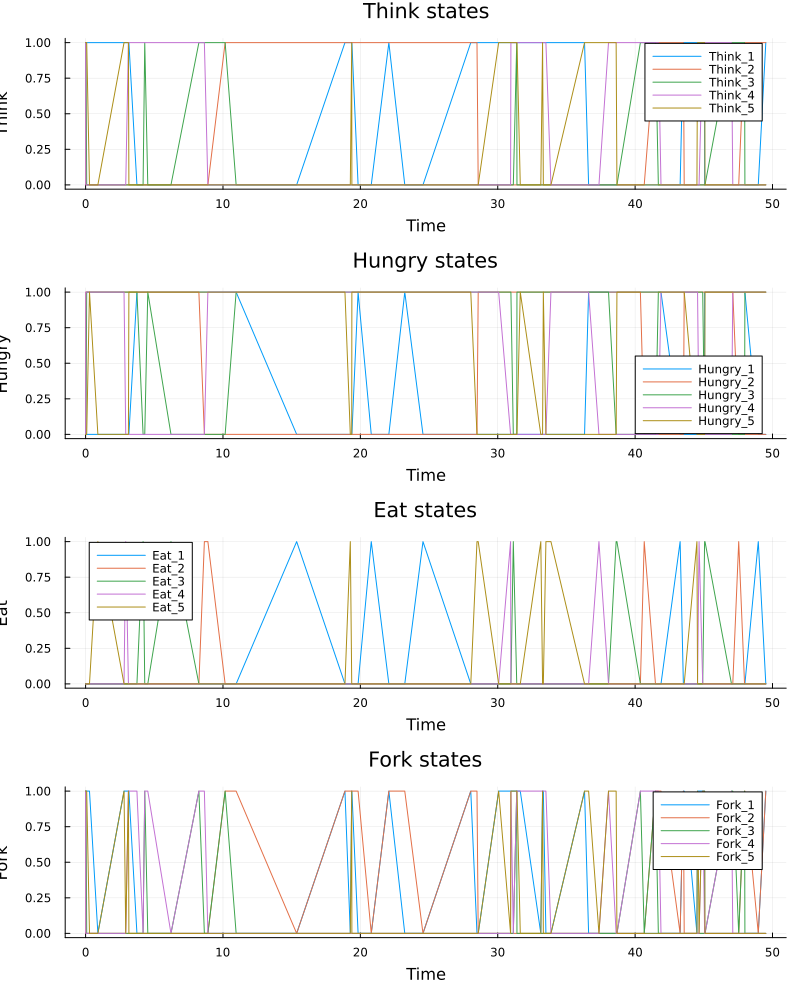
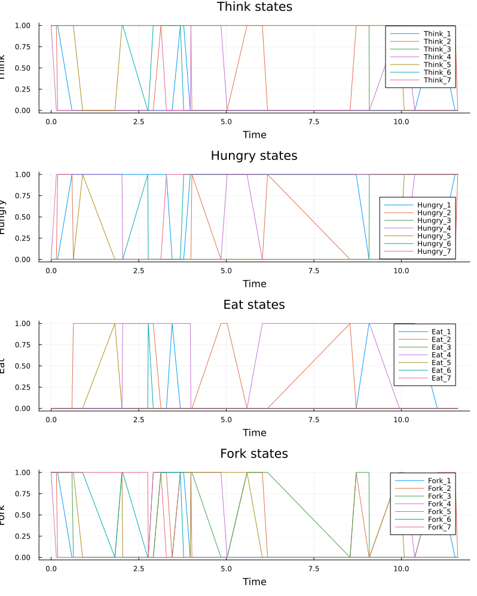
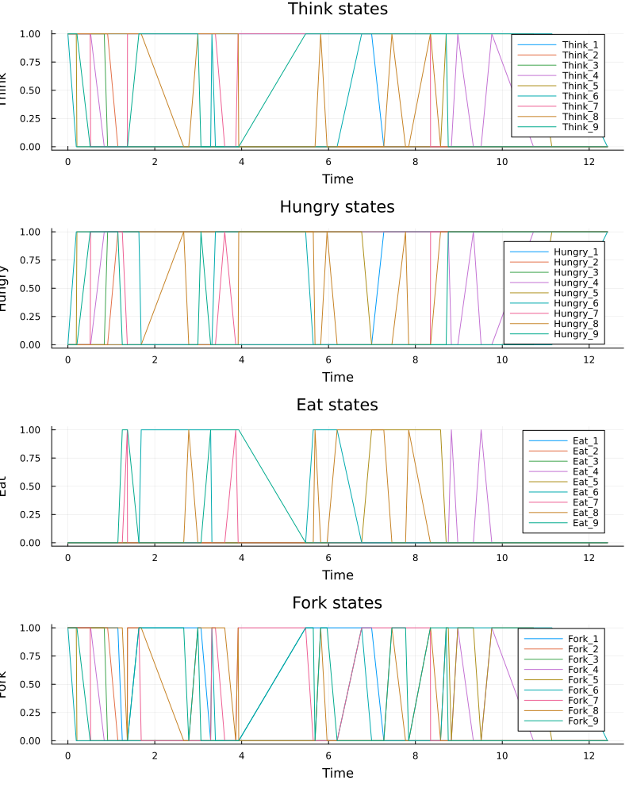
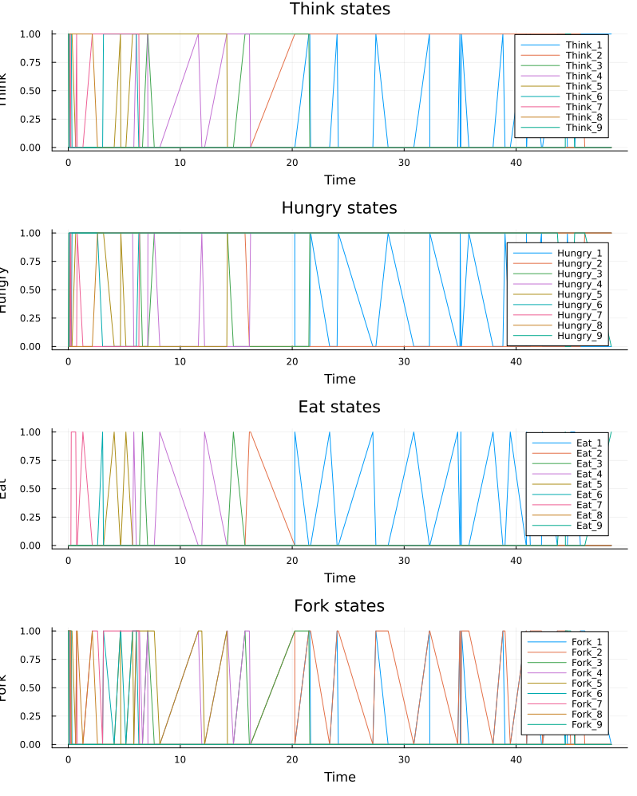
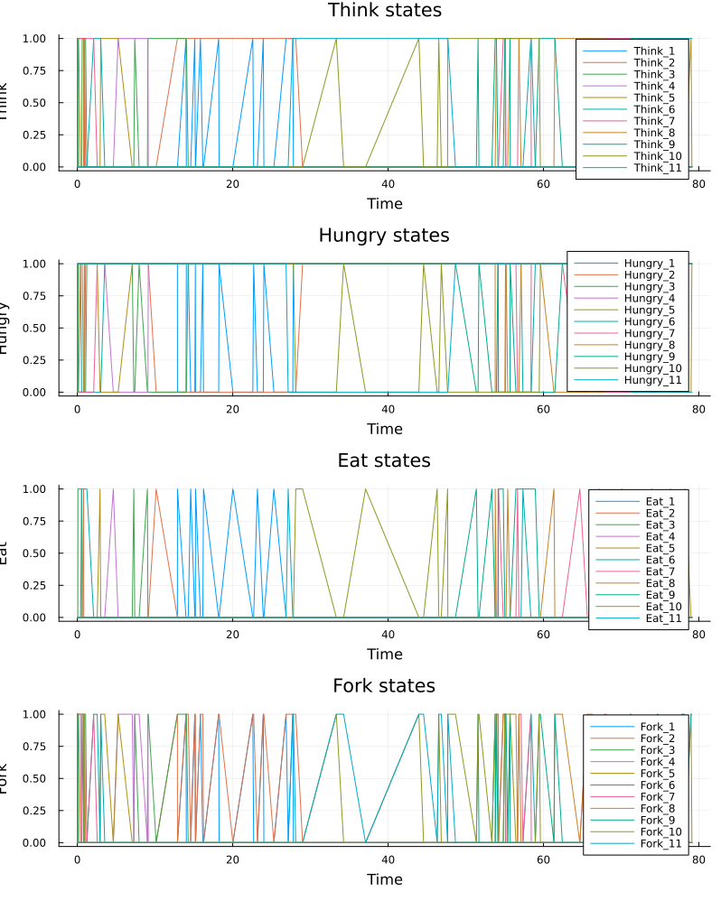
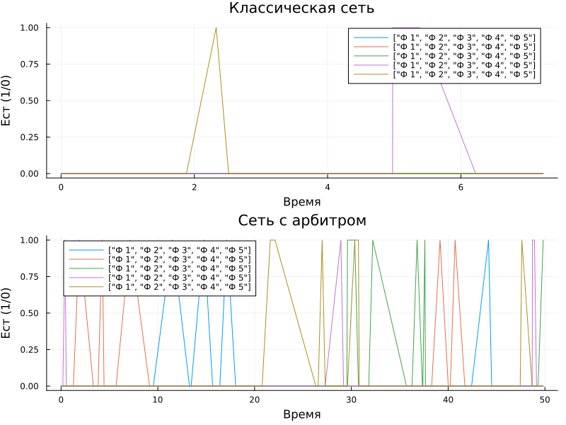
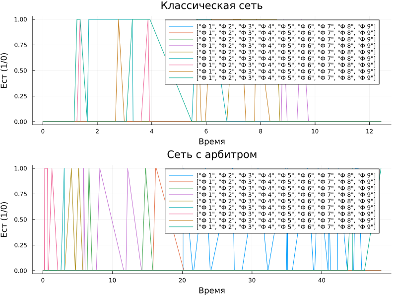

---
## Author
author:
  name: Вакутайпа Милдред
  degrees: BSc
  orcid: 0009-0001-3145-3518
  email: kulyabov-ds@rudn.ru
  affiliation:
    - name: Российский университет дружбы народов
      country: Российская Федерация
      postal-code: 117198
      city: Москва
      address: ул. Миклухо-Маклая, д. 6
## Title
title: Презентация по иммитационому моделированию
subtitle: Аппарат сети Петри
license: CC BY
date: today
date-format: "YYYY-MM-DD" # Example: 2025-09-06
---

# Информация

## Докладчик

:::::::::::::: {.columns align=center}
::: {.column width="70%"}

  * Вакутайпа Милдред
  * НКН-01-23
  * кафедра математического моделирования и исскуственого интелекта
  * Российский университет дружбы народов им. П. Лумумбы
  * [1032239009@rudn.ru](mailto:1032239009@rudn.ru)
  * <https://wakutaipa.github.io/ru/>

:::
::: {.column width="30%"}

:::
::::::::::::::

# Цель работы

— Построить сеть Петри для пяти философов, моделируя захват и освобождение вилок.

— Обнаружить состояние взаимной блокировки (deadlock), когда каждый философ взял одну вилку и ждёт вторую.

— Провести имитационное моделирование (стохастическое и детерминированное) и выявить наличие deadlock.

— Модифицировать сеть, чтобы предотвратить deadlock.

— Проанализировать результаты и оформить отчёт с графиками и анимацией.

# Задание

- Создать рабочий каталог для кода.
- Установить необходимые пакеты.
- Выполнить предложенный код.
- Преобразовать код в литературный стиль.
- Сгенерировать из литературного кода чистый код, jupyter notebook, документацию в формате Quarto.
- Выполнить код из jupyter notebook.
- Интегрировать документацию в формате Quarto в отчёт.
- Добавить в код в литературном стиле вычисление для набора параметров.
- Сгенерировать из литературного кода с параметрами чистый код, jupyter notebook, документацию в формате Quarto.
— Выполнить код из jupyter notebook с параметрами.
— Интегрировать документацию с параметрами в формате Quarto в отчёт.

# Теоретическое введение

- Сеть Петри есть математический аппарат для моделирования дискретных систем.
- Базовые элементы -- позиции (places), переходы (transitions), дуги (arcs).
- Задача «Обедающие философы» демонстрирует явления взаимной блокировки (deadlock) и голодания (starvation) при конкурентном доступе к разделяемым ресурсам.

- За круглым столом сидят N философов (обычно 5). Перед каждым философом стоит тарелка с едой. Между каждыми двумя соседними философами лежит одна вилка (или палочка для еды). Таким образом, количество вилок равно количеству философов.

## Теоретическое введение

Правила поведения философов:

- Философ может находиться в одном из трёх состояний: думает, голоден (хочет есть), ест.

- Чтобы поесть, философу необходимы две вилки — та, что слева от него, и та, что справа.

- Если философ не может получить обе вилки одновременно, он ждёт, пока они освободятся.

- Поев, философ кладёт обе вилки обратно на стол и возвращается к размышлениям.

Ограничения:

- Вилками нельзя пользоваться одновременно двум философам.

- Философ не может отнять вилку у соседа — только дождаться, пока тот её положит.

# Выполнение лабораторной работы

- Я подготовила рабочее пространство: установила необходимые пакеты, создала проект используя пакет DrWatson и язык программирования Julia. 
- После этого выполнила предложенный код сети Петри для пяти философов, моделируя захват и освобождение вилок. 

## dining philosophers

- Выполнила скрипт dining_philosophers.jl, который выполняет основное моделирование и сравнение двух вариантов сети Петри.

- Первая классическая модель (без арбитра), в которой возможна взаимная блокировка (deadlock) и вторая модифицированная модель с арбитром, которая должна предотвращать deadlock 

## Классическая сеть

{#fig-001 width=50%}

## Сеть с арбитом

{#fig-002 width=50%}

## Классическая сеть с семью философами

{#fig-003 width=50%}

## Классическая сеть с девятью философами

{#fig-004 width=50%}

## Классическая сеть с одинадцатью философами

{#fig-005 width=50%}

## Сеть с  арбитом с семью философами

{#fig-006 width=70%}

## Сеть с  арбитом с девятью философами

{#fig-007 width=70%}

## Сеть с  арбитом с одинадцатью философами

{#fig-008 width=70%}

## dining philosophers animate

- Далее выполнила скрипт dining_philosophers_animate.jl, который создает анимацию демонстрирующий динамики работы сети Петри во времени. 

- Анимация позволяет увидеть, как меняется маркировка (фишки) в каждой позиции, и особенно наглядно показывает возникновение deadlock в классической модели.

## dining philosophers report 

- Выполнила предложенный скрипт dining_philosophers_report.jl для сравнительного анализа двух моделей по числу философов, находящихся в состоянии "Ест"

{#fig-009 width=60%}

## Итоговый отчет с параметром 7 

{#fig-010 width=70%}

## Итоговый отчет с параметром 9

{#fig-011 width=70%}

# Выводы

При выполнении данной работы я умела:

— Построить сеть Петри для пяти философов, моделируя захват и освобождение вилок.

— Обнаружить состояние взаимной блокировки (deadlock), когда каждый философ взял одну вилку и ждёт вторую.

— Провести имитационное моделирование (стохастическое и детерминированное) и выявить наличие deadlock.

— Модифицировать сеть, чтобы предотвратить deadlock.

— Проанализировать результаты и оформить отчёт с графиками и анимацией.

