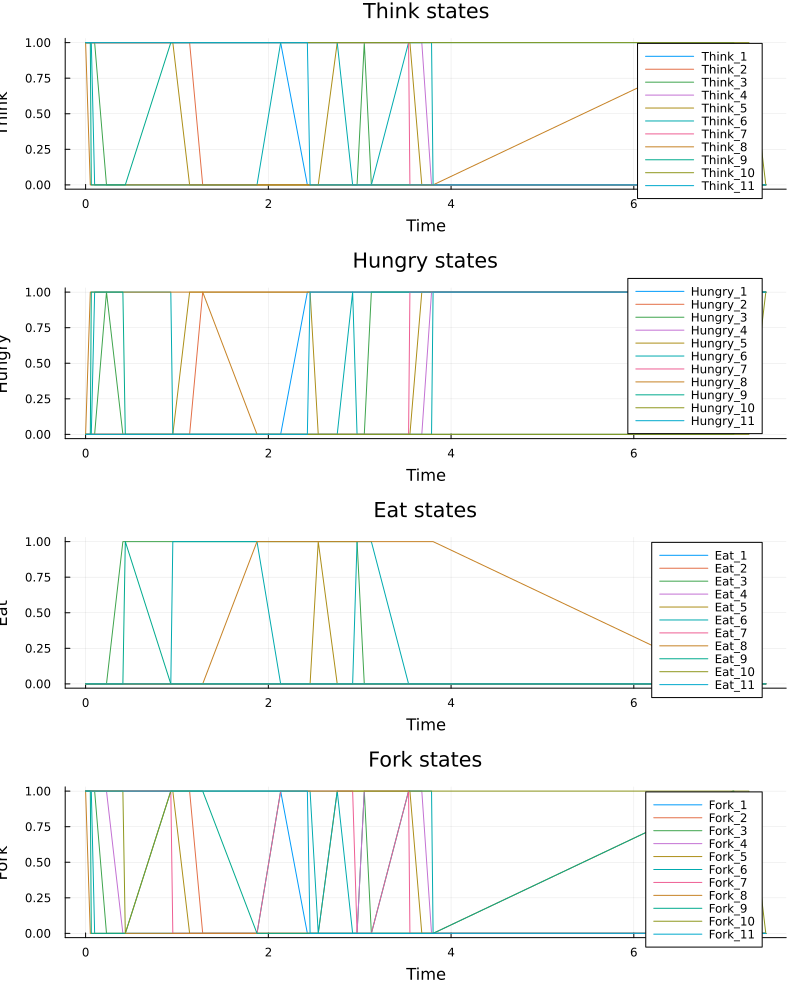
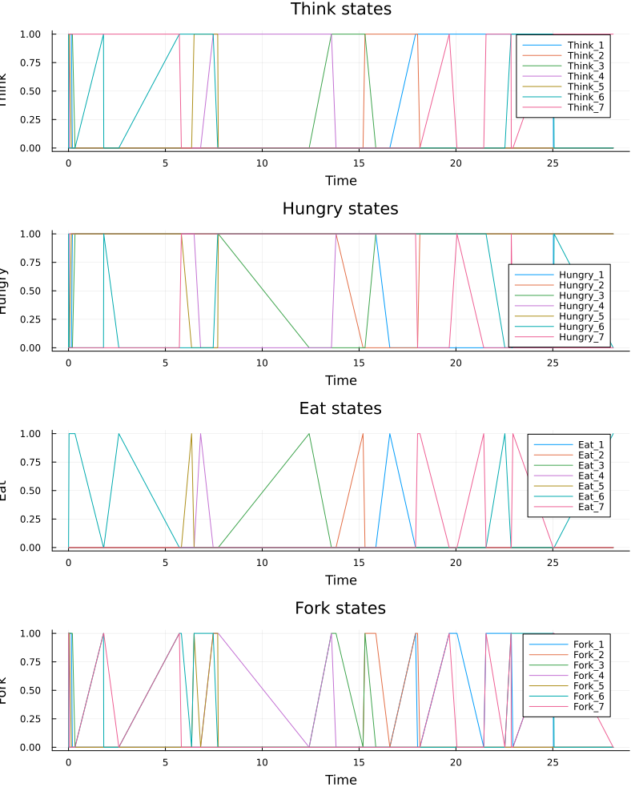
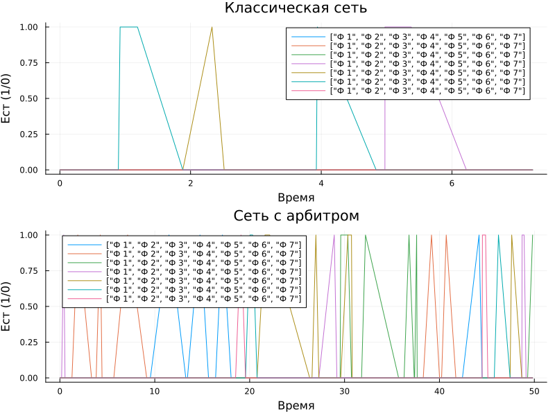

---
## Author
author:
  name: Вакутайпа Милдред
  degrees: BSc
  orcid: 0009-0001-3145-3518
  email: 1032239009@rudn.ru
  affiliation:
    - name: Российский университет дружбы народов
      country: Российская Федерация
      postal-code: 117198
      city: Москва
      address: ул. Миклухо-Маклая, д. 6

## Title
title: "Отчёт по лабораторной работе №5"
subtitle: "Аппарат сетей Петри"
license: "CC BY"
---

# Цель работы

— Построить сеть Петри для пяти философов, моделируя захват и освобождение вилок.

— Обнаружить состояние взаимной блокировки (deadlock), когда каждый философ взял одну вилку и ждёт вторую.

— Провести имитационное моделирование (стохастическое и детерминированное) и выявить наличие deadlock.

— Модифицировать сеть, чтобы предотвратить deadlock.

— Проанализировать результаты и оформить отчёт с графиками и анимацией.

# Задание

- Создать рабочий каталог для кода.
- Установить необходимые пакеты.
- Выполнить предложенный код.
- Преобразовать код в литературный стиль.
- Сгенерировать из литературного кода чистый код, jupyter notebook, документацию в формате Quarto.
- Выполнить код из jupyter notebook.
- Интегрировать документацию в формате Quarto в отчёт.
- Добавить в код в литературном стиле вычисление для набора параметров.
- Сгенерировать из литературного кода с параметрами чистый код, jupyter notebook, документацию в формате Quarto.
— Выполнить код из jupyter notebook с параметрами.
— Интегрировать документацию с параметрами в формате Quarto в отчёт.

# Теоретическое введение

Сеть Петри есть математический аппарат для моделирования дискретных систем. Графически она представляется как двудольный ориентированный граф двух типов вершин: позиции (круги) и переходы (прямоугольники).
Базовые элементы -- позиции (places), переходы (transitions), дуги (arcs).
Задача «Обедающие философы» была сформулирована Эдсгером Дейкстрой в 1965 году как иллюстрация проблемы синхронизации в параллельных вычислительных системах. Она наглядно демонстрирует явления взаимной блокировки (deadlock) и голодания (starvation) при конкурентном доступе к разделяемым ресурсам. Это одна из самых известных задач, демонстрирующая проблемы параллелизма, в частности взаимные блокировки (deadlocks) и состояние гонки (race conditions).

За круглым столом сидят N философов (обычно 5). Перед каждым философом стоит тарелка с едой. Между каждыми двумя соседними философами лежит одна вилка (или палочка для еды). Таким образом, количество вилок равно количеству философов.
Правила поведения философов:
— Философ может находиться в одном из трёх состояний: думает, голоден (хочет есть), ест.
— Чтобы поесть, философу необходимы две вилки — та, что слева от него, и та, что справа.
— Если философ не может получить обе вилки одновременно, он ждёт, пока они освободятся.
— Поев, философ кладёт обе вилки обратно на стол и возвращается к размышлениям.

Ограничения:

- Вилками нельзя пользоваться одновременно двум философам.
— Философ не может отнять вилку у соседа — только дождаться, пока тот её положит.

# Выполнение лабораторной работы

Перед тем, как начала работать я подготовила рабочее пространство: установила необходимые пакеты, создала проект используя пакет DrWatson и язык программирования Julia. После этого я выполнила предложенный код сети Петри для пяти философов, моделируя захват и освобождение вилок. Он также делает стохатическое и детерминирование моделирование и выявляет наличие deadlock

``` julia

module DiningPhilosophers

using OrdinaryDiffEq
using Plots
using DataFrames
using Random, LinearAlgebra

export build_classical_network, build_arbiter_network
export simulate_ode, simulate_stochastic
export detect_deadlock, plot_marking_evolution

# Определение простой структуры PetriNet
struct PetriNet
	n_places::Int
	n_transitions::Int
	incidence::Matrix{Int}
	place_names::Vector{Symbol}
	transition_names::Vector{Symbol}
end

function PetriNet(
	n_places,
	n_transitions;
	place_names = Symbol[],
	transition_names = Symbol[],
	)
	incidence = zeros(Int, n_places, n_transitions)
	if isempty(place_names)
		place_names = [Symbol("p$i") for i = 1:n_places]
	end
	if isempty(transition_names)
		transition_names = [Symbol("t$i") for i = 1:n_transitions]
	end
	PetriNet(n_places, n_transitions, incidence, place_names, transition_names)
end

function add_arc!(net::PetriNet, place::Int, transition::Int, sign::Int)
	net.incidence[place, transition] += sign
end

# Построение сетей Петри
function build_classical_network(N::Int)
	n_places = 4N
	n_transitions = 3N
	net = PetriNet(n_places, n_transitions)
	for i = 1:N
		net.place_names[i] = Symbol("Think_$i")
		net.place_names[N+i] = Symbol("Hungry_$i")
		net.place_names[2N+i] = Symbol("Eat_$i")
		net.place_names[3N+i] = Symbol("Fork_$i")
	end
	for i = 1:N
		net.transition_names[i] = Symbol("GetLeft_$i")
		net.transition_names[N+i] = Symbol("GetRight_$i")
		net.transition_names[2N+i] = Symbol("PutForks_$i")
	end
	for i = 1:N
		think = i
		hungry = N + i
		eat = 2N + i
		left_fork = 3N + i
		right_fork = 3N + (i % N + 1)
		get_left = i
		get_right = N + i
		put_forks = 2N + i
		add_arc!(net, think, get_left, -1)
		add_arc!(net, left_fork, get_left, -1)
		add_arc!(net, hungry, get_left, +1)
		add_arc!(net, hungry, get_right, -1)
		add_arc!(net, right_fork, get_right, -1)
		add_arc!(net, eat, get_right, +1)
		add_arc!(net, eat, put_forks, -1)
		add_arc!(net, think, put_forks, +1)
		add_arc!(net, left_fork, put_forks, +1)
		add_arc!(net, right_fork, put_forks, +1)
	end
	u0 = zeros(Float64, n_places)
	for i = 1:N
		u0[i] = 1.0
		u0[3N+i] = 1.0
	end
	return net, u0, net.place_names

end	
		
function build_arbiter_network(N::Int)
	n_places = 4N + 1
	n_transitions = 3N
	net = PetriNet(n_places, n_transitions)
	for i = 1:N
		net.place_names[i] = Symbol("Think_$i")
		net.place_names[N+i] = Symbol("Hungry_$i")
		net.place_names[2N+i] = Symbol("Eat_$i")
		net.place_names[3N+i] = Symbol("Fork_$i")
	end
	net.place_names[4N+1] = :Arbiter
	for i = 1:N
		net.transition_names[i] = Symbol("GetLeft_$i")
		net.transition_names[N+i] = Symbol("GetRight_$i")
		net.transition_names[2N+i] = Symbol("PutForks_$i")
	end
	arbiter_idx = 4N + 1
	for i = 1:N
		think = i
		hungry = N + i
		eat = 2N + i
		left_fork = 3N + i
		right_fork = 3N + (i % N + 1)	
		get_left = i
		get_right = N + i
		put_forks = 2N + i
		add_arc!(net, think, get_left, -1)
		add_arc!(net, left_fork, get_left, -1)
		add_arc!(net, arbiter_idx, get_left, -1)
		add_arc!(net, hungry, get_left, +1)
		add_arc!(net, hungry, get_right, -1)
		add_arc!(net, right_fork, get_right, -1)
		add_arc!(net, eat, get_right, +1)
		add_arc!(net, eat, put_forks, -1)
		add_arc!(net, think, put_forks, +1)
		add_arc!(net, left_fork, put_forks, +1)
		add_arc!(net, right_fork, put_forks, +1)
		add_arc!(net, arbiter_idx, put_forks, +1)
	end
	u0 = zeros(Float64, n_places)
	for i = 1:N
		u0[i] = 1.0
		u0[3N+i] = 1.0
	end
	u0[arbiter_idx] = N - 1
	return net, u0, net.place_names
end

function vectorfield(net::PetriNet, rates = ones(net.n_transitions))
	function f!(du, u, params, t)
		a = zeros(net.n_transitions)
		for j = 1:net.n_transitions
			rate = rates[j]
			prod = rate
			for i = 1:net.n_places
				if net.incidence[i, j] < 0
					prod *= u[i] ^ (-net.incidence[i, j])
				end
			end
			a[j] = prod
		end
		du .= net.incidence * a
	end
	return f!
end

function simulate_ode(net::PetriNet, u0::Vector{Float64}, tmax::Float64; saveat = 0.1)
	f = vectorfield(net)
	prob = ODEProblem(f, u0, (0.0, tmax))
	sol = solve(prob, Tsit5(), saveat = saveat)
	df = DataFrame(time = sol.t)
	for i = 1:net.n_places
		df[!, String(net.place_names[i])] = sol[i, :]
	end
	return df
end

# Стохастическое моделирование (алгоритм Гиллеспи)
function simulate_stochastic( net::PetriNet, u0::Vector{Float64}, tmax::Float64; rates = ones(net.n_transitions), rng = Random.GLOBAL_RNG, 
)
	u = copy(u0)
	t = 0.0
	times = [t]
	states = [copy(u)]
	while t < tmax
		a = zeros(net.n_transitions)
		for j = 1:net.n_transitions
			rate = rates[j]
			prod = rate
			for i = 1:net.n_places
				if net.incidence[i, j] < 0
					prod *= u[i] ^ (-net.incidence[i, j])
				end
			end
			a[j] = prod
		end
		a0 = sum(a)
		if a0 == 0
			break
		end
		dt = -log(rand(rng)) / a0
		r = rand(rng) * a0
		cumsum = 0.0
		chosen = 1
		for j = 1:net.n_transitions
			cumsum += a[j]
			if r <= cumsum
				chosen = j
				break
			end
		end
		for i = 1:net.n_places
			u[i] += net.incidence[i, chosen]
		end
		t += dt
		if t <= tmax
			push!(times, t)
			push!(states, copy(u))
		end
	end
	df = DataFrame(time = times)
	for i = 1:net.n_places
		df[!, String(net.place_names[i])] = [s[i] for s in states]
	end
	return df
end

# Обнаружение deadlock
function detect_deadlock(df::DataFrame, net::PetriNet; tol = 1e-6)
	u_last = [df[end, String(net.place_names[i])] for i = 1:net.n_places]
	for j = 1:net.n_transitions
		can_fire = true
		for i = 1:net.n_places
			if net.incidence[i, j] < 0 && u_last[i] <-net.incidence[i, j] - tol
				can_fire = false
				break
			end
		end
		if can_fire
			return false
		end
	end
	return true
end

# Визуализация
function plot_marking_evolution(df::DataFrame, N::Int)
	plots = []
	for group in ["Think", "Hungry", "Eat", "Fork"]
		p = plot(xlabel = "Time", ylabel = group, title = "$group states")
		for i = 1:N
			col = "$(group)_$i"
			if col in names(df)
				plot!(df.time, df[!, col], label = "$(group)_$i")
			end
		end
		push!(plots, p)
	end
	return plot(plots..., layout = (4, 1), size = (800, 1000))
end
end # module


```

Далее я выполнила скрипт dining_philosophers.jl, который выполняет основное моделирование и сравнение двух вариантов сети Петри. Первая классическая модель (без арбитра), в которой возможна взаимная блокировка (deadlock) и вторая модифицированная модель с арбитром, которая должна предотвращать deadlock 

``` julia

using DrWatson
@quickactivate "project"
include(srcdir("DiningPhilosophers.jl"))
using .DiningPhilosophers
using DataFrames, CSV, Plots
N = 5
tmax = 50.0
println("=== Классическая сеть (без арбитра) ===")
net_classic, u0_classic, _ = build_classical_network(N)

df_classic = simulate_stochastic(net_classic, u0_classic, tmax)
CSV.write(datadir("dining_classic.csv"), df_classic)
dead = detect_deadlock(df_classic, net_classic)
println("Deadlock обнаружен: $dead")
plot_classic = plot_marking_evolution(df_classic, N)
savefig(plotsdir("classic_simulation.png"))

println("\n=== Сеть с арбитром ===")
net_arb, u0_arb, _ = build_arbiter_network(N)
df_arb = simulate_stochastic(net_arb, u0_arb, tmax)
CSV.write(datadir("dining_arbiter.csv"), df_arb)
dead_arb = detect_deadlock(df_arb, net_arb)
println("Deadlock обнаружен: $dead_arb")
plot_arb = plot_marking_evolution(df_arb, N)
savefig(plotsdir("arbiter_simulation.png"))

```

После выпонении высше представленного кода, получила следующие графики для классической сети ([рис. @fig-001]) и для сети с арбитом ([рис. @fig-002]).

{#fig-001 width=70%}

{#fig-002 width=70%}

В задание требуется выполнить код для разных параметров, поэтому построила графики при число философов 7 ([рис. @fig-003]), 9 ([рис. @fig-004]) и 11 ([рис. @fig-005]) для классической сети

{#fig-003 width=70%}

{#fig-004 width=70%}

{#fig-005 width=70%}

И для сети с арбитом ([рис. @fig-006]), ([рис. @fig-007]) и ([рис. @fig-008])

{#fig-006 width=70%}

{#fig-007 width=70%}

{#fig-008 width=70%}

Далее выполнила скрипт dining_philosophers_animate.jl, который создает анимацию демонстрирующий динамики работы сети Петри во времени. Анимация позволяет увидеть, как меняется маркировка (фишки) в каждой позиции, и особенно наглядно показывает возникновение deadlock в классической модели.

``` julia

using DrWatson

@quickactivate "project"
include(srcdir("DiningPhilosophers.jl"))
using .DiningPhilosophers
using Plots, Random

N = 3
tmax = 30.0
net, u0, names = build_classical_network(N)
Random.seed!(123)
df = simulate_stochastic(net, u0, tmax)

anim = @animate for row in eachrow(df)
	u = [row[col] for col in propertynames(row) if col != :time]
	bar(
		1:length(u),
		u,
		legend = false,
		ylims = (0, maximum(u0) + 1),
		xlabel = "Позиция",
		ylabel = "Фишки",
		title = "Время = $(round(row.time, digits=2))",
	)
	xticks!(1:length(u), string.(names), rotation = 45)
end

gif(anim, plotsdir("philosophers_simulation.gif"), fps = 2)
println("Анимация сохранена в plots/philosophers_simulation.gif")

```

Для анимации выполнила код с количеством философов 3 и еще для 7 и 9.  

Выполнила предложенный скрипт dining_philosophers_report.jl для сравнительного анализа двух моделей по числу философов, находящихся в состоянии "Ест"

```julia

using DrWatson
@quickactivate "project"
using DataFrames, CSV, Plots

df_classic = CSV.read(datadir("dining_classic.csv"), DataFrame)
df_arbiter = CSV.read(datadir("dining_arbiter.csv"), DataFrame)
N = 5

# Столбцы для состояния "Ест"
eat_cols = [Symbol("Eat_$i") for i = 1:N]

p1 = plot(
	df_classic.time,
	Matrix(df_classic[:, eat_cols]),
	label = ["Ф $i" for i = 1:N],
	xlabel = "Время",
	ylabel = "Ест (1/0)",
	title = "Классическая сеть",)
	
p2 = plot(
	df_arbiter.time,
	Matrix(df_arbiter[:, eat_cols]),
	label = ["Ф $i" for i = 1:N],
	xlabel = "Время",
	ylabel = "Ест (1/0)",
	title = "Сеть с арбитром",
	)
p_final = plot(p1, p2, layout = (2, 1), size = (800, 600))
savefig(plotsdir("final_report.png"))
println("Отчёт сохранён в plots/final_report.png")

```

Я выполнила код и получила (рис. [@fig-009]) 

{#fig-009 width=70%}

В jupyter notebook выполнила код с параметрами 7 (рис.[@fig-010]) и 9 (рис. [@fig-011])

{#fig-010 width=70%}

{#fig-011 width=70%}

# Выводы

При выполнении данной работы, я познакомилась с сетью Петри и построила модель для задачи обедающих философов.

# Список литературы{.unnumbered}

::: {#refs}
:::
