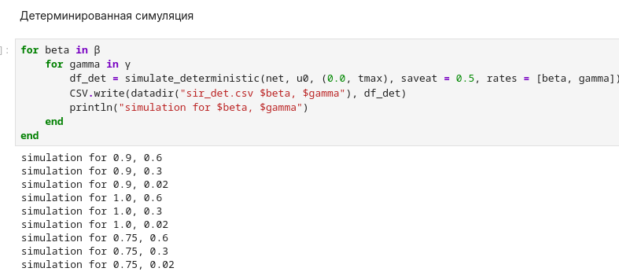

---
## Author
author:
  name: Вакутайпа Милдред
  degrees: BSc
  orcid: 0009-0001-3145-3518
  email: 1032239009@rudn.ru
  affiliation:
    - name: Российский университет дружбы народов
      country: Российская Федерация
      postal-code: 117198
      city: Москва
      address: ул. Миклухо-Маклая, д. 6
## Title
title: Презентация по лабораторной работе №6
subtitle: Реализация основных моделей в подходе сетей Петри
license: CC BY
date: today
date-format: "YYYY-MM-DD" # Example: 2025-09-06
---

# Информация

## Докладчик

:::::::::::::: {.columns align=center}
::: {.column width="70%"}

  * Вакутайпа Милдред
  * НКНбд-01-23
  * кафедра математического моделирования и искусственного интелекта
  * Российский университет дружбы народов им. П. Лумумбы
  * [1032239009@rudn.ru](mailto:1032239009@rudn.ru)
  * <https://wakutaipa.github.io>

:::
::: {.column width="30%"}

:::
::::::::::::::

# Цель работы

Реализовать модель эпидемии SIR с использованием сетей Петри.

# Задание

1. Создать рабочий каталог для кода.
2. Установить необходимые пакеты.
3. Выполнить предложенный код.
4. Преобразовать код в литературный стиль.
5. Сгенерировать из литературного кода:
	- чистый код;
	- jupyter notebook;
	- документацию в формате Quarto.
6. Выполнить код из jupyter notebook.
7. Интегрировать документацию в формате Quarto в отчёт.
8. Добавить в код в литературном стиле вычисление для набора параметров.
9. Сгенерировать из литературного кода с параметрами:
	- чистый код;
	- jupyter notebook;
	- документацию в формате Quarto.
10. Выполнить код из jupyter notebook с параметрами.
11. Интегрировать документацию с параметрами в формате Quarto в отчёт.

# Теоретическое введение

Модель описывает переходы между тремя состояниями:
	- S (восприимчивые) — могут заразиться;
	- I (инфицированные) — заражают других и выздоравливают;
	- R (выздоровевшие / с иммунитетом) — больше не участвуют в эпидемии.

Сеть Петри содержит два перехода:
	- infection: S + I → I + I (скорость $\beta$);
	- recovery: I → R (скорость $\gamma$)

# Выполнение лабораторной работы

## Создание проекта

Создала новый проект с пакетом DrWatson языка julia ([рис. @fig-001]).

{#fig-001 width=70%}

## Установка пакеты

Далее я установила остальные необходимые пакеты ([рис. @fig-002])

{#fig-002 width=70%}

## Основная программа

Потом я выполнила предвложенный код основной программы, который реализует вычислетельную логику модели. В нем входят функции для построения сети, детерминированной и стохатической симуляции, решения ОДУ и визуализации.

## Детерминистический график динамики SIR

Далее я выполнила код для базового прогона модели. Он выполняет один базовый эксперимент с фиксированными параметрами beta и gamma, запускает два типа симуляции: детерминистичесую для решения ОДУ ([рис. @fig-003]) и симуляцию алгоритм Гиллеспи ([рис. @fig-004]). Результаты сохраняются в файл CSV

{#fig-003 width=40%}

## Стохастический график динамики SIR

{#fig-004 width=50%}

## Симуляция для набора параметров

Далее я преобразовала код в литературный стиль и выполнила такой же эксперимент в ноутбуке для набора параметров но графики получились одинаковые.

{#fig-005 width=50%}

## Симуляция для набора параметров

{#fig-006 width=50%}

## Симуляция для набора параметров

{#fig-007 width=70%}

## Коэффицент заражения $\beta$

Далее я выполнила скрипт для сканирования параметра $\beta$. Он исследует чувствительность модели к изменению параметра, запускается детерминированную симуляцию, вычисляется пик эпидемии и конечное число выздоровленных ([рис. @fig-008]) и сохраняет результаты в CSV файл.

{#fig-008 width=40%}

## Анимция динамики

Потом я создала скрипт для анимации детерминированной динамики, который создает анимацию, показивающую, как меняется количество людей в каждой из групп с временем.

## График сравнения симуляций

Я выпонила последний скрипт, который загружает сохранненые результаты и строит сравнительные графики для итогового отчета ([рис. @fig-009])

{#fig-009 width=40%}

## График сравнения чувствительностей

{#fig-010 width=70%}

# Выводы

В ходе выполнении данной работы я реализовала модель эпидемии SIR с использованием сетей Петри.

