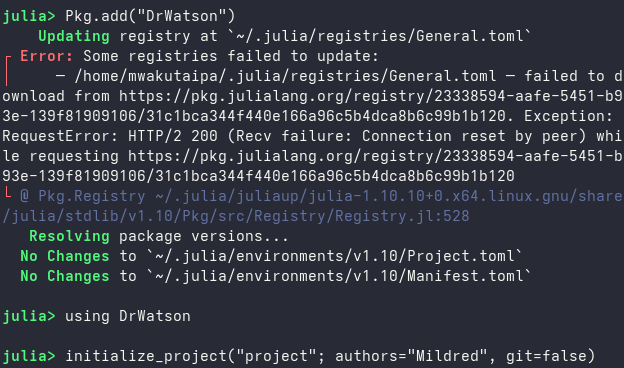
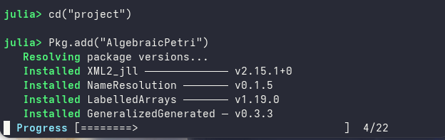
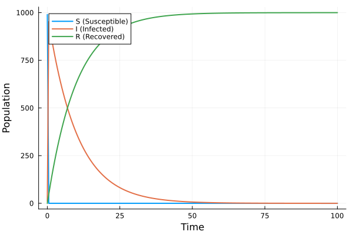
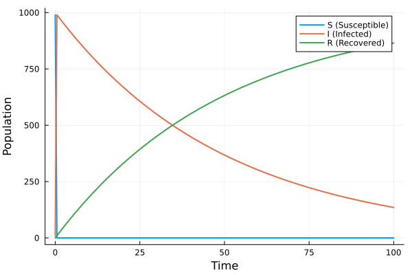

---
## Author
author:
  name: Вакутайпа Милдред
  degrees: BSc
  orcid: 0009-0001-3145-3518
  email: 1032239009@rudn.ru
  affiliation:
    - name: Российский университет дружбы народов
      country: Российская Федерация
      postal-code: 117198
      city: Москва
      address: ул. Миклухо-Маклая, д. 6

## Title
title: "Отчёт по лабораторной работе №6"
subtitle: "Реализация основных моделей в подходе сетей Петри"
license: "CC BY"
---

# Цель работы

Реализовать модель эпидемии SIR с использованием сетей Петри.

# Задание

1. Создать рабочий каталог для кода.
2. Установить необходимые пакеты.
3. Выполнить предложенный код.
4. Преобразовать код в литературный стиль.
5. Сгенерировать из литературного кода:
	- чистый код;
	- jupyter notebook;
	- документацию в формате Quarto.
6. Выполнить код из jupyter notebook.
7. Интегрировать документацию в формате Quarto в отчёт.
8. Добавить в код в литературном стиле вычисление для набора параметров.
9. Сгенерировать из литературного кода с параметрами:
	- чистый код;
	- jupyter notebook;
	- документацию в формате Quarto.
10. Выполнить код из jupyter notebook с параметрами.
11. Интегрировать документацию с параметрами в формате Quarto в отчёт.

# Теоретическое введение

Модель описывает переходы между тремя состояниями:
	- S (восприимчивые) — могут заразиться;
	- I (инфицированные) — заражают других и выздоравливают;
	- R (выздоровевшие / с иммунитетом) — больше не участвуют в эпидемии.

Сеть Петри содержит два перехода:
	- infection: S + I → I + I (скорость $\beta$);
	- recovery: I → R (скорость $\gamma$)

# Выполнение лабораторной работы

До начала работы я создала новый проект с пакетом DrWatson языка julia ([рис. @fig-001]).

{#fig-001 width=70%}

Далее я установила остальные необходимые пакеты ([рис. @fig-002])

{#fig-002 width=70%}

Потом я выполнила предвложенный код основной программы, который реализует вычислетельную логику модели. В нем входят функции для построения сети, детерминированной и стохатической симуляции, решения ОДУ и визуализации.

``` julia

module SIRPetri

using AlgebraicPetri
using Catlab.CategoricalAlgebra
using Catlab.Graphics
using OrdinaryDiffEq
using Plots
using DataFrames
using Random
export build_sir_network, simulate_deterministic, simulate_stochastic
export plot_sir, to_graphviz_sir

function build_sir_network(β = 0.3, γ = 0.1)
	states = [:S, :I, :R]
	net = LabelledPetriNet(
		states,
		:infection => ([:S, :I] => [:I, :I]),
		:recovery => ([:I] => [:R]),
	)
u0 = [990.0, 10.0, 0.0]
	return net, u0, states
end

function sir_ode(net, rates = [0.3, 0.1])
	function f!(du, u, p, t)
		S, I, R = u
		β, γ = rates
		infection_rate = β * S * I
		recovery_rate = γ * I
		du[1] = -infection_rate
		du[2] = infection_rate - recovery_rate
		du[3] = recovery_rate
	end
	return f!
end

function simulate_deterministic(net, u0, tspan; saveat = 0.1, rates= [0.3, 0.1])
	f = sir_ode(net, rates)
	prob = ODEProblem(f, u0, tspan)
	sol = solve(prob, Tsit5(), saveat = saveat)
	df = DataFrame(time = sol.t)
	df.S = sol[1, :]
	df.I = sol[2, :]
	df.R = sol[3, :]
	return df
end

function simulate_stochastic(net, u0, tspan; rates = [0.3, 0.1], rng = Random.GLOBAL_RNG)
	u = copy(u0)
	t = 0.0
	times = [t]
	states = [copy(u)]
	β, γ = rates
	while t < tspan[2]
		S, I, R = u
		a_inf = β * S * I
		a_rec = γ * I
		a0 = a_inf + a_rec
		if a0 == 0
			break
		end
		dt = -log(rand(rng)) / a0
		r = rand(rng) * a0
		if r < a_inf
			u[1] -= 1
			u[2] += 1
		else
			u[2] -= 1
			u[3] += 1
		end
		t += dt
		if t <= tspan[2]
			push!(times, t)
			push!(states, copy(u))
		end
	end
	df = DataFrame(time = times)
	df.S = [s[1] for s in states]
	df.I = [s[2] for s in states]
	df.R = [s[3] for s in states]
	return df
end

function plot_sir(df)
	p = plot(
		df.time,
		[df.S, df.I, df.R],
		label = ["S (Susceptible)" "I (Infected)" "R (Recovered)"],
		xlabel = "Time",
		ylabel = "Population",
		linewidth = 2,
		)
	return p
end

function to_graphviz_sir(net)
	return to_graphviz(net, prog = "dot")
end
end 

```

Далее я выполнила код для базового прогона модели. Он выполняет один базовый эксперимент с фиксированными параметрами beta и gamma, запускает два типа симуляции: детерминистичесую для решения ОДУ ([рис. @fig-003]) и симуляцию алгоритм Гиллеспи ([рис. @fig-004]). Результаты сохраняются в файл CSV

``` julia

using DrWatson
@quickactivate "Project"
using Random
include(srcdir("SIRPetri.jl"))
using .SIRPetri
using DataFrames, CSV, Plots

β = 0.3
γ = 0.1
tmax = 100.0

net, u0, states = build_sir_network(β, γ)

df_det = simulate_deterministic(net, u0, (0.0, tmax), saveat = 0.5, rates = [β, γ])
CSV.write(datadir("sir_det.csv"), df_det)

Random.seed!(123)
df_stoch = simulate_stochastic(net, u0, (0.0, tmax), rates = [β, γ])
CSV.write(datadir("sir_stoch.csv"), df_stoch)

p_det = plot_sir(df_det)
savefig(plotsdir("sir_det_dynamics.png"))

p_stoch = plot_sir(df_stoch)
savefig(plotsdir("sir_stoch_dynamics.png"))

```

{#fig-003 width=70%}

{#fig-004 width=70%}

Далее я преобразовала код в литературный стиль и выполнила такой же эксперимент в ноутбуке для набора параметров но графики получились одинаковые.

{#fig-005 width=70%}

{#fig-006 width=70%}

{#fig-007 width=70%}

Далее я выполнила скрипт для сканирования параметра $\beta$. Он исследует чувствительность модели к изменению параметра, запускается детерминированную симуляцию, вычисляется пик эпидемии и конечное число выздоровленных ([рис. @fig-008]) и сохраняет результаты в CSV файл.

``` julia

using DrWatson
@quickactivate "Project"
include(srcdir("SIRPetri.jl"))
using .SIRPetri
using DataFrames, CSV, Plots

β_range = 0.1:0.05:0.8
γ_fixed = 0.1
tmax = 100.0
results = []

for β in β_range
	net, u0, _ = build_sir_network(β, γ_fixed)
	df = simulate_deterministic(net, u0, (0.0, tmax), saveat = 0.5, rates = [β, γ_fixed])
	peak_I = maximum(df.I)
	final_R = df.R[end]
	push!(results, (β = β, peak_I = peak_I, final_R = 
	final_R))
end

df_scan = DataFrame(results)
CSV.write(datadir("sir_scan.csv"), df_scan)

# График
p = plot(
	df_scan.β,
	[df_scan.peak_I df_scan.final_R],
	label = ["Peak I" "Final R"],
	marker = :circle,
	xlabel = "β (infection rate)",
	ylabel = "Population",
)
savefig(plotsdir("sir_scan.png"))

```

{#fig-008 width=70%}

Потом я создала скрипт для анимации детерминированной динамики, который создает анимацию, показивающую, как меняется количество людей в каждой из групп с временем.

``` julia

using DrWatson
using Random
using DataFrames
using Plots
using OrdinaryDiffEq
@quickactivate "Project"
include(srcdir("SIRPetri.jl"))
using .SIRPetri
using DataFrames, CSV, Plots

β = 0.3
γ = 0.1
tmax = 100.0
step = 0.2  

net, u0, states = build_sir_network(β, γ)

df = simulate_deterministic(net, u0, (0.0, tmax), saveat = step, rates = [β, γ])

@info "Creating animation... This may take a moment."
anim = @animate for t in eachrow(df)
    S_val = t.S
    I_val = t.I
    R_val = t.R
    time_val = round(t.time, digits=1)
    
    bar(
        ["S", "I", "R"],
        [S_val, I_val, R_val],
        ylabel = "Population",
        title = "SIR Dynamics at time = $(time_val)",
        color = [:green, :red, :blue],
        legend = false,
        ylims = (0, sum(u0)),
        bar_width = 0.6,
        label = ["S" "I" "R"]
    )
end

gif_path = plotsdir("sir_animation.gif")
gif(anim, gif_path, fps = 15)
println("Animation saved to: $(gif_path)")

```

Я выпонила последний скрипт, который загружает сохранненые результаты и строит сравнительные графики для итогового отчета ([рис. @fig-009])

``` julia

using DrWatson
@quickactivate "Project"
using DataFrames, CSV, Plots
df_det = CSV.read(datadir("sir_det.csv"), DataFrame)
df_stoch = CSV.read(datadir("sir_stoch.csv"), DataFrame)
df_scan = CSV.read(datadir("sir_scan.csv"), DataFrame)

p1 = plot(
	df_det.time,
	[df_det.I df_stoch.I[1:length(df_det.time)]],
	label = ["Deterministic I" "Stochastic I"],
	xlabel = "Time",
	ylabel = "Infected",
	title = "Comparison",
	)
	
savefig(plotsdir("comparison.png"))
p2 = plot(
	df_scan.β,
	df_scan.peak_I,
	marker = :circle,
	xlabel = "β",
	ylabel = "Peak I",
	title = "Sensitivity",
	)
savefig(plotsdir("sensitivity.png"))

```

{#fig-009 width=70%}

{#fig-010 width=70%}

# Выводы

В ходе выполнении данной работы я реализовала модель эпидемии SIR с использованием сетей Петри.

# Список литературы{.unnumbered}

::: {#refs}
:::
