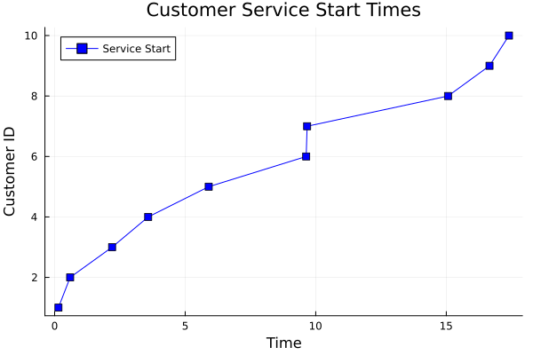
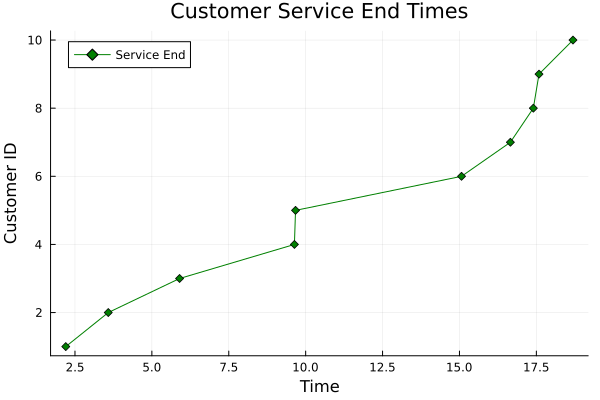
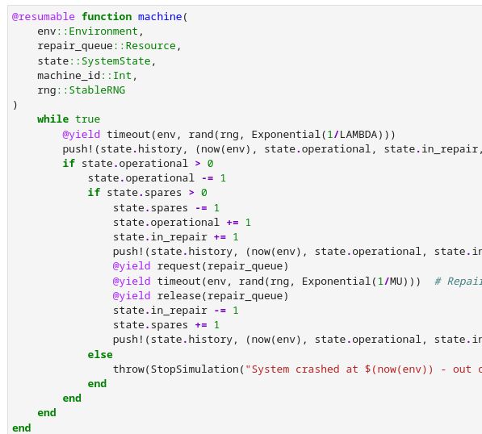
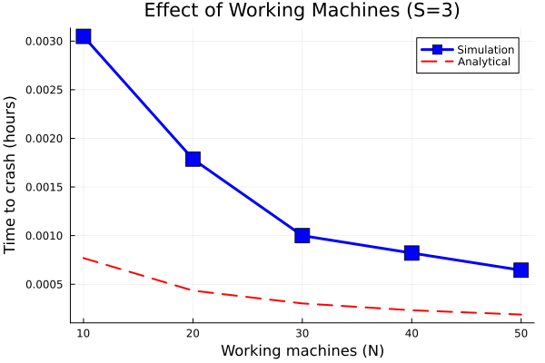
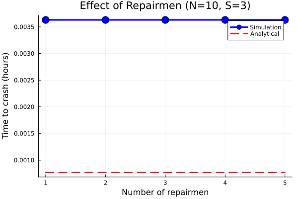

---
## Author
author:
  name: Вакутайпа Милдред
  degrees: BSc
  orcid: 009-0001-3145-3518
  email: 1032239009@rudn.ru
  affiliation:
    - name: Российский университет дружбы народов
      country: Российская Федерация
      postal-code: 117198
      city: Москва
      address: ул. Миклухо-Маклая, д. 6
## Title
title: Презентация по лабораторная работа №7
subtitle: Дискретно-событийное моделирование
license: CC BY
date: today
date-format: "YYYY-MM-DD" # Example: 2025-09-06
---

# Информация

## Докладчик

:::::::::::::: {.columns align=center}
::: {.column width="70%"}

  * Вакутайпа Милдред
  * НКНбд-01-23
  * кафедра математическое моделирование и искусственного интеллекта
  * Российский университет дружбы народов им. П. Лумумбы
  * [1032239009@rudn.ru](mailto:1032239009@rudn.ru)
  * <https://wakutaipa.github.io>

:::
::: {.column width="30%"}

:::
::::::::::::::

# Цель работы

Цель данной работы - освоить работу с дискретно-событийными моделями М/М/с и Росса.

# Задание

Для модели М/М/с:

- Перевести скрипт в структуру DrWatson

- Добавить необходимые графики

Для модели Росса:

- Перевести скрипт в структуру DrWatson

- Добавить необходимые графики

- Сделать прогон для разного количества машин

- Проведить мониторинг загрузки ремонтника, средней длины очереди на ремонт

- Построить графики изменения числа исправных машин во времени

- Сравнить с аналитическим решением

# Теоретическое введение

## Модель М/М/с - 

Модель М/М/с - система массового обслуживания со следующими свойствами:

- M (Markovian) — входящий поток заявок пуассоновский, интервалы между прибытиями распределены экспоненциально с параметром $\lambda$ - интенсивность входящего потока.
- M — время обслуживания каждой заявки распределено экспоненциально с параметром $\mu$ - среднее число заявок, обслуживаемых одним прибором в единицу времени (длительность обслуживания).
- c — количество идентичных обслуживающих приборов (каналов), работающих параллельно.

## Модель Росса

- Модель представляет собой классический пример системы массового обслуживания с конечной популяцией, резервом и ремонтом.

- В системе находятся N идентичных машин, которые постоянно работают и могут выходить из строя. S машин находятся в резерве и готовы немедленно заменить любую отказавшую.

- Одно ремонтное устройство (ремонтник), которое может одновременно ремонтировать только одну машину. 

## Модель Росса

Когда работающая машина ломается, происходит следующее:

- Немедленно берётся одна резервная машина (если она есть) и запускается в работу вместо сломавшейся.

- Сломанная машина отправляется в ремонт.

- Если резерва нет, система падает (crash). Моделирование заканчивается.

- После ремонта машина пополняет пул резервных (становится исправной и ждёт).

- Требуется оценить среднее время до падения системы E[T] при заданных распределениях наработки до отказа и времени ремонта

# Выполнение лабораторной работы

## Модель М/М/с

До начала выполнении работы я создала проект испоьзуя DrWatson и установила все необходимые пакты.

{#fig-001 width=70%}

## Модель М/М/с

- Далее я перевела предложенный код в стиле DrWatson при этом сохраняя функции customer и setup_and_run для описание всех клиентов и запуска симуляции соответсвенно.

- я создала графики для сравнения время прихода клиентов

{#fig-004 width=45%}

## Модель М/М/с

- Для сравнения время начала обслуживания.

{#fig-005 width=70%}

## Модель М/М/с

- Для сравнения время конца обслуживания.

{#fig-006 width=70%}

## Модель М/М/с

- И для сравнения время ожидания в очереди.

{#fig-007 width=70%}

## Модель Росса

Для модели Росса я создоала структура для описания параметров системы и сохранила все функции, но добавила несколько новые сторка.

{#fig-008 width=60%}

## Модель Росса

Используя результаты сохранены из симуляции, я построила графики, которые показывают следующее: 

- эффективность колисества работающих машин (прогон для разного количества машин);

{#fig-011 width=55%}

## Модель Росса

- состояние машин в разное время (изменения числа исправных машин во времени);

{#fig-012 width=70%}

## Модель Росса

- время ожидания ремонта в очереди (длина очереди на ремонт);

{#fig-013 width=70%}

## Модель Росса

- эффективность увеличения количества ремонтиков (загрузка ремонтика);

{#fig-014 width=70%}

## Модель Росса

- эффективность наличия запасных машин;

{#fig-015 width=70%}

# Выводы

При выпонении данной работы я освоила работу с дискретно-событийными моделями.

