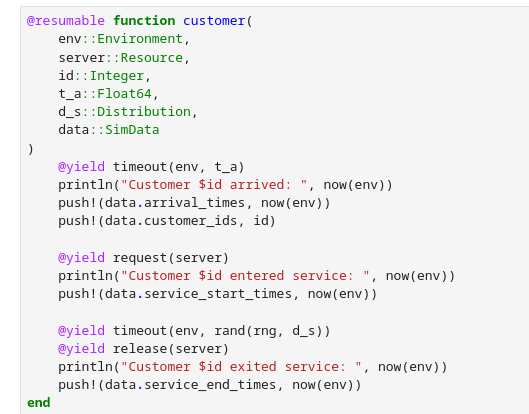
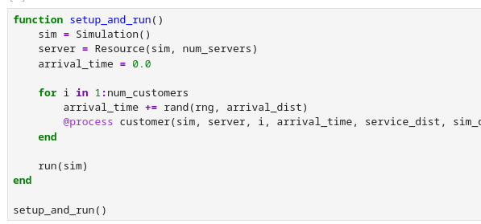
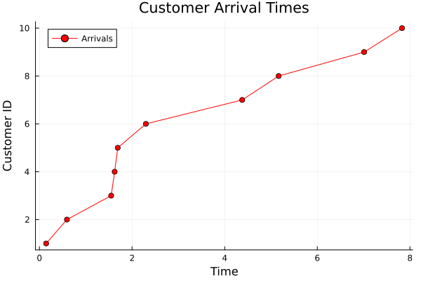
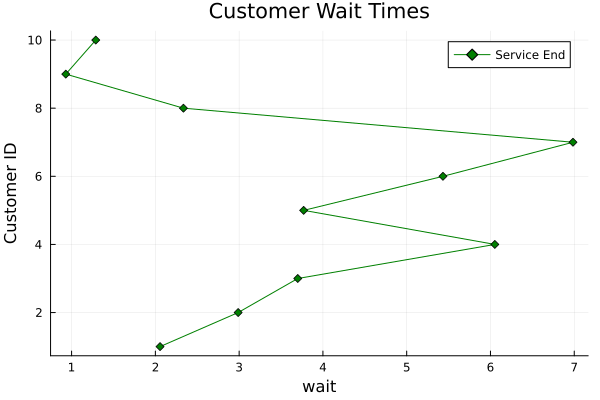
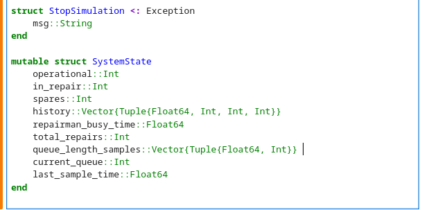
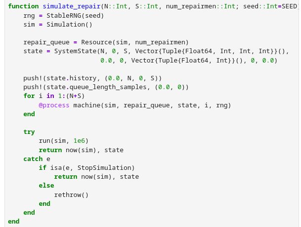
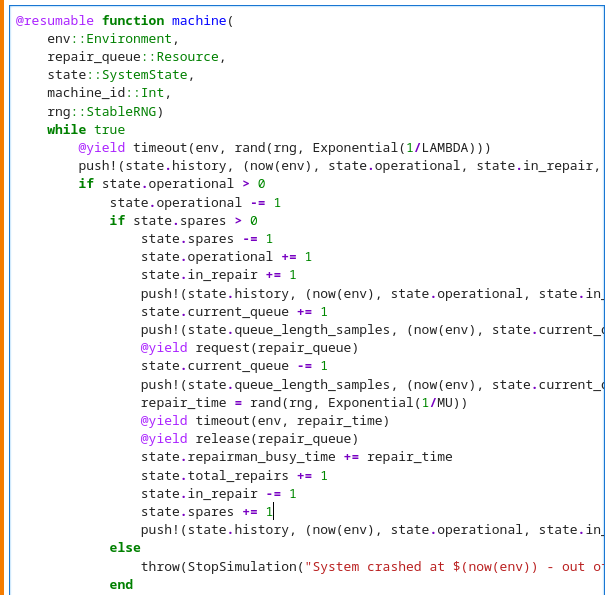
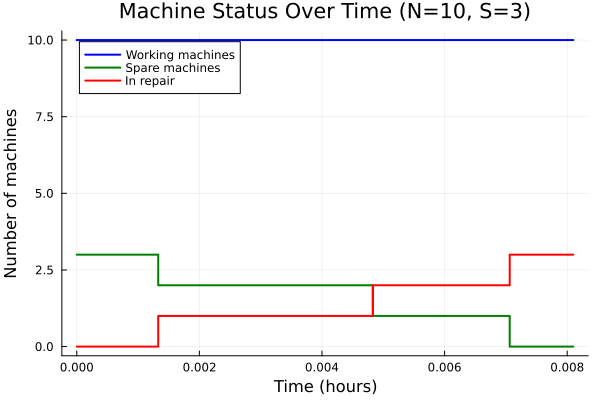
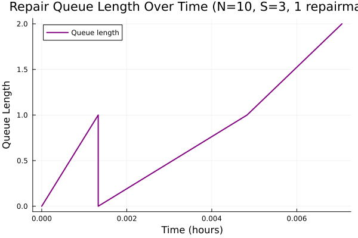
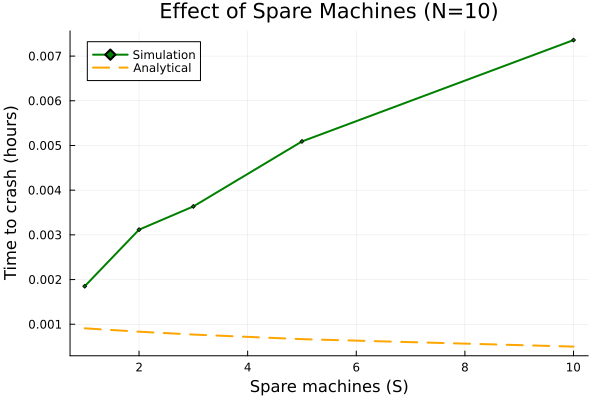

---
## Author
author:
  name: Вакутайпа Милдред
  degrees: BSc
  orcid: 009-0001-3145-3518
  email: kulyabov-ds@rudn.ru
  affiliation:
    - name: Российский университет дружбы народов
      country: Российская Федерация
      postal-code: 117198
      city: Москва
      address: ул. Миклухо-Маклая, д. 6

## Title
title: "Отчёт по лабораторной работе №7"
subtitle: "Дискретно-событийное моделирование"
license: "CC BY"
---

# Цель работы

Цель данной работы - освоить работу с дискретно-событийными моделями М/М/с и Росса.

# Задание

Для модели М/М/с:
- Перевести скрипт в структуру DrWatson
- Добавить необходимые графики

Для модели Росса:
- Перевести скрипт в структуру DrWatson
- Добавить необходимые графики
- Сделать прогон для разного количества машин
- Проведить мониторинг загрузки ремонтника, средней длины очереди на ремонт.
- Построить графики изменения числа исправных машин во времени.
- Сравнить с аналитическим решением.

# Теоретическое введение

## Модель М/М/с 

Модель М/М/с - система массового обслуживания со следующими свойствами:
- M (Markovian) — входящий поток заявок пуассоновский, интервалы между прибытиями распределены экспоненциально с параметром $\lambda$ - интенсивность входящего потока.
- M — время обслуживания каждой заявки распределено экспоненциально с параметром $\mu$ - среднее число заявок, обслуживаемых одним прибором в единицу времени (длительность обслуживания).
- c — количество идентичных обслуживающих приборов (каналов), работающих параллельно.

## Модель Росса

Модель представляет собой классический пример системы массового обслуживания с конечной популяцией, резервом и ремонтом.

В системе находятся N идентичных машин, которые постоянно работают и могут выходить из строя. S машин находятся в резерве и готовы немедленно заменить любую отказавшую.

Одно ремонтное устройство (ремонтник), которое может одновременно ремонтировать только одну машину. Когда работающая машина ломается, происходит следующее:

- Немедленно берётся одна резервная машина (если она есть) и запускается в работу вместо сломавшейся.

- Сломанная машина отправляется в ремонт.

- Если резерва нет, система падает (crash). Моделирование заканчивается.

- После ремонта машина пополняет пул резервных (становится исправной и ждёт).

- Требуется оценить среднее время до падения системы E[T] при заданных распределениях наработки до отказа и времени ремонта

# Выполнение лабораторной работы

## Модель М/М/с

До начала выполнении работы я создала проект испоьзуя DrWatson и установила все необходимые пакты ([рис. @fig-001]).

{#fig-001 width=70%}

Далее я перевела предложенный код в стиле DrWatson при этом сохраняя функции customer ([рис. @fig-002]) и setup_and_run ([рис. @fig-003]) для описание всех клиентов и запуска симуляции соответсвенно:

{#fig-002 width=70%}

{#fig-003 width=70%}

Далее я создала графики для сравнения время прихода клиентов ([рис. @fig-004])

{#fig-004 width=70%}

Для сравнения время начала обслуживания ([рис. @fig-005]).

{#fig-005 width=70%}

Для сравнения время конца обслуживания ([рис. @fig-006]).

{#fig-006 width=70%}

И для сравнения время ожидания в очереди ([рис. @fig-007]).

{#fig-007 width=70%}

Ниже предложен исользованный скрипт для модели М/М/с:

``` julia

using DrWatson
@quickactivate "project"
using StableRNGs
using Distributions
using ConcurrentSim
using ResumableFunctions
using Plots

rng = StableRNG(123)
num_customers = 10 

num_servers = 2  
mu = 1.0 / 2  
lam = 0.9  
arrival_dist = Exponential(1 / lam)  
service_dist = Exponential(1 / mu)  

mutable struct SimData
    arrival_times::Vector{Float64}
    service_start_times::Vector{Float64}
    service_end_times::Vector{Float64}
    customer_ids::Vector{Int}
end

sim_data = SimData([], [], [], [])

@resumable function customer(
    env::Environment,
    server::Resource,
    id::Integer,
    t_a::Float64,
    d_s::Distribution,
    data::SimData
)
    @yield timeout(env, t_a) 
    println("Customer $id arrived: ", now(env))
    push!(data.arrival_times, now(env))  
    push!(data.customer_ids, id)         

    @yield request(server)  
    println("Customer $id entered service: ", now(env))
    push!(data.service_start_times, now(env)) 

    @yield timeout(env, rand(rng, d_s)) 
    @yield release(server) 
    println("Customer $id exited service: ", now(env))
    push!(data.service_end_times, now(env))  
end

function setup_and_run()
    sim = Simulation() 
    server = Resource(sim, num_servers) 
    arrival_time = 0.0

    for i in 1:num_customers 
        arrival_time += rand(rng, arrival_dist)
        @process customer(sim, server, i, arrival_time, service_dist, sim_data)
    end

    run(sim) 
end

setup_and_run()

function make_graphs(data::SimData)

    p1 = plot(data.arrival_times, data.customer_ids, label="Arrivals", color=:red, marker=:circle)
    xlabel!(p1, "Time")
    ylabel!(p1, "Customer ID")
    title!(p1, "Customer Arrival Times")
    savefig(p1, plotsdir("customer_arrival_times.png"))
    display(p1)

    p2 = plot(data.service_start_times, data.customer_ids, label="Service Start", color=:blue, marker=:square)
    xlabel!(p2, "Time")
    ylabel!(p2, "Customer ID")
    title!(p2, "Customer Service Start Times")
    savefig(p2, plotsdir("customer_service_start_times.png"))
    display(p2)

    p3 = plot(data.service_end_times, data.customer_ids, label="Service End", color=:green, marker=:diamond)
    xlabel!(p3, "Time")
    ylabel!(p3, "Customer ID")
    title!(p3, "Customer Service End Times")
    savefig(p3, plotsdir("customer_service_end_times.png"))
    display(p3)

    wait = data.service_end_times .- data.service_start_times
    p4 = plot(wait, data.customer_ids, label="Service End", color=:green, marker=:diamond)
    xlabel!(p4, "wait")
    ylabel!(p4, "Customer ID")
    title!(p4, "Customer Wait Times")
    savefig(p4, plotsdir("customer_wait_times.png"))
    display(p4)

    println("All plots saved in plots directory.")
end

make_graphs(sim_data)

``` 

## Модель Росса

Для модели Росса я создоала структура для описания параметров системы ([рис. @fig-008]). и сохранила все функции ([рис. @fig-009]), ([рис. @fig-010]) но добавила несколько новые сторка.

{#fig-008 width=70%}

{#fig-009 width=70%}

{#fig-010 width=70%}

Используя результаты сохранены из симуляции, я построила графики, которые показывают следующее: 

- эффективность колисества работающих машин (прогон для разного количества машин)([рис. @fig-011]);

{#fig-011 width=70%}

- состояние машин в разное время (изменения числа исправных машин во времени) ([рис. @fig-012]);

{#fig-012 width=70%}

- время ожидания ремонта в очереди (длина очереди на ремонт) ([рис. @fig-013]);

{#fig-013 width=70%}

- эффективность увеличения количества ремонтиков (загрузка ремонтика) ([рис. @fig-014]);

{#fig-014 width=70%}

- эффективность наличия запасных машин ([рис. @fig-015]);

{#fig-015 width=70%}

Использованный код для модели Росса

``` julia 

using DrWatson
@quickactivate "project"

using ResumableFunctions, ConcurrentSim, Distributions, StableRNGs
using Statistics, Plots, DataFrames

const RUNS = 10 
const N = 10         
const S = 3          
const LAMBDA = 100.0      
const MU = 1.0        
const SEED = 42

struct StopSimulation <: Exception
    msg::String
end

mutable struct SystemState
    operational::Int      
    in_repair::Int        
    spares::Int          
    history::Vector{Tuple{Float64, Int, Int, Int}}
    repairman_busy_time::Float64
    total_repairs::Int
    queue_length_samples::Vector{Tuple{Float64, Int}} 
    current_queue::Int
    last_sample_time::Float64
end

@resumable function machine(
    env::Environment,
    repair_queue::Resource,
    state::SystemState,
    machine_id::Int,
    rng::StableRNG
)
    while true
        @yield timeout(env, rand(rng, Exponential(1/LAMBDA)))
     
        push!(state.history, (now(env), state.operational, state.in_repair, state.spares))
      
        if state.operational > 0
            state.operational -= 1
          
            if state.spares > 0
                state.spares -= 1
                state.operational += 1
                state.in_repair += 1 
                push!(state.history, (now(env), state.operational, state.in_repair, state.spares))
              
                state.current_queue += 1
                push!(state.queue_length_samples, (now(env), state.current_queue))
                
                @yield request(repair_queue)
               
                state.current_queue -= 1
                push!(state.queue_length_samples, (now(env), state.current_queue))
                
                repair_time = rand(rng, Exponential(1/MU))
                @yield timeout(env, repair_time)
                @yield release(repair_queue)
                
                state.repairman_busy_time += repair_time
                state.total_repairs += 1
                
                state.in_repair -= 1
                state.spares += 1
            
                push!(state.history, (now(env), state.operational, state.in_repair, state.spares))
            else
                throw(StopSimulation("System crashed at $(now(env)) - out of spares"))
            end
        end
    end
end

function simulate_repair(N::Int, S::Int, num_repairmen::Int; seed::Int=SEED)
    rng = StableRNG(seed)
    sim = Simulation()
    
    repair_queue = Resource(sim, num_repairmen)
    state = SystemState(N, 0, S, Vector{Tuple{Float64, Int, Int, Int}}(), 
                        0.0, 0, Vector{Tuple{Float64, Int}}(), 0, 0.0)
  
    push!(state.history, (0.0, N, 0, S))
    push!(state.queue_length_samples, (0.0, 0))
   
    for i in 1:(N+S)
        @process machine(sim, repair_queue, state, i, rng)
    end
    
    try
        run(sim, 1e6)
        return now(sim), state
    catch e
        if isa(e, StopSimulation)
            return now(sim), state
        else
            rethrow()
        end
    end
end

function hist_to_df(history::Vector{Tuple{Float64, Int, Int, Int}})
    if isempty(history)
        return DataFrame(time=Float64[], operational=Int[], in_repair=Int[], spares=Int[])
    end
    
    times = [t for (t, _, _, _) in history]
    operational = [op for (_, op, _, _) in history]
    in_repair = [rep for (_, _, rep, _) in history]
    spares = [sp for (_, _, _, sp) in history]
    
    return DataFrame(time=times, operational=operational, in_repair=in_repair, spares=spares)
end

function avg_queue_length(samples::Vector{Tuple{Float64, Int}})
    if length(samples) < 2
        return 0.0
    end
    
    total_time = 0.0
    weighted_sum = 0.0
    
    for i in 1:length(samples)-1
        dt = samples[i+1][1] - samples[i][1]
        total_time += dt
        weighted_sum += samples[i][2] * dt
    end
    
    return total_time > 0 ? weighted_sum / total_time : 0.0
end

function analytical_mttf(N::Int, S::Int, lambda::Float64, mu::Float64, c::Int)
    total_machines = N + S
    failure_rate = total_machines * lambda
    service_rate = c * mu
    
    if service_rate <= failure_rate
        return 1/failure_rate, 1.0, total_machines
    end
   
    rho = failure_rate / service_rate
    p0 = 1 - rho

    mttf = 1/(failure_rate * p0)
    utilization = rho

    if c == 1
        Lq = rho^2 / (1 - rho)
    else
        Lq = (rho^(c+1)) / (c * (1 - rho)^2) * p0
    end
    
    return mttf, utilization, Lq
end

machine_configs = [(10, 3), (20, 3), (30, 3), (40, 3), (50, 3)]
N_values = []
sim_times = []
sim_stds = []
sim_utils = []
anal_times = []

for (N_val, S_val) in machine_configs
    println("\nTesting N=$N_val, S=$S_val...")
    crash_times = Float64[]
    utilizations = Float64[]
    queue_lengths = Float64[]
    
    for run in 1:RUNS
        crash_time, state = simulate_repair(N_val, S_val, 1, seed=SEED + run)
        push!(crash_times, crash_time)
        push!(utilizations, state.repairman_busy_time / crash_time)
        push!(queue_lengths, avg_queue_length(state.queue_length_samples))
    end
    
    avg_time = mean(crash_times)
    std_time = std(crash_times)
    avg_util = mean(utilizations)
    avg_queue = mean(queue_lengths)
    
    anal_mttf, anal_util, anal_queue = analytical_mttf(N_val, S_val, LAMBDA, MU, 1)
    
    push!(N_values, N_val)
    push!(sim_times, avg_time)
    push!(sim_stds, std_time)
    push!(sim_utils, avg_util)
    push!(anal_times, anal_mttf)
    
    println("  Simulation: $(round(avg_time, digits=2)) ± $(round(std_time, digits=2)) hours")
    println("  Utilization: $(round(100*avg_util, digits=1))% (Analytical: $(round(100*anal_util, digits=1))%)")
    println("  Queue length: $(round(avg_queue, digits=2)) (Analytical: $(round(anal_queue, digits=2)))")
end

p1 = plot(N_values, sim_times, 
          linewidth=3, marker=:square, markersize=8,
          label="Simulation",
          xlabel="Working machines (N)", ylabel="Time to crash (hours)",
          title="Effect of Working Machines (S=3)", color=:blue)
plot!(p1, N_values, anal_times, linewidth=2, linestyle=:dash, label="Analytical", color=:red)
savefig(p1, plotsdir("machine_effect.png"))
println("\nPlot saved: ", plotsdir("machine_effect.png"))

_, state_detail = simulate_repair(N, S, 1, seed=SEED)

times = [t for (t, _) in state_detail.queue_length_samples]
queues = [q for (_, q) in state_detail.queue_length_samples]

p2 = plot(times, queues, linewidth=2,
          xlabel="Time (hours)", ylabel="Queue Length",
          title="Repair Queue Length Over Time (N=$N, S=$S, 1 repairman)",
          label="Queue length", color=:purple)
savefig(p2, plotsdir("queue_monitoring.png"))
println("Queue plot saved: ", plotsdir("queue_monitoring.png"))

avg_q = avg_queue_length(state_detail.queue_length_samples)
println("Average queue length (time-weighted): $(round(avg_q, digits=3))")
println("Total repairs completed: $(state_detail.total_repairs)")

_, history_base = simulate_repair(N, S, 1, seed=SEED)
df_status = hist_to_df(history_base.history)

p3 = plot(df_status.time, df_status.operational, linewidth=2,
          label="Working machines", xlabel="Time (hours)", ylabel="Number of machines",
          title="Machine Status Over Time (N=$N, S=$S)", color=:blue)
plot!(p3, df_status.time, df_status.spares, linewidth=2, label="Spare machines", color=:green)
plot!(p3, df_status.time, df_status.in_repair, linewidth=2, label="In repair", color=:red)
savefig(p3, plotsdir("machine_status.png"))
println("Status plot saved: ", plotsdir("machine_status.png"))

repairmen_counts = [1, 2, 3, 4, 5]
rep_values = []
sim_times_rep = []
sim_stds_rep = []
anal_times_rep = []

for c in repairmen_counts
    println("\nTesting with $c repairmen...")
    crash_times = Float64[]
    utils = Float64[]
    
    for run in 1:RUNS
        crash, state = simulate_repair(N, S, c, seed=SEED + run*10)
        push!(crash_times, crash)
        push!(utils, state.repairman_busy_time / crash)
    end
    
    avg_time = mean(crash_times)
    std_time = std(crash_times)
    avg_util = mean(utils)
    
    anal_mttf, anal_util, _ = analytical_mttf(N, S, LAMBDA, MU, c)
    
    push!(rep_values, c)
    push!(sim_times_rep, avg_time)
    push!(sim_stds_rep, std_time)
    push!(anal_times_rep, anal_mttf)
    
    println("  Simulation: $(round(avg_time, digits=2)) ± $(round(std_time, digits=2)) hours")
    println("  Utilization: $(round(100*avg_util, digits=1))% (Analytical: $(round(100*anal_util, digits=1))%)")
end

p4 = plot(rep_values, sim_times_rep,
          linewidth=3, marker=:circle, markersize=8,
          label="Simulation",
          xlabel="Number of repairmen", ylabel="Time to crash (hours)",
          title="Effect of Repairmen (N=$N, S=$S)", color=:blue)
plot!(p4, rep_values, anal_times_rep, linewidth=2, linestyle=:dash, label="Analytical", color=:red)
savefig(p4, plotsdir("repairmen_effect.png"))
println("\nPlot saved: ", plotsdir("repairmen_effect.png"))

spare_configs = [(10, 1), (10, 2), (10, 3), (10, 5), (10, 10)]
spare_values = []
sim_times_spare = []
sim_stds_spare = []
anal_times_spare = []

for (N_val, S_val) in spare_configs
    println("\nTesting N=$N_val, S=$S_val...")
    crash_times = Float64[]
    
    for run in 1:RUNS
        crash, _ = simulate_repair(N_val, S_val, 1, seed=SEED + run*100)
        push!(crash_times, crash)
    end
    
    avg_time = mean(crash_times)
    std_time = std(crash_times)
    anal_mttf, _, _ = analytical_mttf(N_val, S_val, LAMBDA, MU, 1)
    
    push!(spare_values, S_val)
    push!(sim_times_spare, avg_time)
    push!(sim_stds_spare, std_time)
    push!(anal_times_spare, anal_mttf)
    
    println("  Simulation: $(round(avg_time, digits=2)) ± $(round(std_time, digits=2)) hours")
    println("  Analytical: $(round(anal_mttf, digits=2)) hours")
end

p5 = plot(spare_values, sim_times_spare, linewidth=2, marker=:diamond, markersize=2,label="Simulation", xlabel="Spare machines (S)", ylabel="Time to crash (hours)",
          title="Effect of Spare Machines (N=10)", color=:green)
plot!(p5, spare_values, anal_times_spare, linewidth=2, linestyle=:dash, label="Analytical", color=:orange)
savefig(p5, plotsdir("spares_effect.png"))
println("\nPlot saved: ", plotsdir("spares_effect.png"))

```

# Выводы

При выпонении данной работы я освоила работу с дискретно-событийными моделями.

# Список литературы{.unnumbered}

::: {#refs}
:::
